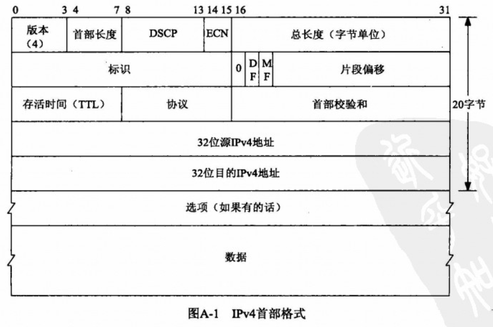

==**IPv4 允许在20字节首部固定部分之后 跟以最多共40字节的选项**==

==**IPv6 允许在固定长度的40字节 IPv6首部和传输层首部 (ICMPv6, TCP或UDP) 之间出现拓展首部 (extension header).   IPv6拓展首部的访问途径是函数接口.**==

**以太网头部 则为14字节 加上 4字节的 FCS,  并且数据到达数据链路层时, FCS会被去除**

- [IPv4选项](#IPv4选项)
    - [IPv4源路径选项](#IPv4源路径选项)
- [IPv6首部](#IPv6首部)
    - [IPv6拓展首部](#IPv6拓展首部)
    - [IPv6步跳选项和目的地选项](#IPv6步跳选项和目的地选项)
    - [IPv6路由首部](#IPv6路由首部)

 

# IPv4选项

**IPv4的选项字段跟在20字节IPv4首部固定部分之后,  并且4位bit的 首部长度字段把IPv4首部的总长度限制为60字节 `(权重为4)`**

- **IPv4定义了10种不同的选项:  `但有很多部分被作废了`**
    - **NOP : no-operation  , 单字节选项, 为某个后续选项落在4字节边界上提供填充**
    - EOL : end-of-list, 单字节选项, 终止选项的处理. 用来指示 后面有多少字节是填充的无用字节 (NOP)
    - LSRR :  loose source and record route, 松散的源和记录路径
    - SSRR : strict source and record route, 严格的来源和记录路线
    - Timestamp  : 时间戳
    - Record route : 记录路线
    - Basic security : 基本安全  (已作废)
    - Extended security  :扩展安全  (已作废)
    - Stream identifier : 流标识符  (已作废)
    - Router alert : 路由器警报, 包含该选项的IP数据报要求所有转发路由器都查看器内存
- ==**读取和设置IP 选项字段使用 `getsockopt` 和  `setsockopt`**==
    - ==**其 level 参数为 `IPPROTO_IP` ,其 optname 参数为 `IP_OPTIONS`, 其第四个参数是指向某个缓冲区 (小于等于44字节) 的一个指针, 第五个参数是该缓冲区的大小**==
        - **缓冲区多出来的4字节, 是由 原路径选项的处理方式使然**

## IPv4源路径选项

**源路径  是由IP数据报的发送者指定的一个IP地址列表.**

**有很大的安全漏洞, 而且逐渐的在被禁用**

# IPv6首部

==**IPv6 允许在固定长度的40字节 IPv6首部和传输层首部 (ICMPv6, TCP或UDP) 之间出现拓展首部 (extension header).   IPv6拓展首部的访问途径是函数接口.**==

## IPv6拓展首部

- **可选的拓展首部:**
    - 步跳选项
    - 目的地选项
    - 路径选项
    - 分片首部,  完全由内核处理
    - 认证首部
    - 安全净荷封装

## IPv6步跳选项和目的地选项

**步跳选项必须跟紧40字节的IPv6首部**

 

## IPv6路由首部

