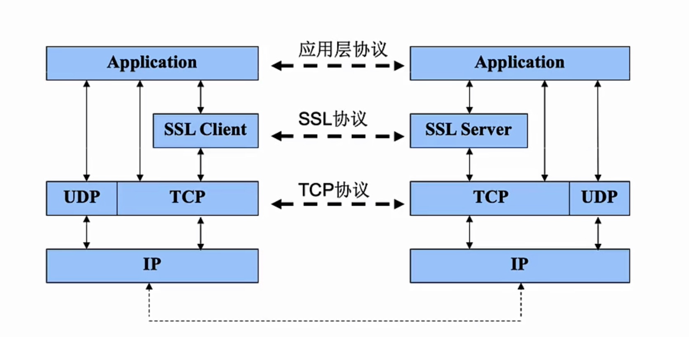
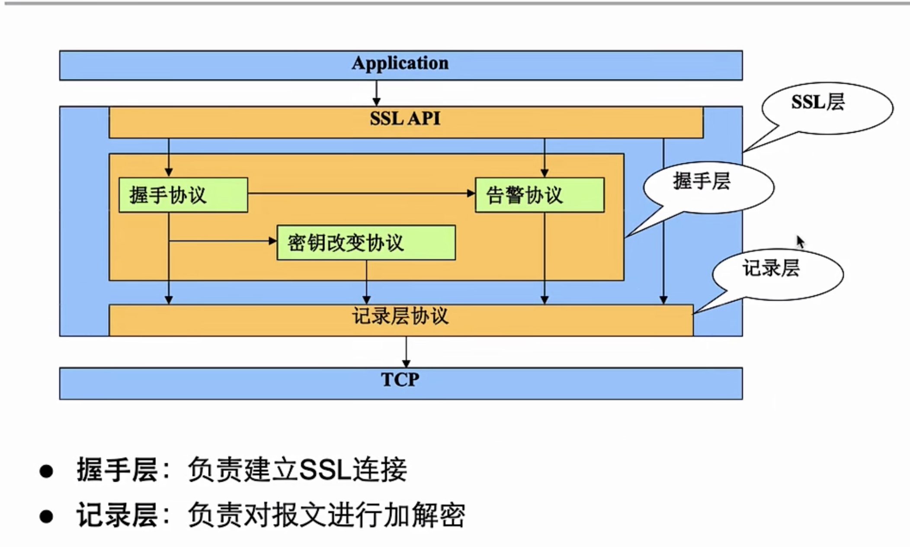
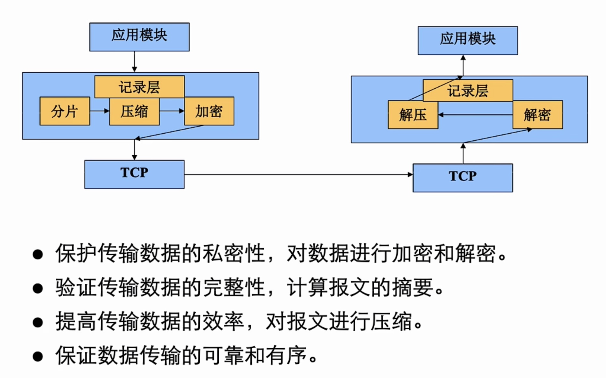
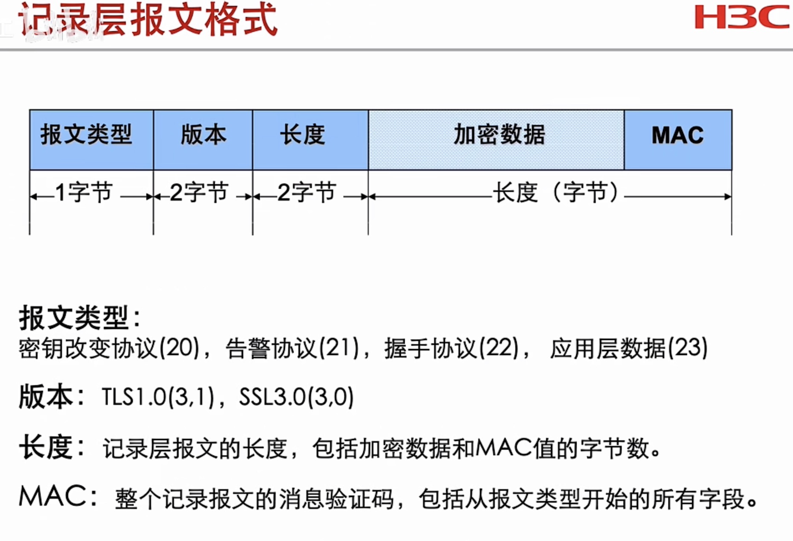
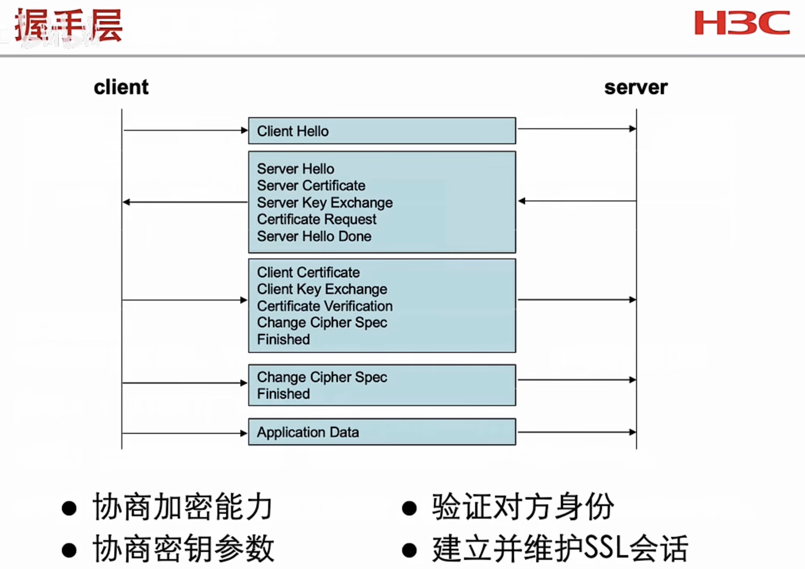
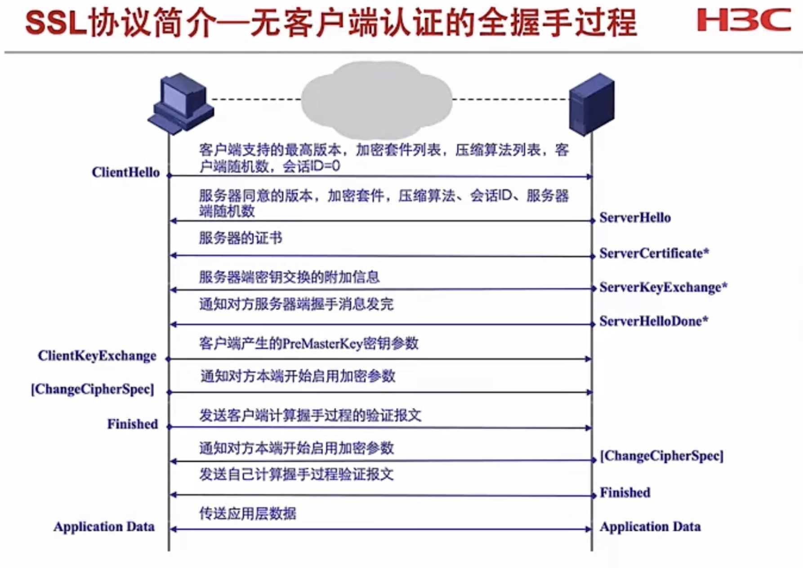
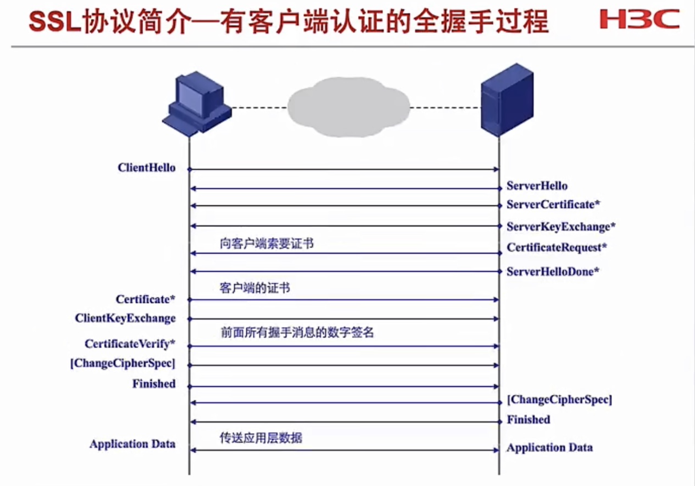
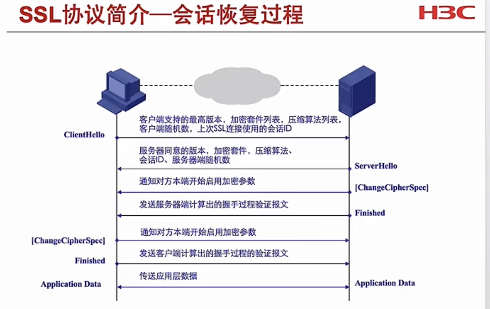
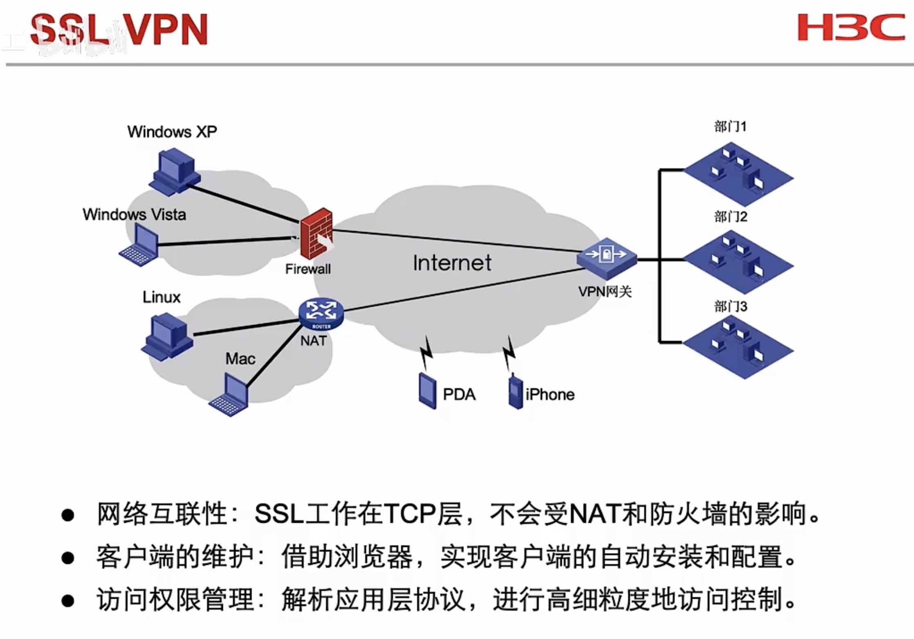
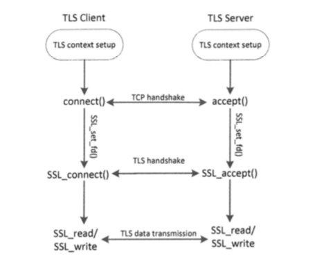

目录

- [SSL协议工作模型_安全套接字](#SSL协议工作模型_安全套接字)
- [SSL协议架构](#SSL协议架构)
  - [SSL记录层](#SSL记录层)
  - [SSL握手层](#SSL握手层)
    - [SSL握手协议提供了三种握手过程](#SSL握手协议提供了三种握手过程)
- [SSL_VPN](#SSL_VPN)
  - [VPN接入方式](#VPN接入方式)
- [TLS编程](#TLS编程)
  - [TLS客户端程序](#TLS客户端程序)
  - 


**证书 包含：公钥、身份信息、根证书签名（C签名 无法伪造）**


# SSL协议工作模型_安全套接字

- SSL是工作在 TCP层之上的加密协议。
- SSL协议采用C/S架构
- SSL服务器端采用TCP协议的443号短库提供SSL服务




# SSL协议架构

**SSL是基于证书的非对称加密（公钥和私钥），还可以做签名校验，防篡改和防伪造**




## SSL记录层





## SSL握手层




### SSL握手协议提供了三种握手过程

- **SSL握手协议提供了三种握手过程：**
  - **无客户端身份认证的全握手过程**
  - **有客户端身份认证的全握手过程**
  - **会话恢复过程**

**==建立会话的流程==**

1. **客户端向服务器发起TCP连请求，建立TCP连接**
2. **客户端向服务器发起Client-HelLo报文。携带本地支持的所有加密算法**
3. **服务器端向客户端返回Server-Hello报文。服务器选择双方都支持的加密算法的最高版本，通告客户**
   **端**
4. **客户端向服务器索要证书**
5. **服务器向客户端发送证书**
6. **服务器向客户端索要证书（可选， 银行登录时会有双向认证（token）**
7. **客户端和服务器在证书的保护下，协商出数据加密的密钥**
8. **服务器使用数据加密密钥来传输HTTP数据**
9. **客户端和服务器通过4次挥手结束TCP连接**








# SSL_VPN





## VPN接入方式

1. Web接入
   1. 由SSL VPN设备把客户端的HTTPS请求转换为HTTP发送至内网服务器，把内网服务器的HTTP响应转换为
      HTTPS发送至客户端
      1. 优点：客户端无需解析HTTP页面，客户端可以免控件
      2. 缺点：协议转换非常消耗资源
2. TCP接入
   1. 需要在客户端安装TCP抓取控件。由该控件抓取客户端访问内网TCP的流量，进行公网封装。
      1. 优点：支持访问所有基于TCP的服务
      2. 缺点：需要在客户端安装控件，不支持基于UDP的服务
3. IP接入
   1. 需要在客户端安装虛拟网卡，并分配虚拟IP地址，并自动产生到达内网服务器的路由指向虚拟网卡。由虛拟网卡来完成公网封装
      1. 优点：可以支持所有基于TCP、UDP、ICMP的服务

- **选择方式**
  - 如果远程用户要访问的内网资源是基于TCP协议，首选TCP接入
  - 如果因为远程用户浏览器对控件不兼容的问题导致无法访问内网wWeb，就使用Web接入
  - 其他非TCP的服务，使用IP接入


# TLS编程

## TLS客户端程序

TLS编程的四个步骤：
1、建立TLS上下文：包括加载加密算法和私钥，决定TLS版本，决定是否验证对方的证书等
2、建立TCP连接
3、TLS握手
4、数据传输



```c++
// mac 系统需要先将 库的头文件加入到配置选项和环境变量中
```


