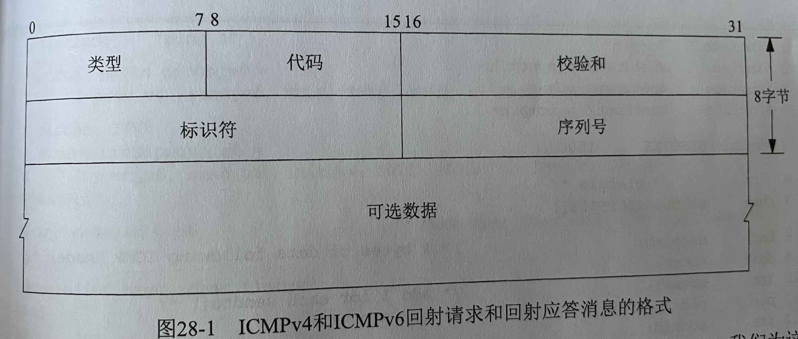

> - **原始套接字提供普通的TCP和UDP套接字所不提供的以下三个能力:**
>     - 进程通过原始套接字可以读写ICMPv4,  IGMPv4 和 ICMPv6 等分组. (发送ICMP回射请求并接收ICMP回射应答)
>     - **进程可以读写内核不处理其协议字段的 IPv4数据报. 也就是直接处理 IP数据报**
>     - **进程可以使用 IP_HDRINCL 套接字选项自行构造 IPv4首部,  也可以构造 TCP或UDP分组**


- [原始套接字创建](#原始套接字创建)
- [原始套接字输出](#原始套接字输出)
    - [IPv6的差异](#IPv6的差异)
- [原始套接字输入](#原始套接字输入)
    - [ICMPv6类型过滤器](#ICMPv6类型过滤器)
    - [计算网际网校验和算法和实现](#计算网际网校验和算法和实现)
    - [ping程序和CMPv4和ICMPv6回射请求以及回射应答消息格式](#ping程序和CMPv4和ICMPv6回射请求以及回射应答消息格式)
    - [ping程序源代码](#ping程序源代码)
    - [使用TP_TTL套接字选项设置外出数据报所用的TTL](#使用TP_TTL套接字选项设置外出数据报所用的TTL)
    - [IPv6的IPV6_UNICAST_HOPS套接字选项允许我们控制IPv6数据报的跳限字段](#IPv6的IPV6_UNICAST_HOPS套接字选项允许我们控制IPv6数据报的跳限字段)
    - 


==**ICMPv4 校验和计算 涵盖ICMPv4首部 及 后跟的任何数据.**==


==**IPv4首部 20字节,  IPv6首部 40字节,  ICMPv4/v6首部8字节  外带数据56字节. TCP首部20字节, UDP首部8字节**==

**ARP在数据链路层 请求和应答占据 28字节**

**小端由高向低内存读, 高地址记录高位数据,  大端由低向高内存读, 高地址记录低位,  都是先读数据的最高有效位**

# 原始套接字创建

==**只有超级用户才可以创建原始套接字, 防止普通用户往网络写出它们自行构造的IP数据报**==

原始套接字不存在端口的概念

```cpp
#include <sys/socket.h>
#include <netinet/in.h>

创建原始套接字的步骤:
	1. 使用socket()函数, 并把第二个参数设置为 SOCK_RAW , 第三个参数不能为0. 来创建套接字
  	int  sockfd = socket(AF_INET或AF_IENT6, SOCK_RAW, 尽可能不为0);
         // 第三个参数是形如 IPPROTO_xxx 的某个常值, 定义在<netinet/in.h>, 如 IPPROTO_ICMP
  
	2. 开启 IP_HDRINCL 套接字选项, 标头包含在数据中
    const int on = 1; 
    if ( setsockopt(sockfd, IPPROTO_IP, IP_HDRINCL, &on, sizeof(on)) < 0 )
         出错处理...

	3. 还可以调用 bind, 仅仅设置通过该套接字发送的数据报的源地址 (IP_HDRINCL不能开启), 如果不调用,那么内核会把
        源IP 地址设置为外出接口的主 IP地址.
    struct  sockaddr_in  addr;
    memset(&addr, 0, sizeof(addr));
    if( 1 != inet_pton(AF_INET, "127.0.0.1", &addr.sin_addr)){
      std::cerr << strerror(errno) << std::endl;
      close(sockfd);
      exit(errno);
    }
    socklen_t addrLen =  sizeof(addr);
    if ( 0 != bind(sockfd, reinterpret_cast< const sockaddr*>(&addr),addrLen) ){
      std::cerr << strerror(errno) << std::endl;
      close(sockfd);
      exit(errno);
    } 
    std::cout << "成功"  << std::endl;

	4. 还可以调用 connect() 来指定 外地地址, 在调用connect() 之后 可以把 sendto() 调用改为 write()或send()
		connect(sockfd, reinterpret_cast<sockaddr*>(&ServAddr), addrLen);
```


# 原始套接字输出

- **遵循的规则:**
    - 普通输出通过调用 sendto() 或 sendmsg 并指定目的IP地址完成. 如果已经 connect() 连接, 也可以使用 write, writev, 和 send.
    - **如果 IP_HDRINCL 套接字选项未开启, 那么进程让内核发送的数据的 起始地址 指的是IP首部 之后 的第一个字节, 因为内核将构造IP 首部并把它置于 来自进程的数据之前.  内核把所构造IPv4 首部的协议之短设置成 来自 socket() 调用的第三个参数**
    - 如果 IP_HDRINCL 套接字选项已开启, 那么进程让内核发送的数据的 起始地址 指的是IP首部 的第一个字节,  进程调用输出函数的写出数据量必须 包括IP首部的大小.
        - **那就代表整个IP首部由进程构造:**
            - **IPv4标识字段(分片编号) 可设置为0, 从而告知内核设置该值**
            - **IPv4首部校验 和字段总是有内核计算并存储的.**
            - **IPv4选项字段是可选的**
    - **内核会对超出外出接口 MTU 的原始分组执行分片**
    - **除了IP需要的头部信息之外,  其他的协议 ICMP 之类的 头部都需要用户手动创建, 并且计算校验和**
        - ==**ICMPv4 校验和计算 涵盖ICMPv4首部 及 后跟的任何数据.**==


## IPv6的差异

- **IPv4与IPv6 相比存在如下差异:**
    - **IPv6发生和接受的协议首部中的所有字段均采用网络字节序**
    - 通过IPv6原始套接字 无法读入或写出完整的IPv6 分组(包括首部和扩张首部),  必须使用数据链路层访问
        - **IPv6 没有 IP_HDRINCL 套接字选项**
    - IPv6 原始套接字的校验和处理存在差异.
        - ICMPv6 原始套接字 内核总是计算并存储 ICMPv6首部中的校验和,
            -  并且在校验和中包括一个伪首部.
                - 伪首部中的字段之一是 源IPv6 地址,  通常让内核填写
        - **ICMPv4 原始套接字 首部中的校验和必须由应用程序自行计算并存储**


# 原始套接字输入

==**接收到的TCP分组和UDP分组 是绝对不会传递到任何原始套接字, 如果想读取  那么就必须在数据链路层读取这些分组**==

- **内核会将以下接收到的IP数据报 传递回原始套接字:**
    - **大多数 ICMP 分组在内核处理完其中的 ICMP消息后 传递到原始套接字. `(不包括 回射请求, 时间戳请求,或地址掩码请求. 这三个请求都是内核处理的)`, IPv6还会接收 ARP和IGMP**
    - 所有 IGMP分组在内核完成处理其中的 IGMP消息后 传递到原始套接字
    - **内核不认识其 协议字段 的所有IP数据报传递到原始套接字.**
        - 内核对这些分组执行的唯一处理是 针对某些IP首部字段的最小验证:
            - IP版本.  IPv4首部校验和, 首部长度 以及目的 IP地址
    - **某个数据报以片段的形式到达, 那么在它的所有片段均到达 且重组出该数据报之前, 不传递任何片段到原始套接字**


- **内核 复制传递给原始套接字的IP数据报副本时, 会对所有进程上的 原始套接字执行三个测试,  当原始套接字三个测试全部通过时,  内核才会把数据报的副本传递给这个套接字:**
    - **数据报的协议字段必须匹配 socket() 的第三个参数的值. (第三个参数为非0)**
        - 如果第三个参数为 0,没有bind,和connect  , 那么它可以收到所有传递到原始套接字的 数据报的副本
    - **如果原始套接字 bind 绑定了某个本地地址, 那么 数据报的目的地址也必须匹配这个绑定地址.**
    - **如果原始套接字 connect 指定了某个外地IP地址, 那么数据报的目的地址必须匹配这个已连接的地址.**


==**传递到原始IPv4套接字的数据报 包含了 IP首部在内的完整数据报, 保持原本的网络字节序不变**==

==**传递到原始IPv6套接字的数据报是 去除了IPv6首部和所有拓展首部的 净荷, 并且保持原本的网络字节序不变**==


## ICMPv6类型过滤器

**为了缩减内核传递到应用程序的分组数量, (ARP ,ICMPv6, IGMP)  为应用程序提供 ICMPv6 的过滤器.**

**作为默认设置, 任一进程创建了一个 ICMPv6 原始套接字, 所有ICMPv6 消息类型都允许通过该套接字传递到该应用进程.**

```c
#include <netinet/icmp6.h>
#include <netinet6/in6.h>
int  getsockopt( int sockfd, int level, int optname, void* optval, socklen_t* optlen);
int  setsockopt( int sockfd, int level, int optname, const void* optval, socklen_t optlen);

/*  还是使用套接字选项设置函数.
   sockfd : 必须指向一个打开的套接字描述符.(socket()函数创建套接字之后就是已打开状态)
    level : 填入 IPPROTO_ICMPV6  , 指定系统中解释选项的代码或通用套接字代码
  optname : 填入 ICMP6_FILTER  优化措施, 每个套接字的选项标志。(选项名)
   optval : 指向 struct icmp6_filter 的指针,这个变量用于设置开启或关闭选项标志, 大小由 optlen 参数指定.
	 optlen : 指定 optval 参数的大小, 传出时 使用都需要进行验证.(与标准类型大小进行验证)
                setsockopt 中是传入参数.
                getsockopt 中是传出参数.
    返回值:   成功返回0, 失败返回-1 ,并设置errno 为 ENOPROTOOPT 错误
*/

/* icmp6 过滤器结构 */
struct icmp6_filter { 
	u_int32_t icmp6_filt[8];
};

/* 下面是设置 struct icmp6_filter 的 宏函数 */
void ICMP6_FILTER_SETPASSALL(struct icmp6_filter* filt);  
           // 指定所有消息类型都传递到应用进程, 结构全部位 设置为 1
void ICMP6_FILTER_SETBLOCKALL(struct icmp6_filter* filt); 
          // 指定不传递任何消息类型到应用进程,  结构全部位 设置为 0
void ICMP6_FILTER_SETPASS(int msgtype, struct icmp6_filter* filt);
          // 放行某个指定的消息类型到应用进程的传递, 应该先调用 ICMP6_FILTER_SETBLOCKALL()
void ICMP6_FILTER_SETBLOCK(int msgtype, struct icmp6_filter* filt);
          // 阻止某个指定的消息类型到应用进程的传递, 应该先调用 ICMP6_FILTER_SETBLOCKALL()
int  ICMP6_FILTER_WILLPASS(int msgtype, struct icmp6_filter* filt);
         // 如果指定的消息类型被  放行, 那么就返回1 , 否则0
int  ICMP6_FILTER_WILLBLOCK(int msgtype, struct icmp6_filter* filt);
         // 如果指定的消息类型被  阻止, 那么就返回1 , 否则0

/*  前面四个是设置修改变量,  后面两个是查看该变量
  filt : 就是struct icmp6_filter 结构体指针
  msgtype : 0~255之间, 指定ICMP 消息类型, 存放在 <netinet/icmp6.h> 头文件内
*/


// 范例:  只接收 ICMPv6 的路由器通告消息, 但是在setsockopt() 之前, 还是有可能会收到非 路由通告消息.
struct icmp6_filter myfilt;
int fd = socket(AF_INET6, SOCK_RAW, IPPROTO_ICMPV6);
ICMP6_FILTER_SETBLOCKALL(&myfilt);
ICMP6_FILTER_SETSETPSS(ND_ROUTER_ADVERT, &myfilt);
setsockopt(fd, IPPROTO_ICMPV6, ICMP6_FILTER, &myfilt, sizeof(myfilt));
```


## 计算网际网校验和算法和实现

- ==**ICMPv4 校验和计算 涵盖ICMPv4首部 及 后跟的任何数据.**==
- **IPv4, ICMPv4,  IGMPv4,  ICMPv6, UDP,  TCP  的首部的校验和计算方式:**
    - **先将校验和字段置0**
    - **如果需要校验的数据长度为 奇数个字节, 那么就在数据末尾逻辑添加一个值为0的字节.然后再计算校验和**
    - **被校验的 各个16位值`(u_short)`的 二进制反码的和**
        - 

```c
u_short
in_cksum(u_short * addr, int len)  // 首部字符串, 首部长度
{
     int nleft = len;
     u_short *w = addr;
     int sum = 0;
     u_short answer = 0;

  // 使用 32 位累加器（和），我们将连续的 16 位字添加到它，最后，将所有进位 位从高 16 位折回到低 16 位
    while (nleft > 1)  {
        sum += *w++;
        nleft -= 2;
    }

    /* 可能首部字符串奇数长度, 这里要给加上  */
    if (nleft == 1) {
        *(u_char *)(&answer) = *(u_char *)w ;
        sum += answer;
    }

  // 131332     (131332 >> 16 =2)  + (131332 & 0xffff = 260)  =  262 = sum
    /* 从高 16 位到低 16 位 加回进位  */
    sum = (sum >> 16) + (sum & 0xffff);    /* 将高 16 添加到低 16 */
    sum += (sum >> 16);            /* 添加进位 */  /* 262 */
    answer = ~sum;                /* 截断为 16 位  ,取反码*/  /* 65273 */
    return (answer);
}


int  main(void){
    const int  len = 20;
    char arr[len]= "1234567881244124400";
    arr[len-1] = '1';
    // 48 = 0   ,  0x30 =0
    // 49 50   51 52   53 54   55 56   56 49   50 52   52 49   50 52   52 48   48 49    10
    // 31 32   33 34   35 36   37 38   38 31   32 35   35 32   33 35   35 30   30 31    0x
    // 12849   13363   13877   14391   12600   13618   12856   13619   12341   12592
    std::cout <<  in_cksum( reinterpret_cast<u_short*>(arr), len) << std::endl;
    return 0;
}
```


## ping程序和CMPv4和ICMPv6回射请求以及回射应答消息格式



- ICMPv4 发送方 类型值为8  ,代码值为 0
    - 回射应答方 类型值为0  ,代码值为 0
- ICMPv6 发送方 类型值为128  ,代码值为 0
    - 回射应答方 类型值为129  ,代码值为 0

- 标识符设置为 当前发送方 ping进程的 PID
- 每个发出去的分组添加序列号, 逐次递增.
- 可选数据内存放 8字节的时间戳
    - 可以在收到 回射应答时 计算 RTT,  公式 : $(链路带宽(bit/s) / 8 * RTT(s))/1024 = 缓冲区大小KB$
        - **注意时间单位要对等,毫秒于秒 ,延迟越大, 缓冲区越大**
- ==**ICMPv4 校验和计算 涵盖ICMPv4首部 及 后跟的任何数据.**==


## ping程序源代码

```c++
// main.cpp

#include "ping.hpp"

using namespace std;

void func(int signal, siginfo_t* siginfo, void* t){
    
}

struct proto proto_v4 = {
    proc_v4, send_v4, nullptr, nullptr, nullptr, 0, IPPROTO_ICMP
};


#ifdef INET6_ADDRSTRLEN
    struct proto proto_v6 = {
        proc_v6, send_v6, init_v6, nullptr, nullptr, 0, IPPROTO_ICMPV6
    };
#endif


int main(int argc, char* argv[])
{
    int      c = 0;
    struct   addrinfo * ai;
    char    *h;
    
    opterr = 0; //不希望 getopt() 写入 stderr
    while ((c = getopt(argc, argv, "v")) != -1) {
        switch (c) {
            case 'v':
                verbose++;
                break;
            case '?':
                std::cerr << "unrecognized option: " << c << strerror(errno) << endl;
                exit(errno);
            default:
                std::cerr << "default exit: " << c << strerror(errno) << endl;
                exit(errno);
                break;
        }
    }
    
    if(optind != (argc -1)){
        std::cerr << "usage: ping [ -v ] <hostname>" << std::endl;
        exit(errno);
    }
    
    host = argv[optind];
    pid = getpid() & 0xffff;     //  ICMP ID 字段为 16 位
    
    signal(SIGALRM, sig_alrm);
    ai = Host_serv(host, nullptr, 0, 0  );
    h = Sock_ntop_host(ai->ai_addr, ai->ai_addrlen);
    printf("PING %s (%s): %d data bytes\n",
           ai->ai_canonname ? ai->ai_canonname : h, h, datalen);
    if(ai->ai_family == AF_INET){
        pr = &proto_v4;
#ifdef INET6_ADDRSTRLEN
    }else if( ai->ai_family == AF_INET6){
        pr = &proto_v6;
        if (IN6_IS_ADDR_V4MAPPED(&(((struct sockaddr_in6 *) ai->ai_addr)->sin6_addr))){
            std::cerr << "cannot ping IPv4-mapped IPv6 address" << std::endl;
            exit(errno);
        }
#endif
    }else{
        std::cerr << "unknown address family " << ai->ai_family  << std::endl;
        exit(errno);
    }
    
    pr->sasend = ai->ai_addr;
    pr->sarecv = reinterpret_cast<sockaddr*>( calloc(1, ai->ai_addrlen));
    pr->salen  = ai->ai_addrlen;
    
    readloop();
    exit(0);
}
```

```c++
// ping.hpp

#ifndef ping_hpp
#define ping_hpp

#include <iostream>
#include <errno.h>
#include <sys/signal.h>
#include <sys/stat.h>
#include <sys/ipc.h>
#include <fcntl.h>
#include <unistd.h>
#include <sys/types.h>
#include <sys/time.h>


#include <sys/socket.h>
#include <netinet/in.h>
#include <netinet/ip.h>
#include <netdb.h>
#include <netinet/ip_icmp.h>
#include <netinet/in_systm.h>
#include <net/if_dl.h>
#include <arpa/inet.h>
#include <sys/un.h>  // sockaddr_un

#ifdef INET6_ADDRSTRLEN
    #include <netinet/icmp6.h>
    #include <netinet/ip6.h>
#endif


extern const  short  BUFSIZE; //  = 1500;
extern char   sendbuf[];   //  [BUFSIZE]

extern int    datalen;
extern char   *host;
extern int    nsent;
extern pid_t  pid;
extern int    sockfd;
extern int    verbose;

void init_v6(void);
void proc_v4(char* , ssize_t, struct msghdr*, struct timeval* );
void proc_v6(char* , ssize_t, struct msghdr*, struct timeval* );
void send_v4(void);
void send_v6(void);
void readloop(void);
void sig_alrm(int);
void tv_sub(struct timeval*, struct timeval*);

struct proto{
    void  (*fproc)(char*, ssize_t, struct msghdr*, struct timeval*);
    void  (*fsend)(void);
    void  (*finit)(void);
    struct sockaddr* sasend;
    struct sockaddr* sarecv;
    socklen_t salen;
    int    icmpproto;
};

extern struct proto * pr;

struct addrinfo *
Host_serv(const char *host, const char *serv, int family, int socktype);
struct addrinfo *
host_serv(const char *host, const char *serv, int family, int socktype);
char *
Sock_ntop_host(const struct sockaddr *sa, socklen_t salen);

char *
sock_ntop_host(const struct sockaddr *sa, socklen_t salen);
void
Gettimeofday(struct timeval *tv, void *foo);

u_short
in_cksum(u_short * addr, int len);
#endif /* ping_hpp */
```

```c++
//  ping.cpp
#include "ping.hpp"
const  short  BUFSIZE = 1500;
char   sendbuf[BUFSIZE] = {0};
struct proto * pr = nullptr;

int    datalen = 56;
char   *host = nullptr;
int    nsent = 0;
pid_t  pid = 0;
int    sockfd = -1;
int    verbose = 0;


void send_v6(void){
#ifdef  INET6_ADDRSTRLEN
    int len ;
    struct icmp6_hdr*  icmp6;
    icmp6 = (struct icmp6_hdr*) sendbuf;
    icmp6->icmp6_type = ICMP6_ECHO_REQUEST;
    icmp6->icmp6_code = 0;
    icmp6->icmp6_id = pid;
    icmp6->icmp6_seq = nsent++;
    memset((icmp6 +1 ), 0xa5, datalen);
    Gettimeofday((struct timeval*)(icmp6 + 1), nullptr);  // 指向的是 首部之后的数据
    len  = 8 + datalen;
    ssize_t  ret = 0;
    if (  (ret = sendto(sockfd, sendbuf, len, 0, pr->sasend, pr->salen)) < 0 ){
        std::cerr << "sendto error , ret " << ret << " : " << strerror(errno) << std::endl;
        exit(errno);
    }
#endif
}

u_short
in_cksum(u_short * addr, int len)
{
     int nleft = len;
     u_short *w = addr;
     int sum = 0;
     u_short answer = 0;

    /*
     * Our algorithm is simple, using a 32 bit accumulator (sum), we add
     * sequential 16 bit words to it, and at the end, fold back all the
     * carry bits from the top 16 bits into the lower 16 bits.
     */
    while (nleft > 1)  {
        sum += *w++;
        nleft -= 2;
    }

    /* mop up an odd byte, if necessary */
    if (nleft == 1) {
        *(u_char *)(&answer) = *(u_char *)w ;
        sum += answer;
    }

    /* add back carry outs from top 16 bits to low 16 bits */
    sum = (sum >> 16) + (sum & 0xffff);    /* add hi 16 to low 16 */
    sum += (sum >> 16);            /* add carry */
    answer = ~sum;                /* truncate to 16 bits */
    return (answer);
}


void send_v4(void){
    int   len;
    struct icmp *icmp;
    icmp = (struct icmp*) sendbuf;
    icmp->icmp_type = ICMP_ECHO;
    icmp->icmp_code = 0;
    icmp->icmp_id = pid;
    icmp->icmp_seq = nsent++;
    memset(icmp->icmp_data, 0xa5, datalen);
    Gettimeofday((struct timeval*)icmp->icmp_data, nullptr);
    len = 8 + datalen;
    icmp->icmp_cksum = 0;
    icmp->icmp_cksum = in_cksum((u_short*) icmp, len);  // ICMPv4消息校验和
    ssize_t   ret  = 0;
    if( (ret = sendto(sockfd, sendbuf, len, 0, pr->sasend, pr->salen)) < 0 ){
        std::cerr << "sendto error , ret " << ret << " : " << strerror(errno) << std::endl;
        exit(errno);
    }
}


void sig_alrm(int){
    (*pr->fsend)();
    alarm(1);
    return;
}


void proc_v6(char* ptr, ssize_t len, struct msghdr* msg, struct timeval* tvrecv){
#ifdef INET6_ADDRSTRLEN
    double rtt;
    struct  icmp6_hdr* icmp6;
    struct  timeval * tvsend;
    struct  cmsghdr * cmsg;
    int  hlim;
    
    icmp6 = (struct icmp6_hdr*) ptr;
    if (len < 8)
        return;
    if(icmp6->icmp6_type == ICMP6_ECHO_REPLY){
        if( icmp6->icmp6_id != pid)
            return;
        if(len < 16)
            return;  // ICMPv6 8字节 + 时间戳 8字节
        tvsend = (struct timeval*) (icmp6 + 1);  // 指向了 可选数据中的 时间戳
        tv_sub(tvrecv, tvsend);
        rtt = tvrecv->tv_sec * 1000.0 + tvrecv->tv_usec /1000.0;
        hlim = -1;
        for( cmsg = CMSG_FIRSTHDR(msg); cmsg != nullptr ; cmsg = CMSG_NXTHDR(msg,cmsg) ){
            if(cmsg->cmsg_level == IPPROTO_IPV6 && cmsg->cmsg_type == IPV6_2292HOPLIMIT){
                hlim = *(u_int32_t*) CMSG_DATA(cmsg);
                break;
            }
        }
        printf("%zd bytres from %s: seq=%u, hlim=",
               len, Sock_ntop_host(pr->sarecv, pr->salen), icmp6->icmp6_seq);
        if(hlim == -1)
            printf("? ? ?");
        else
            printf("%d", hlim);
        printf(", rtt=%.3f  ms\n", rtt);
    }else if( verbose)
        printf("  %zd bytes from %s : type = %d, code = %d\n", len,
               Sock_ntop_host(pr->sarecv, pr->salen ),
               icmp6->icmp6_type, icmp6->icmp6_code);
#endif
}


// 设置ICMPv6 过滤器, 还想收取跳限
void init_v6(void){
#ifdef INET6_ADDRSTRLEN
    int  on =1;
    if(verbose == 0){
        struct icmp6_filter myfilt;
        ICMP6_FILTER_SETBLOCKALL(&myfilt);
        ICMP6_FILTER_SETPASS(ICMP6_ECHO_REPLY, &myfilt);
        setsockopt(sockfd, IPPROTO_IPV6, ICMP6_FILTER, &myfilt, sizeof(myfilt));
    }

#ifdef  IPV6_RECVHOPLIMIT
    setsockopt(sockfd, IPPROTO_IPV6, IPV6_RECVHOPLIMIT, &on, sizeof(on));
#else
    setsockopt(sockfd, IPPROTO_IPV6, IPV6_2292HOPLIMIT, &on, sizeof(on));  // IPV6_2292HOPLIMIT 是 IPV6_HOPLIMIT
#endif
#endif
}

// 处理 ICMPv4 消息
void proc_v4(char* ptr, ssize_t len, struct msghdr* msg, struct timeval* tvrecv){
    ssize_t  icmplen;  // ICMP首部+ICMP数据
    ssize_t  hlenl;
    double   rtt;
    struct ip    *ip;
    struct icmp  *icmp;
    struct timeval *tvsend;
    ip = (struct ip*) ptr;
    hlenl = ip->ip_hl << 2;   // 得到IP首部长度和 IPv4选项
    if( ip->ip_p != IPPROTO_ICMP )  // 这里存在疑问,  大小端问题
//    if( ntohs(ip->ip_p ) !=  IPPROTO_ICMP )  // 这里存在疑问,  大小端问题
        return ;
    icmp = (struct icmp*) (ptr + hlenl);  // icmp 首部
    if((icmplen = len - hlenl) < 8)  // icmp 消息数据少于8字节, 代表没有收到时间戳
        return ;
    if(icmp ->icmp_type == ICMP_ECHOREPLY){  // 消息类型
        if(icmp ->icmp_id != pid)
            return;
        if(icmplen < 16) // 数据8+头部8
            return ;
        tvsend = (struct timeval*) icmp->icmp_data;  // 转换 时间戳
        tv_sub(tvrecv, tvsend);
        rtt = tvrecv->tv_sec *10000.0 + tvrecv->tv_usec /1000.0;  // 换算单位成 毫秒
        printf("%lu bytes from %s: seq=%u, ttl=%d, rtt=%.3f ms\n", icmplen, Sock_ntop_host(pr->sarecv, pr->salen),
               icmp->icmp_seq , ip->ip_ttl, rtt);
    }else if( verbose){
        printf("   %lu bytes from %s: type = %d, code =%d\n", icmplen, Sock_ntop_host(pr->sarecv, pr->salen ),
               icmp->icmp_type, icmp->icmp_code);
    }
}


void tv_sub(struct timeval* out, struct timeval* in){
    if ((out->tv_usec -= in->tv_usec ) < 0){
        --out->tv_sec;
        out->tv_usec += 1000000;
    }
    out->tv_sec -= in->tv_sec;
}

void
Gettimeofday(struct timeval *tv, void *foo)
{
    if (gettimeofday(tv, foo) == -1)
    {
        fprintf(stderr, "gettimeofday error %s \n" ,strerror(errno));    /* inet_ntop() sets errno */
        exit(errno);
    }
    return;
}


void readloop(void){
    int  size;
    char recvbuf[BUFSIZE];
    char controlbuf[BUFSIZE];
    struct  msghdr  msg = {0};
    struct  iovec   iov = {0};   //缓冲区
    ssize_t n;
    struct timeval tval = {0};
    
    sockfd = socket(pr->sasend->sa_family, SOCK_RAW, pr->icmpproto);
    setuid(getuid());
    if (pr->finit)
        (*pr->finit)();
    size = 60*1024;    // 6mb 读缓冲区长度
    setsockopt(sockfd, SOL_SOCKET, SO_RCVBUF, &size, sizeof(size));
    
    sig_alrm(SIGALRM);
    
    iov.iov_base = recvbuf;
    iov.iov_len  = sizeof(recvbuf);
    msg.msg_name = pr->sarecv;
    msg.msg_iov  = &iov;
    msg.msg_iovlen = 1;
    msg.msg_control = controlbuf;
    for(;;){
        msg.msg_namelen = pr->salen;
        msg.msg_controllen = sizeof(controlbuf);  // 辅助数据缓冲区长度
        n = recvmsg(sockfd, &msg, 0);
        if ( n < 0){
            if (errno == EINTR )
                continue;
            else{
                fprintf(stderr, "recvmsg error %s \n" ,strerror(errno));    /* inet_ntop() sets errno */
                exit(errno);
            }
        }
        Gettimeofday( &tval, nullptr);
//        (*pr->fproc)(recvbuf, n, &msg, &tval);
        pr->fproc(recvbuf, n, &msg, &tval);
    }
}


struct addrinfo *
host_serv(const char *host, const char *serv, int family, int socktype)
{
    int                n;
    struct addrinfo    hints, *res;

    bzero(&hints, sizeof(struct addrinfo));
    hints.ai_flags = AI_CANONNAME;    /* always return canonical name */
    hints.ai_family = family;        /* AF_UNSPEC, AF_INET, AF_INET6, etc. */
    hints.ai_socktype = socktype;    /* 0, SOCK_STREAM, SOCK_DGRAM, etc. */

    if ( (n = getaddrinfo(host, serv, &hints, &res)) != 0)
        return(NULL);

    return(res);    /* return pointer to first on linked list */
}
/* end host_serv */

/*
 * There is no easy way to pass back the integer return code from
 * getaddrinfo() in the function above, short of adding another argument
 * that is a pointer, so the easiest way to provide the wrapper function
 * is just to duplicate the simple function as we do here.
 */

struct addrinfo *
Host_serv(const char *host, const char *serv, int family, int socktype)
{
    int                n;
    struct addrinfo    hints, *res;

    bzero(&hints, sizeof(struct addrinfo));
    hints.ai_flags = AI_CANONNAME;    /* always return canonical name */
    hints.ai_family = family;        /* 0, AF_INET, AF_INET6, etc. */
    hints.ai_socktype = socktype;    /* 0, SOCK_STREAM, SOCK_DGRAM, etc. */

    if ( (n = getaddrinfo(host, serv, &hints, &res)) != 0){
        printf("host_serv error for %s, %s: %s",
                 (host == NULL) ? "(no hostname)" : host,
                 (serv == NULL) ? "(no service name)" : serv,
                 gai_strerror(n));
        exit(errno);
    }

    return(res);    /* return pointer to first on linked list */
}

char *
sock_ntop_host(const struct sockaddr *sa, socklen_t salen)
{
    static char str[128];        /* Unix domain is largest */

    switch (sa->sa_family) {
    case AF_INET: {
        struct sockaddr_in    *sin = (struct sockaddr_in *) sa;

        if (inet_ntop(AF_INET, &sin->sin_addr, str, sizeof(str)) == NULL)
            return(NULL);
        return(str);
    }

#ifdef    AF_INET6
    case AF_INET6: {
        struct sockaddr_in6    *sin6 = (struct sockaddr_in6 *) sa;

        if (inet_ntop(AF_INET6, &sin6->sin6_addr, str, sizeof(str)) == NULL)
            return(NULL);
        return(str);
    }
#endif

#ifdef    AF_UNIX
    case AF_UNIX: {
        struct sockaddr_un    *unp =
        reinterpret_cast<struct sockaddr_un *>( const_cast<struct sockaddr *>(sa));

            /* OK to have no pathname bound to the socket: happens on
               every connect() unless client calls bind() first. */
        if (unp->sun_path[0] == 0)
            strcpy(str, "(no pathname bound)");
        else
            snprintf(str, sizeof(str), "%s", unp->sun_path);
        return(str);
    }
#endif

#ifdef    AF_LINK
    case AF_LINK: {
        struct sockaddr_dl    *sdl =
        reinterpret_cast<struct sockaddr_dl *>( const_cast<struct sockaddr *>(sa));

        if (sdl->sdl_nlen > 0)
            snprintf(str, sizeof(str), "%*s",
                     sdl->sdl_nlen, &sdl->sdl_data[0]);
        else
            snprintf(str, sizeof(str), "AF_LINK, index=%d", sdl->sdl_index);
        return(str);
    }
#endif
    default:
        snprintf(str, sizeof(str), "sock_ntop_host: unknown AF_xxx: %d, len %d",
                 sa->sa_family, salen);
        return(str);
    }
    return (NULL);
}

char *
Sock_ntop_host(const struct sockaddr *sa, socklen_t salen)
{
    char    *ptr;

    if ( (ptr = sock_ntop_host(sa, salen)) == NULL){
        fprintf(stderr, "sock_ntop_host error");    /* inet_ntop() sets errno */
        exit(errno);
    }
       
    return(ptr);
}

```


## 使用TP_TTL套接字选项设置外出数据报所用的TTL

TTL : 该数据报的生存时间, 也就是能传递几次路由器的数量.

```c++
// 需要头文件 :
#include <netinet/in_systm.h>
#include <netinet/ip.h>
#include <netinet/ip_cimp.h>
#include <netinet/udp.h>
#include <net/if_dl.h>
#include <arpa/inet.h>
#include <sys/un.h>  // sockaddr_un
#include <netdb.h>
#include <sys/socket.h>
```


## IPv6的IPV6_UNICAST_HOPS套接字选项允许我们控制IPv6数据报的跳限字段

```c++
// 需要头文件 :
#include <netinet/in_systm.h>
#include <netinet/ip.h>
#include <netinet/ip_cimp.h>
#include <netinet/udp.h>
#include <netinet/ip6.h>
#include <netinet/icmp6.h>
#include <net/if_dl.h>
#include <arpa/inet.h>
#include <sys/un.h>  // sockaddr_un
#include <netdb.h>
#include <sys/socket.h>
```


