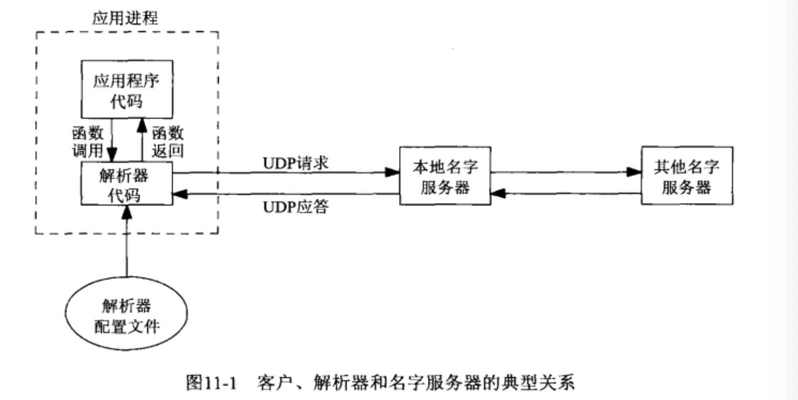

# 目录

- [域名系统](#域名系统)
  - [资源记录](#资源记录)
  - [解析器和域名服务器](#解析器和域名服务器)
  - [DNS替换方法](#DNS替换方法)
  - 


- ==文件 `/ect/resolv.conf` 通常包含本地  域名服务器 主机的IP地址==
  - **对于该系统上大多数进程使用的DNS主机名解析，地址解析或DNS查询路由机制，不参考此文件。**
  - **MacOS使用 `scutil --dns` 命令 查看系统使用的DNS配置**
  - **Linux 使用 `dig` 命令查看**

- `gethostbyname` 和 `gethostbyaddr` 在主机域名与IPv4地址之间进行转换.
- `getservbyname` 和 `getservbyport` 在服务名字和端口号之间进行转换.
- **与协议无关的转换函数**
  - `getaddrinfo`   用于主机域名和 IP地址之间转换
  - `getnameinfo`  用于服务域名和端口号之间转换


## 域名系统

- **域名系统 ( Domain Name System,  DNS)**
  - **主要用于主机域名与地址之间的映射**
- **全限定域名 (Fully Qualified Domain Name,  FQDN), 也称 绝对域名**
  - **必须以 `点号` 结尾的域名才算得上 绝对域名 ( sol.upb.com. )**
  - **有时最后那个 `点号`也可以.  ( sol.upb.com )**
    - **这个 `点号` 会告知 DNS 解析器 该域名是 限定域名 的,而不必搜索解析器自己维护的可能域名列表.**

#### 资源记录

- ==DNS 中的条目称为 **资源记录 (resource record, RR)**==

  - **会用到的 RR 类型:**

    - **A**
      - A记录会把一个主机名映射成一个 32位的 IPv4 地址.
    - **AAAA**
      - 四A记录, 把一个主机名映射成 128位的 IPv6地址. (是32位地址的四倍).
    - **PTR   (指针记录)**
      - PTR记录把 IP地址映射成主机名.
        - IPv4地址:, 32位地址的4字节先反转顺序, 每个字节都转换成各自个十进制ASCII值(0~255)后, 再添加 `in-addr.arpa` , 结果字符串用于 PTR查询. (例: `254.32.106.12.in-addr.arpa`)
        - IPv6地址: 128位地址的32个4位组先反转顺序, 每个四位组都被转换成相应的十六进制ASCII值(0~9,a~f)后, 再添加 `ip6.arpa`, 结果字符串用于 PTR查询.
    - **MX**
      - MX记录 把一个主机指定作为 给定主机的 "邮件交换器", 数字越小优先级越高.
    - **CNAME (规范域名)**
      - **常见用法是为 常用的服务 (www或ftp) 指派 CNAME记录.**
        - ==使用服务名 而不是真实的主机名时, 就可以将相应的服务挪到另一个主机上,而外部也不会知晓.==

  - ```bash
    这是 unpbook.com 域中关于主机 freebsd 的4个DNS记录.
    	freebsd    IN   A        12.106.32.254
    	           IN   AAAA     3ffe:b80:1f8d:1:a00:20ff:fea7:686b
    	           IN   MX    5  freebsd.unpbook.com.
    	           IN   MX    10 mailhost.unpbook.com.
    	           IN   PTR      254.32.106.12.in-addr.arpa
    	           IN   PTR      b.6.8.6.7.a.e.f.f.f.0.2.0.0.a.0.1.0.0.0.b.9.f.1.0.8.b.0.e.f.f.3.ip6.arpa
      ftp        IN   CNAME    linux.unpbook.com.
      www        IN   CNAME    linux.unpbook.com.
      freebsd-4  IN   A        12.106.32.254
      freebsd-6  IN   AAAA     3ffe:b80:1f8d:1:a00:20ff:fea7:686b
      freebsd-6ll IN  AAAA               fe80::a00:20ff:fea7:686b   #AAAA记录+主机的链路局部地址的RR
    ```

- **这些协议给予了我们额外的应用程序协议选择控制权**


#### 解析器和域名服务器

- **域名服务器(name server), 就是 BIND程序(Berkeley Internet Name Domain).**
- 应用程序通过调用称为 **解析器(resolver)** 的函数库中的函数接触 DNS服务器.
  - 常见的 **解析器 函数** 就是 `gethostbyname` 和 `gethostbyaddr` . 前者 主机名到IPv4, 后者 IPv4到主机名
- ==解析器代码通常包含在一个系统函数库中,在构造应用程序时被 **连接** 到应用程序中.==
  - **有的系统提供一个由全体应用进程共享的集中式 解析器守护进程, 并提供向这个守护进程执行 RPC 的系统函数库代码.**
  - 无论哪种情况, 应用程序代码使用通常的函数调用来执行解析器中的代码, 典型函数就是 `gethostbyname` 和 `gethostbyaddr` . 



- **解析器代码 通过读取其系统相关配置文件确定本组织机构的 域名服务器们 的所在位置.(一个机构存在一个或多个域名服务器)**
- ==文件 `/ect/resolv.conf` 通常包含本地域名服务器主机的IP地址, 必须是IP地址 而不可以是域名.==
- **解析器使用 UDP 向本地域名服务器发出查询.**
  - **如果本地服务器不知道答案, 它通常会使用 UDP 在整个互联网上查询其他名字服务器.**
    - **如果答案太长, 超出 UDP消息的承载能力, 本地域名服务器和解析器会自动切换到 TCP**


#### DNS替换方法

- 不使用 DNS 也可能获取名字和地址信息.
- **常用的替换DNS的方法:**
  - 静态主机文件 `/etc/hosts`
  - 文件信息系统 (Network Infomation System,  NIS)
  - 轻权目录访问协议 (Lightweight Directory Access Protocol,  LDAP).
- ***系统管理员* 如何配置一个主机以使用不同类型的 域名服务 是和实现相关的.**
  - `Solaris 2.x`, `HP-UX 10` , ``


