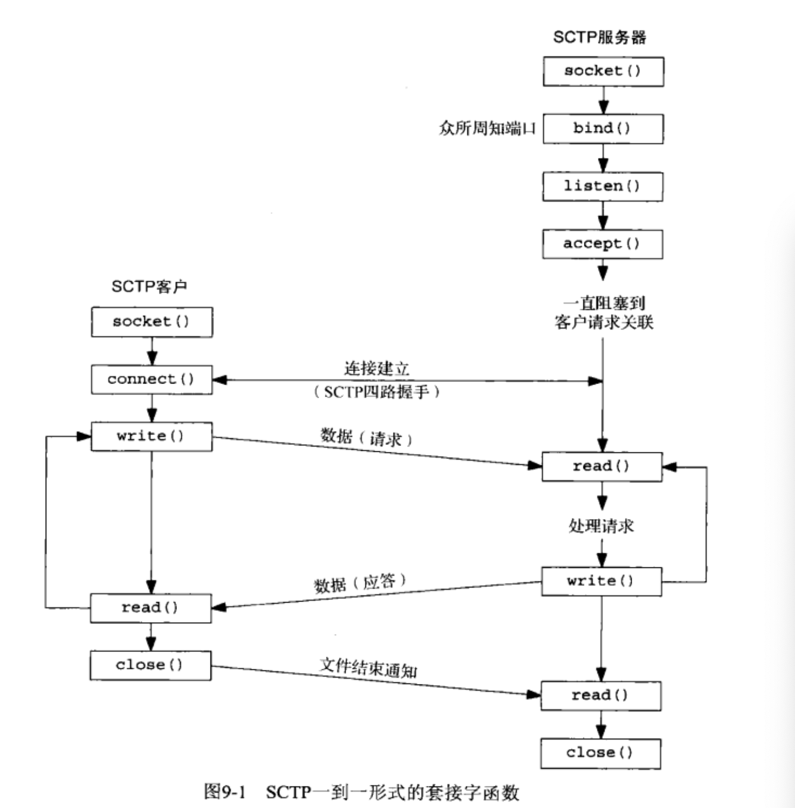
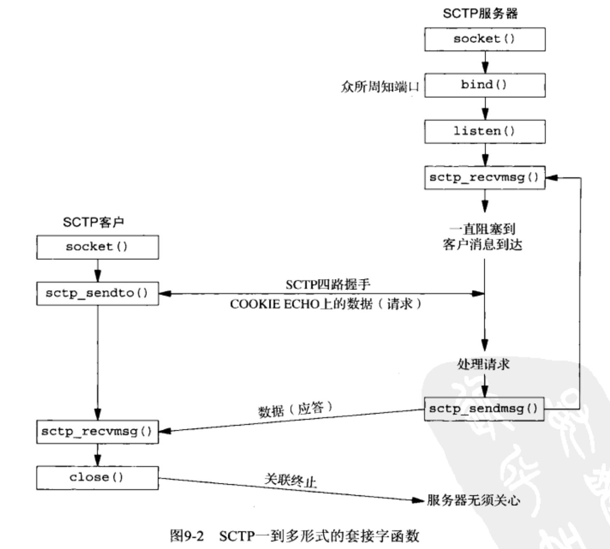

**sctp 代码编译时,必须添加 `-lsctp` 选项.**

```bash
$gcc -Wall  -o a.out a.c -lsctp
```

**sctp 主要需求的头文件有: `<sys/types> , <sys/socket.h>, <netinet/sctp.h>`**

# 目录

- [安装和开启SCTP支持](#安装和开启SCTP支持)
- [基本SCTP套接字编程](#基本SCTP套接字编程)
  - [接口模型](#接口模型)
    - [一到一形式](#一到一形式)
    - [一到多形式](#一到多形式)
  - [sctp_bindx函数](#sctp_bindx函数)
  - [sctp_connectx函数](#sctp_connectx函数)
  - [sctp_getpaddrs函数](#sctp_getpaddrs函数)
  - [sctp_freepaddrs函数](#sctp_freepaddrs函数)
  - [sctp_getladdrs函数](#sctp_getladdrs函数)
  - [sctp_freeladdrs函数](#sctp_freeladdrs函数)
  - [sctp_sendmsg函数](#sctp_sendmsg函数)


# 安装和开启SCTP支持

- **ubuntu  开启命令:** 

  - `sudo apt-get install libsctp-dev lksctp-tools libsctp1`

- **树莓派开启命令(64位自制版,原版和 ubuntu 相同):**

  - `sid-used sudo apt-get install libsctp-dev lksctp-tools libsctp1`

- **Fedora、RedHat、CentOS开启命令:**

  - `sudo yum install kernel-modules-extra.x86_64 lksctp-tools.x86_64`

- **macOS 需要安装内核驱动模块(`失败了`):**

  - ==**首先下载在本目录中的 `macOs-sctp-支持` 目录下的 [SCTP_NKE_ElCapitan_Install_01.dmg](SCTP_NKE_ElCapitan_Install_01.dmg) 文件到本地, 并且双击加载.**==

  - ==先备份 `socket.h ` 文件, 因为后面的步骤会覆盖它==

    ```bash
    首先关闭mac前面验证功能,因为涉及到 内核驱动模块.
    	安装电源键启动后立即按住command+r 进入recover模式
    	打开终端控制台
    	执行命令:
    		csrutil enable  --without kext
    
    
    进行下面操作之前,必须保证已经安装Xcode ,并且也是使用Xcode 进行开发, 否则另寻到 /usr/目录进行替换
    
    
    sudo cp -R /Volumes/SCTP_NKE_ElCapitan_01/SCTPSupport.kext /Library/Extensions
    sudo cp -R /Volumes/SCTP_NKE_ElCapitan_01/SCTP.kext /Library/Extensions
    
    
    sudo cp /Volumes/SCTP_NKE_ElCapitan_01/socket.h /Applications/Xcode.app/Contents/Developer/Platforms/MacOSX.platform/Developer/SDKs/MacOSX.sdk/usr/include 
    
    sudo cp /Volumes/SCTP_NKE_ElCapitan_01/sctp.h /Applications/Xcode.app/Contents/Developer/Platforms/MacOSX.platform/Developer/SDKs/MacOSX.sdk/usr/include/netinet
    
    sudo cp /Volumes/SCTP_NKE_ElCapitan_01/sctp_uio.h /Applications/Xcode.app/Contents/Developer/Platforms/MacOSX.platform/Developer/SDKs/MacOSX.sdk/usr/include/netinet
    
    sudo cp /Volumes/SCTP_NKE_ElCapitan_01/libsctp.dylib /Applications/Xcode.app/Contents/Developer/Platforms/MacOSX.platform/Developer/SDKs/MacOSX.sdk/usr/lib
    
    
    
    - 加载模块 
    	sudo kextload /Library/Extensions/SCTP.kext
    - 卸载模块
    	sudo kextunload /Library/Extensions/SCTP.kext
    ```

  - **加载模块** 

    - **`sudo kextload /Library/Extensions/SCTP.kext`**

  - **卸载模块**
  	
  	- **`sudo kextunload /Library/Extensions/SCTP.kext`**

# 基本SCTP套接字编程

**SCTP 是一个可靠的面向消息的协议,在端点之间提供多个流,并为多宿提供传输级支持.**

**SCTP 中的 *通知* ,使得一个应用进程能够知晓用户数据到达以外的重要协议事件.**


## 接口模型

- ==**SCTP 套接字分类**==
  - **一到一套接字**
    - 对应一个单独的 SCTP 关联. (SCTP的关联是 两个系统之间的一个连接)
    - 类型是 `SCOK_STREAM` , 协议为 `IPPROTO_SCTP` 网际网套接字,协议族为`AF_INET 或 AF_INET6`
  - **一到多套接字**
    - 一个给定套接字上可以同时有多个活跃的SCTP 关联.`(类似于绑定了端口的UDP套接字 正在接收其他很多的套接字发送的数据报)`


### 一到一形式

- ==目的是 方便将现有的TCP应用程序移植到 SCTP上==
  - **在移植时,必须要注意与 TCP 的差异:**
    - **任何TCP套接字选项必须转化成等效的SCTP套接字选项.`(例如: TCP_NODELAT和TCP_MAXSEG ,应该应设成 SCTP_NOELAY和SCTP_MAXSEG)`**
    - **TCP保存消息边界, 因此应用层消息并非必需.**
    - **TCP应用使用半关闭(写关闭) 来告知对方数据流已经结束. 这样移植到SCTP需要额外重新应用层协议,让进程在应用数据流中告知对端传出数据流已经结束**
    - **`send`函数能够以普通方式使用, 但是`sendto` 和 `sendmsg` 函数时, 指定的任何地址都被认为是对 目的地 主地址的重写.**
- ==**一到一 类型是 `SCOK_STREAM` , 协议为 `IPPROTO_SCTP` 网际网套接字,协议族为`AF_INET 或 AF_INET6`**==



### 一到多形式

- **一到多给开发人员提供了这样的能力:**
  - **编写的服务器程序无需管理大量的套接字描述符.**
- **单个套接字描述符将代表多个关联,就像一个UDP套接字能够从多个客户接收消息那样.**
- ==**在一到多式套接字上, 用于标识单个关联的是一个 关联标识 (association identifier)**==
  - **关联标识  是一个类型为 `sctp_assoc_t` 的值, 通常是一个整数. (对开发人员不透明)**
    - ==**应用程序必须使用由内核给予的关联标识符**==
- ==**一到多套接字的用户应该掌握以下几点:**==
  - ==**当一个客户关闭其关联时, 其服务器也将自动关闭同一个关联, 服务器主机内核中不再有该关联的状态.**==
  - ==***可用于致使在四路握手的第三个或第四个分组中捎带用户数据的唯一办法就是使用一到多形式***==
  - **客户端使用 `sento, sendmsg, SCTP_sendmsg` 连接服务器,如果成功则建立一个与该地址的新关联, 这个行为的发生与执行分组的发生与服务器的应用程序是否调用过 `list`函数 无关.**
  - ==**用户必须使用 `sendto, sendmsg , sctp_sendmsg`  三个分组发送函数, 不可以使用`write , send` 这两个分组发送函数.**==
    - **除非已经使用 `sctp_peeloff` 函数从一个一到多式 套接字剥离出一个  一到一式的套接字**
  - **调用发送分组函数时, 所用的目的地址是由系统在关联建立阶段选定的  主目的地址**
    - **除非调用者在所提供的 `sctp_sndrcvinfo` 结构中设置了 `MSG_ADDR_OVER` 标志, 为了提供这个结构,调用者必须使用伴随辅助数据的 `sendmsg`	 函数或 `sctp_sendmsg` 函数 .**
  - **关联事件 可能被启用, 因此要是应用进程不希望收到这些事件, 就得使用 `SCTP_EVENTS` 套接字选项显示禁用他们.**
    - **默认情况下只有 `sctp_data_io_event` 事件会启用, 它给 `recvmsg` 和`sctp_recvmsg` 调用提供辅助数据.( 适用一到多 和 一到一)**
- ==**客户端创建完套接字并且初次调用 `sctp_sendto`函数时, 将导致隐式建立关联, 而数据请求由四路握手的第三个分组捎带到服务器**==



- **一到多 套接字 能够结合使用 `sctp_peeloff` 函数允许组合迭代服务器模型和并发服务器模型:**
  - ==**`sctp_peeloff` 函数能够将 一到多套接字剥离出某个特定关联, 独自构成一个  一到一式套接字**==
  - **剥离出来的关联所在的一到一到接字 锁后就可以遣送给自己的字线程或派生子进程.**
  - **这个时候, 主线程继续在原来的套接字上以迭代的方式处理来自任何剩余关联的消息.**

- ==**一到多 类型是 `SCOK_SEQPACKET` , 协议为 `IPPROTO_SCTP` 网际网套接字,协议族为`AF_INET 或 AF_INET6`**==


### sctp_bindx函数

**SCTP服务器可以绑定与所在主机系统相关IP地址的一个子集.(就是随意挑选主机上的哪几个IP作为捆绑)**

==**所有绑定IP时使用的端口号必须是同一个**==

==**如果对监听套接字使用,那么将来产生的关联将使用新的地址配置,已经存在的关联则不受影响**==

```c
#include <netinet/sctp.h>
int sctp_bindx (int sockfd, const struct sockaddr* addrs, int addrcnt, int flags);
	参数:
		 sockfd :已创建的套接字(socket()), 绑定或未绑定的套接字都可以使用.
     addrs  :需要与套接字绑定的IP,端口,协议 的数组. (是结构体数组 struct sockaddr_in a[10])
               这些结构体的 端口号必须全部一致,不可以出现不同的端口号.
     addrcnt: addrs地址数组的个数,也就是有多少个地址 (也就是数组中元素的个数) (10)
     flags  : 添加或删除参数addrs 中的IP地址
                SCTP_BINDX_ADD_ADDR   往套接字中添加地址
                SCTP_BINDX_REM_ADDR   从套接字中删除地址
	返回值 : 成功返回0 . 出错返回-1 , flags 两种参数同时指定时,返回错误码EINVAL
          addrs 数组中有端口号不同时,会返回错误码 EINVAL
```


### sctp_connectx函数

**用于连接到一个多宿对端主机.**(多宿主机: 拥有多个IP地址的主机)

```c
#include <netinet/sctp>
int sctp_connectx (int sockfd, const struct sockaddr* addrs, int addrcnt,
                    sctp_assoc_t*  id);
参数: 
    sockfd :已创建的套接字(socket()), 绑定或未绑定的套接字都可以使用.
     addrs :一个或多个 服务器的 IP,端口,协议 结构体数组,(一个或多个结构体)
    addrcnt: addrs地址数组的个数,也就是有多少个地址 (也就是数组中元素的个数)
	      id : 传出参数,保存的是 关联ID
 返回值: 成功返回0 .  出错返回 -1
```


### sctp_getpaddrs函数

**`getpeername` 函数不是为支持多宿概念的传输协议设计的, 当用于 SCTP时,仅仅返回主目的的地址**

==**使用 `sctp_getpaddrs` 时,可以返回对端的所有地址**==

==**使用`sctp_getpaddrs` 会分配资源, 必须使用 `sctp_freepaddrs` 函数来释放分配的资源**==

```c
#include <netinet/sctp.h>
int sctp_getpaddrs (int sockfd, sctp_assoc_t id, struct sockaddr **addrs);

参数:
      sockfd :已关联的套接字
          id :指定要查询的 关联ID (connectx获得) , 仅用于一对多, 一对一时忽略该参数.
       addrs :传出参数. 该套接字关联的对端地址的列表数组. IP,端口,协议 .数组长度是返回值
返回值:
		  成功返回 addrs 参数所传出的数组的长度, 如果此套接字上没有关联, 则返回0
	    错误返回-1  并且 addrs的值是未定义的.(也就不需要再调用 sctp_freepaddrs 函数了)
```


### sctp_freepaddrs函数

**释放由`sctp_getpaddrs` 函数分配的资源**

```c
#include <netinet/sctp.h>
void sctp_freepaddrs (struct sockaddr* addrs);

参数:
      addrs: 是 sctp_getpaddrs 所返回的地址数组的指针.
```


### sctp_getladdrs函数

**用于获取 属于某个关联的本地地址(可能是主机所有地址的一个子集)**

**一个本地端点会使用某些本地的地址(可能是个子集)**

==**使用`sctp_getladdrs` 会分配资源, 必须使用 `sctp_freeladdrs` 函数来释放分配的资源**==

```c
#include <netinet/sctp.h>
int sctp_getladdrs (int sockfd, sctp_assoc_t id, struct sockaddr** addrs);

参数:
      sockfd :已关联的套接字
          id :指定要查询的 关联ID(connectx获得) , 仅用于一对多, 一对一时忽略该参数.
       addrs :传出参数. 该套接字关联的本地地址的列表数组. IP,端口,协议 .数组长度是返回值
返回值:
	   成功返回 addrs 参数所传出的数组的长度, 如果此套接字上没有关联, 则返回0
    错误返回-1  并且 addrs的值是未定义的.(也就不需要再调用 sctp_freeladdrs 函数了)
```


### sctp_freeladdrs函数

**释放由`sctp_getladdrs` 函数分配的资源**

```c
#include <netinet/sctp.h>
void sctp_freeladdrs (struct sockaddr* addrs);

参数:
      addrs: 是 sctp_getladdrs 所返回的地址数组的指针.
```


### sctp_sendmsg函数

**发送伴随 辅助数据的函数. 这是个辅助函数库的调用(可能是系统调用), 方便应用进程使用SCTP高级特性**

```c
#include <netinet/sctp.h>
ssize_t sctp_sendmsg (int sockfd,  const void* msg,  size_t msgsz, 
                       const struct sockaddr* to,  socklen_t tolen,
                       uint32_t  ppid,       uint32_t flags,    uint16_t stream,
                       uint32_t  timetolive, uint32_t context);
参数:
     sockfd :套接字
        msg :发送缓冲区
      msgsz :发送缓冲区的字节长度
         to :接收缓冲区数据的对端的地址结构 (应该只是一个对端,并不是群发,传入参数)
      tolen :对端地址结构的长度,to 参数的长度.(传入参数)
       ppid :指定 将随数据块传递的 净荷协议标识符.
      flags :该参数的值将传递给 SCTP栈, 用以标识任何 SCTP选项:
                  SCTP_ABORT   启动中止性的关联终止过程(仅限一对多)
                  SCTP_ADDR_OVER    指定SCTP不顾主目的地址而改用给定的地址
                  SCTP_EOF    发送完本消息后 启动正常的关联终止过程(仅限一对多)
                  SCTP_UNORDERED    指定本消息使用无序的消息传递服务
     stream :指定一个 SCTP流号
 timetolive :发送消息延迟限制时间 以毫秒为单位.如果超过期限没有发送出去 则该消息过期,也就不会发送出去.
                设为0时将不会过期.
    context :指定可能有的用户上下文.
                 (如果该消息发送出错,该值会通过 消息通知机制与未传递的消息一起传递回上层)
返回值:
	 成功则返回所写字节数, 出错返回 -1 
```


