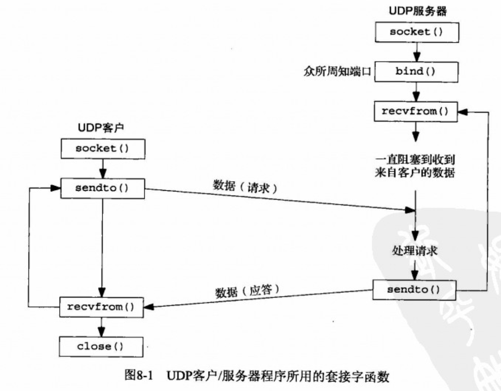

# 目录

- [基本UDP套接字编程](#基本UDP套接字编程)
- [recvfrom函数和sendto函数](#recvfrom函数和sendto函数)
- [UDP的connect函数](#UDP的connect函数)
  - [给一个UDP套接字多次调用connect](#给一个UDP套接字多次调用connect)
  - 


- **`/etc/resolv.conf`  文件保存了DNS服务器主机的IP地址.**
  - **当客户端只设置了一个DNS 服务器IP时,会默认调用 已连接套接字来进行通信, 设置了多个DNS服务器IP时, 就要使用 未连接套接字来进行通信了.**
  - **NDS服务器是不可以调用 `connect` 来设置UDP套接字的**

# 基本UDP套接字编程

UDP是无连接不可靠的数据报协议.

UDP编程的常见应用程序有 : DNS(域名系统), NFS(网络文件系统), SNMP(简单网络管理协议)

- **客户端使用 `endto` 函数给服务器发送数据报. 必须指定目的地(服务器)**
- **服务器使用 `recvfrom` 函数, 等待来自某个客户的数据到达, 然后使用`sendto` 将与所接受的数据报一道返回客户的协议地址.**
- **UDP 不存在EOF之类的内容**
- **UDP 接收缓冲区会依照 FIFO(先进先出) 规则来顺序返回进程,可使用`SO_RCVBUF`套接字选项增大缓冲区**
- **基本原则:**
  - **对于一个UDP套接字, 由它引发的异步错误并不返回给它, 除非它已连接.(`connect`)**
  - **给UDP套接字调用 `connect` 的结果是, 内核检查是否存在立即可知的错误(例如 ICMP), 记录对端的IP地址和端口号(套接字结构体),然后立即返回到调用进程.**
- **客户端的临时端口是在第一次调用 `sendto` 时由内核一次性指定的.**
  - **如果客户捆绑了一个IP在其套接字上, 但是内核决定外出数据报必须从另一个数据链路发出, 这个时候IP数据报将包含一个不同于外出链路IP地址的源IP地址.**
- 如果客户端连接的服务器并未运行UDP服务器程序.那么将返回 ICMP(端口不可达错误). 必须使用一个已连接的UDP套接字来接受错误.
- **只有已连接的套接字才会返回 异步错误.**
  - **异步错误: 就是ICMP(端口不可达) 错误, 这个错误无法通过无连接套接字返回和接收.**



## recvfrom函数和sendto函数

**这两个函数类似于 `read`和 `write` 函数, 只不过是需要三个额外参数.**

**`sendto`函数只可用于 未连接UDP套接字.**

```c
#include <sys/socket.h>
ssize_t recvfrom( int sockfd, void* buff, size_t nbytes, int flags,
                 struct sockaddr* from, socklen_t* addrlen);
ssize_t sendto  ( int sockfd, const void* buff, size_t nbytes, int flags,
                 const struct sockaddr* to, socklen_t addrlen);

	参数:  sockfd : UDP套接字
         buff  : 发送或接收数据的缓冲区的指针
         nbytes: 读写字节数,不会超过buff缓冲区大小
         flags :   MSG_OOB   处理带外数据
                   MSG_PEEK  偷看传入的消息
                   MSG_WAITALL  等待完整的请求或错误
                   一般这个参数给0即可.
         from  : 传出参数, 数据报发送者的协议地址和端口号.
                (该参数可以为空指针,但是addrlen也必须为空指针,表示不关心数据发送者的协议地址,但有风险)
         to    : 指向一个含有数据报 接收者的协议地址(地址及端口号)的套接字地址结构.(传入参数)
         addrlen: 指定from和to 的地址结构长度.(recvfrom是传出指针参数, sendto是传入普通参数)

 返回值: 允许发送空的UDP数据报,也就是说返回0 是正常的. 
        对于TCP套接字，返回值0表示对等方已关闭其连接的一半。
        出错返回 -1 
        TCP和UDP已连接套接字使用sendto发送数据报时 不可以指定地址(to)和长度(addrlen),否则返回 EISCONN 错误
        sendto 应该返回已发送的字节数. 否则出错
        recvfrom 应该返回已接收到的字节数
```

**可使用 `sudo tcpdump -i lo0 -v` 命令来监视和查看UDP/TCP 数据报内容. (lo0  是回环网卡,也就是接口)**

- 使用 `recvfrom` 可以获得 来自客户的IP数据报中的  源IP地址和源端口号 (客户端的IP地址和端口号)
- 使用 `recvmsg` 可以获得 来自客户的IP数据报中的 目的IP地址.   (服务器的IP地址)
- 使用 `getsockname` 可以获得 来自客户的IP数据报中的 目的端口号.(服务器的端口号)


## UDP的connect函数

**给UDP套接字调用 `connect` 的结果是:  内核检查是否存在立即可知的错误(例如 ICMP), 记录对端的IP地址和端口号(放入套接字结构体),然后立即返回到调用进程.**


- **未连接 UDP套接字, 新创建UDP套接字默认如此**
- **已连接 UDP套接字, 对UDP套接字调用 `connect` 的结果**
  - **只有已连接套接字才会返回异步错误.**

- **已连接UDP套接字 与 未连接UDP套接字的变化:**
  - **不可以给输出操作指定目的IP地址和端口号, 也就是可以不使用 `sendto` 函数了, 而改用 `write`或`send` 函数, 写到已连接UDP套接字上的任何内容都自动发送到由 `connect` 函数指定的协议地址.**
  - **不必使用`recvfrom` 获取数据报的发送者, 而改用 `read, recv, recvmsg` . 一个已连接UDP套接字 仅仅能与一个 IP地址交换数据报(包括多播或广播地址)**
  - **由已连接UDP套接字引发的异步错误 会返回给他们所在的进程,而未连接UDP套接字不接受任何异步错误**
  - **未连接DUP套接字不可以使用 `write`或`send`, 以及不指定目的地址的`sendto`, 否则返回 EDESTADDREQ 错误**
  - **TCP和UDP已连接套接字使用`sendto`发送数据报时 不可以指定地址和长度,否则返回 EISCONN 错误**
- **客户端应用进程首先调用 `connect` 指定对端的IP和端口号, 然后使用 `read` 和 `write` 与对端进程交换数据**
  - **服务器与客户端都可以使用 `connect` 来指定对端并进行长时间通信.(TFTP 就是这样的).**
- **当客户端只设置了一个DNS 服务器IP时,会默认调用 已连接套接字来进行通信, 设置了多个DNS服务器IP时, 就要使用 未连接套接字来进行通信了.**
- **已连接套接字的性能比未连接套接字的性能会提高三分之一.**
  - 当未连接套接字使用`sendto` 时, 内核会复制两次含有目的地IP地址和端口号的套接字地址结构.
  - 已连接套接字使用 `write` 时, 内核仅仅复制一次IP地址和端口的套接字地址结构到内核.


#### 给一个UDP套接字多次调用connect

- 可以对已连接的套接字再次调用`connect` 函数, 从而达到以下两种目的
  - 指定新的IP地址和端口号
  - 断开套接字
    - 将地址结构清0, 并把参数中的 `sin_family` 修改为 AF_UNSPEC, 即可断开套接字
      - 这样做会导致返回一个 EAFNOSUPPORT错误, 可以忽略.


