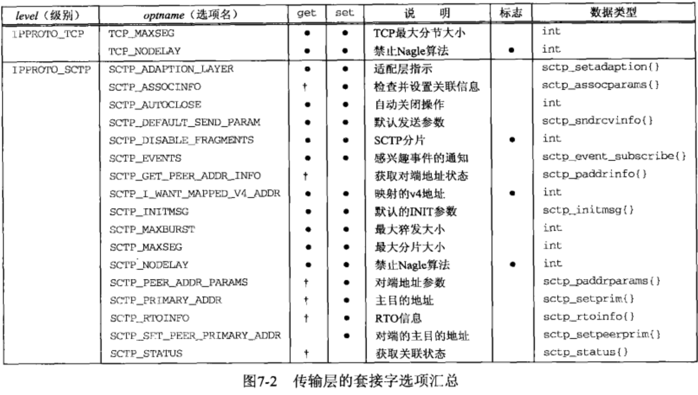
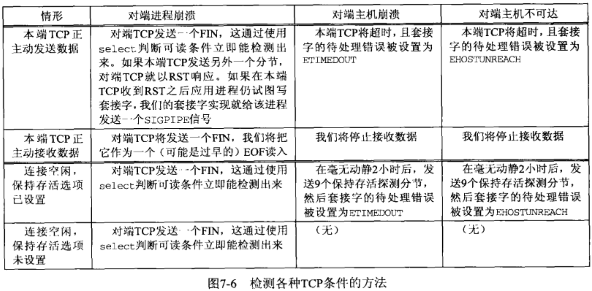

# 套接字选项

- 获取和设置套接字选项的方法:
  - 可以通过 `gitsockopt` 和 `setsockopt`  函数
  - `fcntl` 函数
    - 把套接字设置为非阻塞式I/O型 或信号驱动式I/O型  以及设置套接字属主的POSIX方法.
  - `ioctl` 函数


## getsockopt 和 setsockopt 函数 (仅用于套接字)

- **套接字选项 粗分为两大基本类型:**
  - **启用或禁止某个特性的二元选项 (称为标志选项)**
  - **取得并返回可以设置或检查的特定值的选项 (称为值选项)**
- **这两个函数可以设置 `套接字层` 和 `IP层` 以及 `传输层` 的选项**
- **使用 `int` 的 `1` 或 `0` 来表示开启和关闭,  或者是使用指定的数据结构来进行开启和关闭**

```c
#include <sys/socket.h>
int  getsockopt( int sockfd, int level, int optname, void* optval, socklen_t* optlen);
int  setsockopt( int sockfd, int level, int optname, const void* optval, socklen_t optlen);

/*参数:
 *  sockfd : 必须指向一个打开的套接字描述符.(socket()函数创建套接字之后就是已打开状态)
 *  level  : 指定系统中解释选项的代码或通用套接字代码,或为某个特定于协议的代码(IPv4/6, TCP或SCTP)
 *  optname: 每个套接字的选项标志。(选项名)
 *  optval : 指向某个变量的指针,这个变量用于设置开启或关闭选项标志, 大小由 optlen 参数指定.
 	           setsockopt 从 *optval 中取得选项待设置的新值. (传入)  0禁止,不为0则开启.
 	           getsockopt 则把已获取的选项当前值存放到 *optval 中.(传出) 0表示关闭,1开启
 *  optlen : 指定 optval 参数的大小, 传出时 使用都需要进行验证.(与标准类型大小进行验证)
                setsockopt 中是传入参数.
                getsockopt 中是传出参数.
 * 返回值:   成功返回0, 失败返回-1 ,并设置errno 
  
 */
范例和常用
  int fd = Socket(AF_INET, SOCK_STREAM, 0);
  int  flag = 1;   // 1表示开启, 0表示关闭
	socklen_t flag_len= sizeof(flag);
	setsockopt(fd, SOL_SOCKET, SO_BROADCAST, &flag, sizeof(flag)); //开启广播权限
//---
  size_t  flag_len = sizeof(flag);
  getsockopt(fd, SOL_SOCKET, SO_ERROR, &flag, &flag_len);  //获取待处理错误并清除
//---
  setsockopt(fd, SOL_SOCKET, SO_KEEPALIVE, &flag, sizeof(flag)); //周期性测试链接是否存活(心跳包)
//---  
  struct  linger  optl;  
  optl.l_onoff  = 1;  // 开启
  optl.l_linger = 5;  // 延迟保留时间为 5秒
  setsockopt(fd, SOL_SOCKET, SO_LINGER, &optl, sizeof(optl)); // 若有数据待发送 则延迟关闭
//---
  int  buflen = 4096;  //缓冲区大小(字节)
  setsockopt(fd, SOL_SOCKET, SO_RCVBUF, &buflen, sizeof(buflen)); // 设置接收缓冲区大小
  setsockopt(fd, SOL_SOCKET, SO_SNDBUF, &buflen, sizeof(buflen)); // 设置发送缓冲区大小
//---
  setsockopt(fd, SOL_SOCKET, SO_RCVLOWAT, &buflen, sizeof(buflen)); // 接收缓冲区低水位标记
  setsockopt(fd, SOL_SOCKET, SO_SNDLOWAT, &buflen, sizeof(buflen)); // 发送缓冲区低水位标记
*/
```




- **列表中的   标志位,  有点 ,表示 选项用于在用户进程与系统之间传递所指定数据类型的值.**
- **数据类型 后面有 {} 的表示是结构体.**
- **使用不受支持的套接字选项名字的时候, 会返回一个 `ENOPROTOOPT` 的 `errno` 的值**

### 默认套接字选项可开启的状态和值

```c
#include <errno.h>
#include <string.h>
#include <stdio.h>
#include <sys/socket.h>
#include <netinet/in.h>
#include <netinet/tcp.h>

void err_quit(char* str);


union val {
    int            i_val;
    long           l_val;
    struct linger  linger_val;
    struct timeval timeval_val;
}val;

static char* sock_str_flag(union val* ,int);
static char* sock_str_int(union val* ,int);
static char* sock_str_linger(union val* ,int);
static char* sock_str_timeval(union val* ,int);
struct sock_opts{
    const char*    opt_str;
    int            opt_level;
    int            opt_name;
    char* (*opt_val_str) (union val* ,int);
}sock_opts[] = {
        { "SO_BROADCAST",        SOL_SOCKET,    SO_BROADCAST,    sock_str_flag },
        { "SO_DEBUG",            SOL_SOCKET,    SO_DEBUG,        sock_str_flag },
        { "SO_DONTROUTE",        SOL_SOCKET,    SO_DONTROUTE,    sock_str_flag },
        { "SO_ERROR",            SOL_SOCKET,    SO_ERROR,        sock_str_int },
        { "SO_KEEPALIVE",        SOL_SOCKET,    SO_KEEPALIVE,    sock_str_flag },
        { "SO_LINGER",            SOL_SOCKET,    SO_LINGER,        sock_str_linger },
        { "SO_OOBINLINE",        SOL_SOCKET,    SO_OOBINLINE,    sock_str_flag },
        { "SO_RCVBUF",            SOL_SOCKET,    SO_RCVBUF,        sock_str_int },
        { "SO_SNDBUF",            SOL_SOCKET,    SO_SNDBUF,        sock_str_int },
        { "SO_RCVLOWAT",        SOL_SOCKET,    SO_RCVLOWAT,    sock_str_int },
        { "SO_SNDLOWAT",        SOL_SOCKET,    SO_SNDLOWAT,    sock_str_int },
        { "SO_RCVTIMEO",        SOL_SOCKET,    SO_RCVTIMEO,    sock_str_timeval },
        { "SO_SNDTIMEO",        SOL_SOCKET,    SO_SNDTIMEO,    sock_str_timeval },
        { "SO_REUSEADDR",        SOL_SOCKET,    SO_REUSEADDR,    sock_str_flag },
    #ifdef    SO_REUSEPORT
        { "SO_REUSEPORT",        SOL_SOCKET,    SO_REUSEPORT,    sock_str_flag },
    #else
        { "SO_REUSEPORT",        0,            0,                NULL },
    #endif
        { "SO_TYPE",            SOL_SOCKET,    SO_TYPE,        sock_str_int },
        { "SO_USELOOPBACK",        SOL_SOCKET,    SO_USELOOPBACK,    sock_str_flag },
        { "IP_TOS",                IPPROTO_IP,    IP_TOS,            sock_str_int },
        { "IP_TTL",                IPPROTO_IP,    IP_TTL,            sock_str_int },
    #ifdef    IPV6_DONTFRAG
        { "IPV6_DONTFRAG",        IPPROTO_IPV6,IPV6_DONTFRAG,    sock_str_flag },
    #else
        { "IPV6_DONTFRAG",        0,            0,                NULL },
    #endif
    #ifdef    IPV6_UNICAST_HOPS
        { "IPV6_UNICAST_HOPS",    IPPROTO_IPV6,IPV6_UNICAST_HOPS,sock_str_int },
    #else
        { "IPV6_UNICAST_HOPS",    0,            0,                NULL },
    #endif
    #ifdef    IPV6_V6ONLY
        { "IPV6_V6ONLY",        IPPROTO_IPV6,IPV6_V6ONLY,    sock_str_flag },
    #else
        { "IPV6_V6ONLY",        0,            0,                NULL },
    #endif
        { "TCP_MAXSEG",            IPPROTO_TCP,TCP_MAXSEG,        sock_str_int },
        { "TCP_NODELAY",        IPPROTO_TCP,TCP_NODELAY,    sock_str_flag },
    #ifdef    SCTP_AUTOCLOSE
        { "SCTP_AUTOCLOSE",        IPPROTO_SCTP,SCTP_AUTOCLOSE,sock_str_int },
    #else
        { "SCTP_AUTOCLOSE",        0,            0,                NULL },
    #endif
    #ifdef    SCTP_MAXBURST
        { "SCTP_MAXBURST",        IPPROTO_SCTP,SCTP_MAXBURST,    sock_str_int },
    #else
        { "SCTP_MAXBURST",        0,            0,                NULL },
    #endif
    #ifdef    SCTP_MAXSEG
        { "SCTP_MAXSEG",        IPPROTO_SCTP,SCTP_MAXSEG,    sock_str_int },
    #else
        { "SCTP_MAXSEG",        0,            0,                NULL },
    #endif
    #ifdef    SCTP_NODELAY
        { "SCTP_NODELAY",        IPPROTO_SCTP,SCTP_NODELAY,    sock_str_flag },
    #else
        { "SCTP_NODELAY",        0,            0,                NULL },
    #endif
        { NULL,                    0,            0,                NULL }
    };
int main(int argc, char ** argv){
    int        fd;
    socklen_t  len;
    struct sock_opts* ptr;
    
    for (ptr = sock_opts; ptr->opt_str != NULL; ptr++){
        printf("%s: ",ptr->opt_str);
        if (ptr->opt_val_str == NULL)    // 函数指针
            printf("(undefined)\n");
        else{
            switch (ptr->opt_level){
                case SOL_SOCKET :      /* 套接字层 */
                case IPPROTO_IP:       /* TCP层 */
                case IPPROTO_TCP:      /* IPv4层套接字 */
                    fd = Socket(AF_INET, SOCK_STREAM, 0); // IPv4 TCP
                    break;
#ifdef IPV6
                case IPPROTO_IPV6:
                    fd = Socket(AF_INET6, SOCK_STREAM, 0);  // IPv6 TCP
                    break;
#endif
#ifdef IPPROTO_SCTP
                case IPPROTO_SCTP:
                    fd = Socket(AF_INET, SOCK_SEQPACKET, IPPROTO_SCTP); //IPv4 SCTP
                    break;
#endif
                default:
                    err_quit("Can`t create fd for level %d\n", ptr->opt_level);
            }
            
            len = sizeof(val);
            if (getsockopt(fd, ptr->opt_level, ptr->opt_name, &val, &len) == -1){
                if( errno == ENOPROTOOPT)
                    printf("出现错误 errno 值为:%d ,宏值为:%s \n", errno,ptr->opt_str);
                else
                    err_ret("getsockopt error");
            }
            else
                printf("default = %s\n", (*ptr->opt_val_str)(&val,len));
            close(fd);
        }
    }
    exit(0);
}


static char strres[128];

static char*
sock_str_flag(union val* ptr, int len){
    if (len != sizeof(int))
        snprintf(strres,sizeof(strres), "size (%d) not sizeof(int)", len);
    else
        snprintf(strres, sizeof(strres), "%s", (ptr->i_val == 0)? "off" : "on" );
    return (strres);
}

static char*
sock_str_int(union val* ptr, int len){
    if (len != sizeof(int))
        snprintf(strres,sizeof(strres), "size (%d) not sizeof(int)", len);
    else
        snprintf(strres, sizeof(strres), "%s", (ptr->i_val == 0)? "off" : "on" );
    return (strres);
}


static char    *
sock_str_linger(union val *ptr, int len)
{
    struct linger    *lptr = &ptr->linger_val;

    if (len != sizeof(struct linger))
        snprintf(strres, sizeof(strres),
                 "size (%d) not sizeof(struct linger)", len);
    else
        snprintf(strres, sizeof(strres), "l_onoff = %d, l_linger = %d",
                 lptr->l_onoff, lptr->l_linger);
    return(strres);
}

static char    *
sock_str_timeval(union val *ptr, int len)
{
    struct timeval    *tvptr = &ptr->timeval_val;

    if (len != sizeof(struct timeval))
        snprintf(strres, sizeof(strres),
                 "size (%d) not sizeof(struct timeval)", len);
    else
        snprintf(strres, sizeof(strres), "%ld sec, %d usec",
                 tvptr->tv_sec, tvptr->tv_usec);
    return(strres);
}

void 
err_quit(char* str){
	fprintf(stderr, "%s",str);
  exit(erron);
}
```


## 套接字状态

- **套接字选项的设置与获取是有时间上的考虑的**
  - 下面的套接字选项是由 TCP `已连接套接字`从 `监听套接字` 继承来的
  - **`SO_DEBUG, SO_DONTROUTE, SO_KEEPALIVE, SO_LINGER, SO_OOBINLINE, SO_RCVBUF, SO_RCVLOWAT, SO_SNBUF, SO_SNDLOWAT, TCP_MAXSEG, TCP_NODELAY`**
    - 这些对TCP很重要, `accept` 需要一直到 三次握手完成后才会给服务器返回已连接套接字
    - **如果想在三次握手完成时 确保这些套接字选项中的某一项是给已连接套接字设置的,那么必须先给`监听套接字` 设置该选项. **


## 通用套接字选项

- 通用套接字选项是和协议无关的 (由内核中的协议无关代码处理)
  
  - 其中有些选项只能应用到某些特定类型的套接字中.
  
- **`SO_BROADCAST` 套接字选项**
  - ***开启或禁止进程发送广播消息的能力.***
  - **只有数据报套接字支持广播, 并且还必须是在支持广播消息的网络上 (以太网,令牌环网) .**
    - 不可以在点对点链路上进行广播
    - 不可以在基于连接的传输协议(TCP和SCTP) 之上进行广播.
    - **只可以在 UDP 传输协议上进行广播**
  
- **`SO_DEBUG` 套接字选项**
  - ***套接字调试和信息记录, 只有 TCP 协议支持***
  - 开启后,内核为TCP在该套接字发送和接受的所有分组保留详细跟踪信息.
    - 信息存在保存在 某个环形缓冲区中.
      - **使用 `trpt` 程序可以进行检查**
  
- **`SO_DONTROUTE` 套接字选项**
  - ***外出的分组将绕过底层协议的正常路由机制***
    - 只可以进行 子网内部的通信, 数据报将不会通过 默认网关 转发到其他子网或外网, 也就是无法和外部通讯.
  
- **`SO_ERROR` 套接字选项**

  - *发接字发生错误时, 源自内核的协议模块将套接字的名为 `so_error` 的变量设为标准的 Unix exxx 值中的一个, 这就是 **该套接字的待处理错误***
  - **一旦套接字上出现的待处理错误返回给用户进程,那么 `so_error` 会被复位为0**
    - **内核能够以下面两种方式之一来通知进程这个错误**
      - **进程阻塞在 `select` 调用**
        - **无论检查可读条件还是可写条件, `select` 均返回并设置其中一个或所有两个条件.**
      - **进程使用 信号驱动式I/O模型**
        - **给进程或进程组产生一个 `SIGIO` 信号.**
  - **处理错误的方式:**
    - **进程访问 `SO_ERROR` 套接字选项 获取 `so_error` 的值.**
      - **由 `getsockopt` 返回的整数值就是该套接字的待处理错误.** `(optval 参数就是返回值)`
        - **`so_error` 随后由内核复位为0 ,  (或者手动复位为0)**
  - ***进程调用 `read` 并没有数据返回时:***
    - 如果 `so_error` 为非0值, 那么 `read` 返回 -1 , 且 `errno` 被置为 `so_error` 的值.
  - ***如果套接字上有数据在排队等待读取, 那么 `read` 返回那些数据而不是错误条件***
  - **如果在进程调用 `srite` 时 `so_error` 为非0 值, 那么 `write` 返回-1  且`errno`被设为 `so_error`的值,  `so_error` 随后被复位为0.**

- **`SO_KEEPALIVE` 套接字选项**

  - **保持存活选项**

    - 2小时内已连接的套接字的任一方向都没有数据交换, TCP就会自动给对端发送一个**保持存活探测分节**

      - **这一个 对端必须响应的 TCP分节, 他会导致以下三种情况之一的发生**

        - ```ruby
          1. 对端以期望的 ACK 响应. (表示一切正常)
          2. 对端已 RST 响应, 它告知本端TCP : 对端已崩溃且已重新启动. 该套接字的待处理错误( so_error )被置为 ECONNRESET, 套接字本身则被关闭.
          3. 对端 对保持存活探测分节没有任何响应. 这个时候 TCP将另外发送8个探测分节, 每个分节间隔75秒,  如果在发送第一个 探测分节后的11分15秒内 没有任何响应则放弃. 待处理错误被设置为 ETIMEOUT ,套接字本身关闭.
                如果套接字收到一个 ICMP错误 作为某个探测分节的响应,那么返回相应的错误, 套接字本身也被关闭
                最常见的是返回 IMCP 错误是 host unreachable(主机不可达) , so_error 被设置为EHOSTUNREACH , 原因是网络故障,但是对端主机没有崩溃
          ```

        - 

- **`SO_LINGER` 套接字选项**

  - ***改变 `close` 函数对面向连接的协议(`tcp, sctp`) 的操作.***

    - `close` 默认行为是立即返回, 将残留在套接字发送缓冲区中的数据发送给对端.

  - 设置 这个套接字选项后, `close` 的成功返回代表先前发送的数据(和FIN) 已由对端TCP确认, 但却不知道应用进程是否已读取到数据.

  - 使用这个套接字选项应该改用 `shutdown` 来进行关闭套接字,并设置 `SHUT_WR` 避免数据丢失
  
  - **应该使用应用级的 ACK 确认通信,( 1字节的确认标志)**
  
  - 这个选项要求在用户进程与内核进程之间传递 `linger`结构,
  
    - ```c
    #include <sys/socket.h>
      struct linger{ 
        int l_onoff;	 /* 0 = off,  nonzero=on */
        int l_linger;  /* 持续时间，POSIX将单位指定为秒 */
      };
      ```
  
      - **`setsockopt` 调用将根据两个结构成员的值 想成下列三种情况之一:**
        - `l_onoff为0` : 关闭本选项. `l_linger` 的值被忽略,  默认的 TCP下的`close`设置生效.
        - `l_onoff为非0值, l_linger为0` :  当`close` 关闭某个 TCP连接时,丢弃套接字发送和接收缓冲区的所有数据, 并发送 RST给对端 , 而没有通常的四次挥手序列.
          - SCTP 会发送一个 ABORT块 给对端, 并终止性的关闭关联.
        - `l_onoff为非0, l_linger为非0` : 当套接字关闭时,内核将拖延一段时间:
          - 发送套接字缓冲区残留数据,进程进入睡眠, 直到数据发完并得到对端确认,或 延迟时间到.
          - 如果套接字是非阻塞 : 不等待`close` 完成(忽略`l_linger` 参数). 此时 `close` 返回值很重要. 延迟时间到达时数据没有发送完毕`close` 将返回 `EWOULDBLOCK `错误,套接字发送缓冲区数据将会丢弃.
  
- **`SO_OOBINLINE` 套接字选项**

  - ***让 外带数据 留在正常的输入队列中( 在线存留 ), 接收函数的 `MSG_OOB` 标志不能用来读外带数据.***

- **`SO_RCVBUF 和 SO_SNDBUF` 套接字选项**

  - ***改变 未连接的 套接字发送和接收缓存区的默认大小.***
  - **在TCP中, 客户端必须在调用 `connect` 之前进行设置,服务器必须在调用 `listen` 之前给 监听套接字设置.**
    - 已连接套接字的缓冲区是由监听套接字继承而来.
  - 


