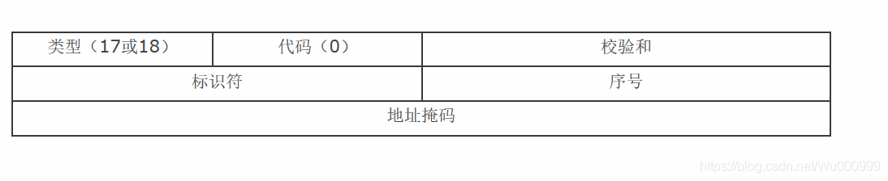

- [ICMPv4](#ICMPv4)
    - [显请求与应答报文格式](#显请求与应答报文格式)
    - [时间戳请求与应答](#时间戳请求与应答)
    - [路由器通告](#路由器通告)
    - [地址掩码请求与应答](#地址掩码请求与应答)
    - [v4消息的校验和](#v4消息的校验和)
- [ICMPv6](#ICMPv6)
    - [数据包格式](#数据包格式)
        - [控制消息集的格式](#控制消息集的格式)
        - [消息类型](#消息类型)
            - [消息的校验和](#消息的校验和)
    - [ICMPv6消息传送](#ICMPv6消息传送)
        - [消息源地址的确定](#消息源地址的确定)
        - [传送和处理规则](#传送和处理规则)
        - 


# ICMPv4


用于在IP主机、路由器之间传递控制消息。控制消息是指网络通不通、主机是否可达、路由是否可用等网络本身的消息。这些控制消息虽然并不传输用户数据，但是对于用户数据的传递起着重要的作用。

ICMP允许主机或路由报告差错情况和提供有关异常情况。ICMP是因特网的标准协议，但ICMP不是高层协议，而是IP层的协议。通常ICMP报文被IP层或更高层协议（TCP或UDP）使用。一些ICMP报文把差错报文返回给用户进程。

ICMP报文作为IP层数据报的数据，加上数据报的首部，组成数据报发送出去。

**ICMP报文的种类有两种，即ICMP差错报告报文和ICMP询问报文。**

==**显请求和应答报文格式：通常用来判断目的主机是否可以通过网络访问到**==

ICMP虽然和IP协议是同一层的协议，但是ICMP是在IP数据报的内部被传输的，紧跟着IP报文的首部（如果IP首部有可选部分，则紧跟着可选部分）

==**类型：8位的报文类型，用来标识报文**==

```
代码：8位的代码用来提供有关类型的进一步信息。

校验和：16位校验和，只覆盖ICMP报文

以上4个字节是ICMP报文中不变的，针对不同ICMP功能后面的有所不同

标识符：用于表示本ICMP进程

序列号：用于判断回射应答数据包
```


### 显请求与应答报文格式

**通常用来判断目的主机是否可以通过网络访问到。**


### 时间戳请求与应答

**网络上的主机一般是独立的，每台机器都有自己的当前时间。时间戳请求与应答用来查询目的主机系统当前的时间。返回值是自午夜开始到现在的毫秒数，通过这个数值来协调时间的统一。事实上因为延时，这个值是不准确的，通常采取多次测量求平均值的办法。**


### 路由器通告

**当主机自举以后必须至少知道本地网络上的一个路由器的地址才能够向其它网络发送报文。ICMP支持路由发现方案（Router Discovery），允许主机发现一个路由器地址。**


### 地址掩码请求与应答

**机可以通过向路由器发送一个地址掩码请求，并且接收发回的地址掩码应答报文来获得本地网络所使用的子网掩码。可以直接发送请求，但如果不知道路由器的地址，也可以采用广播的方式来发送报文。**




## 消息的校验和

和TCP以及UDP校验和计算方式相同

### 

# ICMPv6

**互联网控制消息协议第六版**（英语：**I**nternet **C**ontrol **M**essage **P**rotocol **V**ersion **6**或**ICMP** for IP**v6**，缩写：**ICMPv6**）是[互联网控制消息协议](https://zh.wikipedia.org/wiki/互联网控制消息协议)（ICMP）在[IPv6](https://zh.wikipedia.org/wiki/IPv6)协议下的新版本。它在 [RFC 4443](https://tools.ietf.org/html/rfc4443) 中被定义，其协议号（IPv6的Next Header域）为58。

ICMPv6协议定义在[OSI模型](https://zh.wikipedia.org/wiki/OSI模型)中的[网络层](https://zh.wikipedia.org/wiki/网络层)（Internet Layer），用于报告IPv6节点数据包处理过程中的错误消息和完成一些网络诊断功能（如[ping](https://zh.wikipedia.org/wiki/Ping)和[traceroute](https://zh.wikipedia.org/wiki/Traceroute)等）。它是IPv6体系总体的的一个组成部分，其基本的协议[[1\]](https://zh.wikipedia.org/wiki/互联网控制消息协议第六版#cite_note-1)必须被所有IPv6实现和IPv6节点所完整支持。

除了ICMPv4原有的功能，ICMPv6还承担了IPv4其他协议所实现的功能或IPv6所需的新功能，例如[邻居发现协议](https://zh.wikipedia.org/wiki/邻居发现协议)（同时取代了[ARP](https://zh.wikipedia.org/wiki/地址解析协议)/[RARP](https://zh.wikipedia.org/wiki/逆地址解析协议)，[SEND](https://zh.wikipedia.org/wiki/安全邻居发现)作为其安全扩展）、多播管理（取代了[IGMP](https://zh.wikipedia.org/wiki/因特网组管理协议)）。


## 数据包格式

[IANA](https://zh.wikipedia.org/wiki/IANA)（因特网地址授权委员会）定义ICMPv6的协议号为58。

其消息分为两类，**错误消息和信息消息**。ICMPv6通过IPv6数据包传送，并且IPv6的扩展头需要被设置。


### 控制消息集的格式

ICMPv6包有类型（Type），代码（Code），[校验和](https://zh.wikipedia.org/wiki/校验和)（Checksum）和消息体（Message Body）等几个字段。


- **类型**域为8位，用来表示消息的类型，如果[最高有效位](https://zh.wikipedia.org/wiki/最高有效位)是0（即值的范围是0-127），则表示一个错误消息；
    - 如果是1，则该ICMPv6包是一个信息消息。**代码**域同样为8位，其内容取决于消息类型，用来区分某一类型的多条消息。**校验和**用来检测ICMP消息和IPv6包的错误。**消息体**的内容取决于消息类型。


### 消息类型


### 消息的校验和

ICMPv6 包的校验和是一个 16 位的[二进制补码](https://zh.wikipedia.org/wiki/二進制補碼)，计算消息类型域开始的整个 ICMPv6 消息以及 IPv6 头的伪头标（pseudo-header）。计算校验和时，校验和预设为 0。伪头标中的下一个头标（Next Header）值为 58。

（注意：ICMPv6 校验和中的伪头标的内容与 IPv4 中不同，见 IPv6）。


## ICMPv6消息传送

ICMPv6通过IPv6数据包传送，当节点发送或转发ICMPv6消息时，必须确定消息的IPv6源地址和目的地址。当节点有多个单播地址，则要注意源地址的选择。


### 消息源地址的确定

如果节点有多个单播地址，则通过下面的规则确定源地址。

1. 如果消息是对发送到其中一个[单播](https://zh.wikipedia.org/wiki/單播)（unicast）地址消息的回应，则使用该地址作为源地址。
2. 如果消息是对发送到其他地址消息的回应，如：
    - [多播](https://zh.wikipedia.org/wiki/多播)（multcast）组地址
    - 该节点实现的[选播](https://zh.wikipedia.org/w/index.php?title=选播&action=edit&redlink=1)（anycast）地址
    - 其他节点的单播地址

则源地址必须为该节点所属的一个多播地址，且源地址的选择应该与从该节点发出并到达同一目的地址的其他数据包使用相同的规则，即与其他IPv6协议的数据包使用相同的[路由表](https://zh.wikipedia.org/wiki/路由表)。如果有多个路由可以到达ICMPv6包的目的地址，则可以任选其一。


### 传送和处理规则

当 ICMPv6节点收到数据包时，它应按照消息的类型采取动作。

1. 未知的ICMPv6错误消息交由上层协议处理。
2. 未知的ICMPv6消息信息丢弃。
3. 所有的错误消息必须足够长但不超过IPv6最小的[MTU](https://zh.wikipedia.org/wiki/最大传输单元)。
4. 禁止回应以下的消息或数据包：
    1. ICMPv6错误消息
    2. ICMPv6重定向消息[[3\]](https://zh.wikipedia.org/wiki/互联网控制消息协议第六版#cite_note-3)
    3. 发送到IPv6多播地址的数据包。（有两种例外情况。[[4\]](https://zh.wikipedia.org/wiki/互联网控制消息协议第六版#cite_note-excp-4)）
    4. 发送到[数据链路层](https://zh.wikipedia.org/wiki/数据链路层)广播地址的数据包。（例外情况同上[[4\]](https://zh.wikipedia.org/wiki/互联网控制消息协议第六版#cite_note-excp-4)）
    5. 源地址不确定的数据包。
5. 必须限制ICMPv6错误消息的产生速率。

为避免网络过负载，ICMPv6协议需要限制发送至同一地址的错误消息的数目。例如，如果一个节点持续转发错误的包，则ICMP会通知第一个错误包，然后根据一个固定的最小周期或者最大的网络负载，周期性提醒。禁止以ICMP错误消息回应错误消息包。


