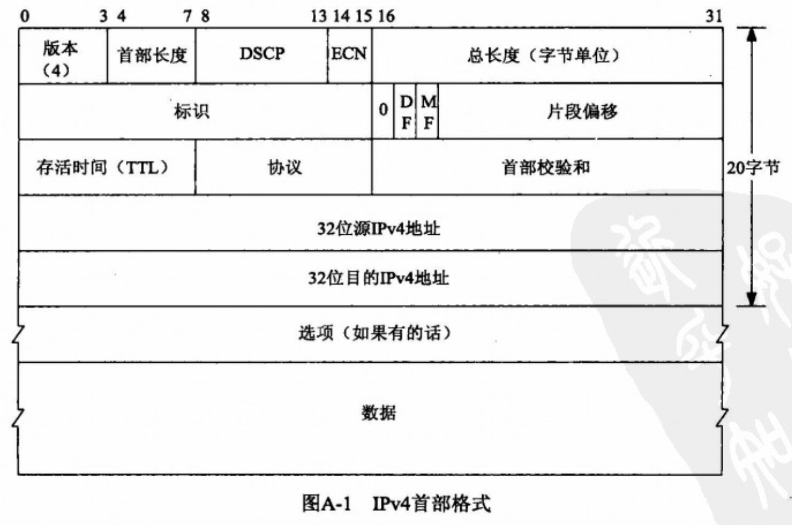
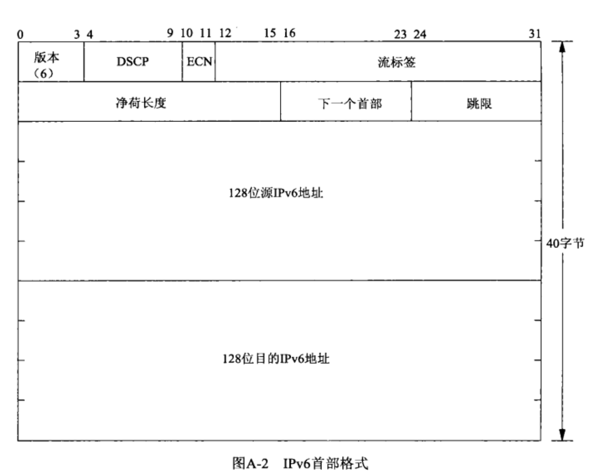
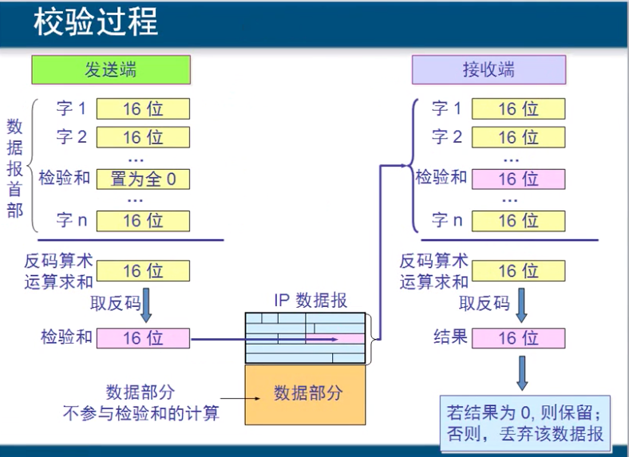
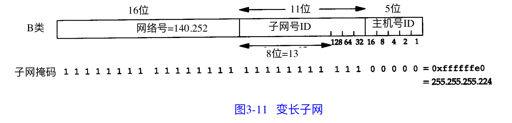

- [IP网际协议](#IP网际协议)
  - [网络号](#网络号)
  - [IP首部](#IP首部)
  - [IPv6](#IPv6)
  - [校验过程](#校验过程)
  - [IP路由选择](#IP路由选择)
  - [路由表](#路由表)
  - [IP路由器](#IP路由器)
  - [子网掩码](#子网掩码)
  - [小结](#小结)

# IP网际协议

IP是 TCP/IP 协议中最为核心的协议.

所有 TCP, UDP, ICMP, IGMP 数据都以 IP数据报格式传输.

- **特点:**
  - **不可靠 :它不能保证 I P 数据报能成功地到达目的地。 I P 仅 提 供 最 好 的传输服务。如果发生某种错误时，如某个路由器暂时用完了缓冲区， I P 有 一 个 简 单 的 错 误 处理算法:丢弃该数据报，然后发送 I C M P 消 息 报 给 信 源 端 。 任 何 要 求 的 可 靠 性 必 须 由 上 层 来 提供(如 T C P )**
  - **无连接:  I P 并 不 维 护 任 何 关 于 后 续 数 据 报 的 状 态 信 息**.


**每个数据报的处理都是相互独立的, IP数据报可以不按发送顺序接收.**

==**IP数据包中是由发送它主机的IP地址(源地址) 和接收它主机的IP地址(目的地址)**==


##  网络号

**指的是五种互联网的地址,每个地址都是32个bit 位构成,读作点分十进制**

网络号可以看成是圈定的范围.

**0.0.0.0 和 255.255.255.255 的地址是无效的. 主机号和网络号 bit位为全0 和 全1 都是无效的.**

| 类型 | 地址                            | 范围                         |
| ---- | ------------------------------- | ---------------------------- |
| A类  | 0 + 7位网络号 + 24位主机号      | 0.0.0.0 到 127.255.255.255   |
| B类  | 1 0  + 14位网络号 + 16位主机号  | 128.0.0.0 到 191.255.255.255 |
| C类  | 1 1 0 + 21位网络号  + 8位主机号 | 192.0.0.0 到 223.255.255.255 |
| D类  | 1 1 1 0  + 28位多播地址         | 224.0.0.0 到 239.255.255.255 |
| E类  | 1 1 1 1 0 + 27位 留待后用       | 240.0.0.0 到 247.255.255.255 |


## IP首部

**普通IP首部长度为20 个字节, 除非含有选项字节, 大端表示法,左边0bit最高,右边31bit最低.**



- **4位版本**:  占了4个bit, 用它来表示TCP/IP协议是哪个版本的 ipV4 或者 ipV6
- **首部长度**: 占用4个bit, 他表示数据包首部长度(byte),过了这个长度就到数据了,一般表示是20,每个bit位代表的是4字节,而不是2字节.( 0101 = 十进制的20 , 4^2 + 4= 20 )
- **服务类型TOS**: 占8个bit,前3bit的优先权字段(现在已经忽略), 后面4bit的TOS字段和 1bit未用位必须置0, 
  - **4bit 的TOS 分别代表, 最小延迟, 最大吞吐量, 最高可靠性, 最小费用.**
    - 这 4 bit 中,只能设置其中一个 1bit 为1, 其他的必须为0.
    - 也可以将这个4个 bit 全部设置成0, 代表一般服务.
- **总长度**:整个IP数据报的长度(首部+数据部分), 以字节为单位, 最高表示2^16-1 = 65535字节
  - *数据链路层* 数据长度最长 1500字节, 最大传输单元 MTU, 如果上层数据太大,那么数据链路层会执行分片, 将数据分切之后再循环全部发出.
  - 数据报 如果不分片, 数据报 数据最大不超过1480字节.
  - 据到达目标后, 网络层会查看下面的 **标识** 如果值相同就将分片组合起来, 变成完整的包. 继续向上层传递, 如果接收不完整,那么他会丢弃所有的包.
- **标识**:  标识字段唯一地标识主机发送的每一份数据报。通常每发送一份报文它的值就会加 1

  - 占16bit, 标示一个完整的数据包, 便于分片之后,组成一个完整的数据包.
- **标志** 占3bit, 目前只有前两位有意义, 最高位只能是0 , 如果没分片是010, 分片是001,或000
  - 标志字段的最低位是MF, MF=1 表示后面还有分片, 为0 表示这是最后一个分片.
  - 标志字段中间的一位是DF, 只有当DF =0 时,才允许分片.
- **片偏移** 占12bit, 当封包进行分段的时候会为各片段做好定位记录,以便在重组的时候就能够对号入座.
  - 以8字节为单位进行取值,  ( 1024/8= 128  , 这个片偏移的值就是128)

- **TTL** :  设置了数据报可以经过的最多路由器数,制定了数据报的生存时间,每过一个路由器TTL需要修改-1,

  - 当TTL字段为0时, 该数据报会被丢弃, 并发送 ICMP 报文通知源主机.
- **协议** 占8bit, 表示后面数据是什么协议( UDP/TCP/IP..... 等等很多协议),指出应将数据部分交给哪个进程来处理.

  - ICMP 协议号是 1 , IGMP 协议号是 2 , TCP 协议号是 6 , UDP 协议号是 17
  - IPv6 协议号是 41 , OSPF 协议号是 89
- **16位首部校验和**: 是根据 I P 首部计算的检验和码。它不对首部后面的数据进行计算.

  - ICMP 、 IGMP 、 UDP 和 TCP 在它们各自的首部中均含有同时覆盖首部和数据检验和码。
  - 如果检验结果为0,则丢弃该包.
  - TCP校验和计算说明:
    - 报头以2字节为单位 进行加法计算,  如果得到的结果大于2字节,那么就将高位溢出的值  降低权值 ,然后再加到结果中.   
      - 将结果取反码 写入到校验和字段即可.
    - 校验的话,  得到的值为0即可. (要加上校验值)
- **源地址** 占32bit, 源IP地址, 发送端,
- **目的地址** 占32bit, 目标地址 , 接收端.
- **选项**:  长度可变,但最长不可超过 60-20 =40字节 .目前没有任何用处 ,但是IPv6 直接取消了这个可变部分了.
- **填充** : 选项字段一直都是以 32bit 为界限, 在必要的时候插入0 进行填充,保持32bit的整数倍.

首部为32位对齐


### IPv6



**::ffff:10.120.78.40 表示 IPv4 映射到IPv6 地址**

- **版本:  6** 
- **8位流通类别字段: 可以使用 `IPV6_TCLASS` 套接字选项设置该字段**
  - **DSCP 区分服务码: 无定义目前为0** 
  - **ECN 显示拥塞通知: 无定义目前为0**
- **20位流标签: 目前只能是 0x100, 或者与分段有关系**
- **净荷长度: 是除去40字节IPv6首部之后的数据长度,  只记录拓展首部和数据的长度**
  - 如果当前为特大数据报, 那么这个值会为0, 而且实际的数值会存放在 特大净荷选项中.
- **下个首部: 指向承载的TCP头部或UDP头部, 也可能指向 首部后面的 拓展首部!**
- **跳限:  就是TTL**

IPv6 只可以在源主机进行分片, 路由器则不可以

首部为64位对齐

**分片在IPv6属于异常情况,  有个独立的分片首部来使用**


## 校验过程




### IP路由选择

在 一 般 的 体 制 中 ， I P 可以从 T C P 、 U D P 、 I C M P 和 I G M P 接 收 数 据 报 ( 即 在 本 地 生 成 的 数 据 报)并进行发送，或者从一个网络接口接收数据报(待转发的数据报)并进行发送.

- I P 层在 内存中有一个路由表。当收到一份数据报并进行发送时，它都要对该表搜索一次
- **当数据报 来自某个网络接口时， I P 首先检查目的 I P 地址是否为本机的 I P 地址之一或者 I P 广 播 地 址.**
  - 如果是本机IP地址或IP广播地址的话,该数据报就会送到由IP首部协议字段所制定的协议模块进行处理.
  - **如果数据报的目的不是这些地址,那么会进行如下处理:**
    - 数据报 会被丢弃.
    - **如果IP 层被设置为路由器功能,那么会对数据报通过路由表的功能进行转发.**

#### 路由表

```tex
路由表中的每一项都包含下面这些信息:
		1. 目的IP地址或主机地址.
		2. 下一站(或下一跳) 路由器(next-hop router) 的IP地址.
		3. 标志, 包括: 
    					- 指明目的IP是网络地址还是主机地址,  
    					- 指明下一站路由器是否为真正的下一站路由器,还是一个直接相连的接口
    4. 为数据报的传输指定一个网络接口.
```

#### IP路由器

```tex
IP路由选择是逐跳地(hop-by-hop)进行的。从这个路由表信息可以看出，IP并不知道到达任何目的的完整路径(当然，除了那些与主机直接相连的目的)。所有的IP路由选择只为数据报传输提供下一站路由器的IP地址。它假定下一站路由器比发送数据报的主机更接近目的，而且下一站路由器与该主机是直接相连的。

IP路由选择主要完成以下这些功能:  (网络号是属于IP地址的一部分)
	1. 搜索路由表, 寻找能与目的IP地址完全匹配的表目(网络号和主机号都要匹配)
				如果找到,则把数据报发送给该表目指定的下一站路由器或直接相连的网络接口.(看标志字段)
	2. 搜索路由表, 寻找与目的网络号相匹配的表目,
			  如果找到,则把数据报发送给该表目指定的下一站路由器或直接相连的网络接口.
  3. 搜索路由表, 寻找标为 “默认“ 的条目, 如果找到,则把数据报发送给该表目指定的下一站路由器.

如果上面的步骤都没有成功, 则该数据报会被丢弃,并向生成数据报的应用程序返回一个“主机不可达”错误. 

```

### 子网掩码

除了IP地址以外，主机还需要知道有多少比特用于子网号及多少比特用于主机号。这是在引导过程中通过子网掩码来确定的.

**子网掩码是一个比特掩码.**

这个掩码是一个32bit的值，其中值为1的比特留给网络号和子网号，为0的比特留给主机号.

- B类子网掩码:
  - 16位网络号 + 8位子网号 + 8位主机号
  - `1111  1111  1111 1111    +  1111 1111   +  0000 0000 `
  - 255.255.255.0
- 子网号并不是固定的.


- 给定IP地址和子网掩码后, 
  - 主机就可以确定 IP 数据报的 目的地.
  - 本子网上的主机
  - 本网络中其他子网中的主机
  - 其他网络上的主机
  - 知道子网号与主机号之间的分界线,

## 小结

- I P 路由 选择，并指出主机的路由选择可以非常简单:如果目的主机在直接相连的网络上，那么就把 数据报直接传给目的主机，否则传给默认路由器。

- 在进行路由选择决策时，主机和路由器都使用路由表。在表中有三种类型的路由:

  - 特定主机型
  - 特定网络型
  - 默认路由型

- 路由表中的表目具有一定的优先级。在选择路由时，主 机路由优先于网络路由，最后在没有其他可选路由存在时才选择默认路由

- I P 路由选择是通过逐跳来实现的

  - 数据报在各站的传输过程中目的 I P 地 址 始 终 不 变 ， 但 是封装和目的链路层地址在每一站都可以改变

- 大多数的主机和许多路由器对于非本地网络 的数据报都使用默认的下一站路由器

- 用于子网号的比特数通过子网掩码来指定

  




TCP、UDP数据包最小值的确定

     在用UDP局域网通信时，经常发生“Hello World”来进行测试，但是“Hello World”并不满足最小有效数据(64-46)的要求，为什么小于18个字节，对方仍然可用收到呢？因为在链路层的MAC子层中会进行数据补齐，不足18个字节的用0补齐。但当服务器在公网，客户端在内网，发生小于18个字节的数据，就会出现接收端收不到数据的情况。
    
       以太网EthernetII规定，以太网帧数据域部分最小为46字节，也就是以太网帧最小是6＋6＋2＋46＋4＝64。除去4个字节的FCS，因此，抓包时就是60字节。当数据字段的长度小于46字节时，MAC子层就会在数据字段的后面填充以满足数据帧长不小于64字节。由于填充数据是由MAC子层负责，也就是设备驱动程序。不同的抓包程序和设备驱动程序所处的优先层次可能不同，抓包程序的优先级可能比设备驱动程序更高，也就是说，我们的抓包程序可能在设备驱动程序还没有填充不到64字节的帧的时候，抓包程序已经捕获了数据。因此不同的抓包工具抓到的数据帧的大小可能不同。下列是本人分别用wireshark和sniffer抓包的结果，对于TCP 的ACK确认帧的大小一个是54字节，一个是60字节，wireshark抓取时没有填充数据段，sniffer抓取时有填充数据段。


