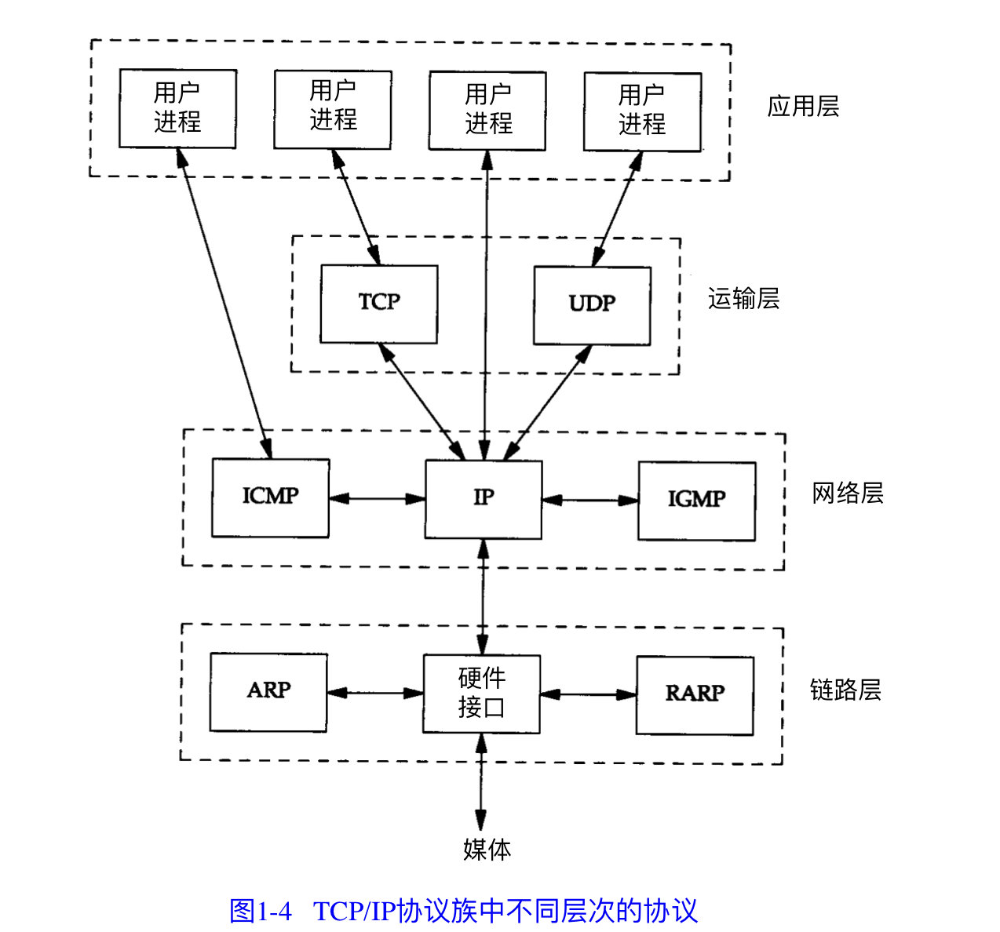
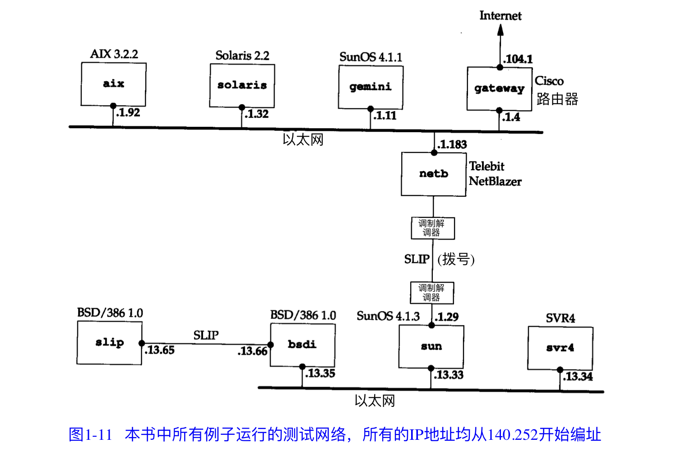

# TCP-IP
### TCP/IP 协议族的四个层次  分层

**在 T C P / I P 中，网络层和运输层之间的区别是最为关键的:`网络层( I P ) 提 供 点 到 点 的 服 务` ， `而传输层( T C P 和 U D P ) 提 供 端 到 端 的 服 务`.**

- **应用层**
  - **应用程序到应用程序**
  - 负责处理特定的应用程序细节
  - Telnet, FTP 和 e-mail
- **传输层**
  - **进程到进程**
  - 主要为两台主机上的应用程序提供端到端的通信
  - TCP(传输控制协议) 和 UDP(用户数据报协议)
  - 它所做的工作包括把应用程序交给它的数据分 成合适的小块交给下面的网络层，确认接收到的分组，设置发送最后确认分组的超时时钟 等
- **网络层**
  - **主机到主机**
  - 处理分组在网络中的活动，例如分组的选路 , 包括IP协议(网际协议), ICMP(internet互联网控制报文协议) 和 IGMP(internet 组管理协议)
- **链路层**
  - **设备到设备**
  - 设备驱动程序及接口卡, 负责数据的接受和发送
  - ARP协议和RARP协议就在这一层 (地址解析协议, 通过IP地址来寻找对方的MAC地址的)

**iternet 意思是用一个共同的协议族把多个网络连接在一起。而 Internet 指 的 是 世 界 范 围 内通过 T C P / I P 互相通信的所有主机集合。**

**I n t e r n e t是一个 i n t e r n e t ，但 i n t e r n e t 不等 于 I n t er n et**

**所有主机名属于 `.tuc.noao.edu`这个域,例如右下角那台的完整主机名是:`svr4.tuc.noao.edu`**

