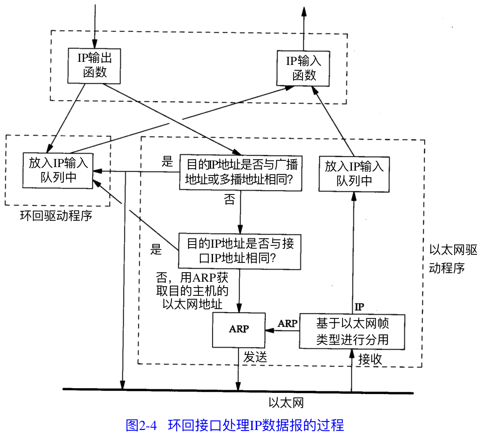

# 链路层

- 链路层主要由三个目的
  - 为 IP 模块发送和接收IP 数据报
  - 为 ARP 模块发送ARP请求和接收ARP 应答;
  - 为RARP 发送 RARP 请求和接收 RARP 应答.

TCP/IP 支持多种不同的链路层协议, 这取决于网络所使用的硬件.（以太网,令牌环网,FDDI,RS-232串行线路).

**以太网的单个数据包不得少于46字节(少的要补齐),也不可大于1500字节,如果算上数据链路层的添加的头部和尾部,应该是1500+14+4=1518字节**

**IEEE802的单个数据包不得少于46字节(少的要补齐),也不可大于1492字节,如果算上数据链路层的添加的头部和尾部,应该是1492+14+4=1510字节**

### 以太网和 IEEE802 封装

**下面是以太网封装, 上面的内容是 802.2 与 802.3标准的格式(他俩格式相同)**

- 802.3 长度字段 不包括 CRC 校验码
- CRC字段用于帧内后续字节差错的循环冗余校验(校验和) , 它也被称为FCS与帧校验序列.
- 802.3规定数据部分最短为38字节,不足时使用 pad进行插入补充
- 以太网,要求数据部分最少是46字节.(不足时插入 pad 字节)

### PPP :点对点协议

- PPP 点对点协议修改了 SLIP协议中的所有缺陷, PPP包括以下三个部分:
  - 在串行链路上封装IP 数据报的方法, PPP支持数据为8位和无奇偶校验的异步模式,还支持面向比特的同步连接
  - 建立,配置及测试数据链路的链路控制协议(LCP),它允许通信双方进行协商,以确定不同的选项.
  - 针对不同网络层协议的网络控制协议(NCP)体系.

### localhost 环回接口

**A类 网络号 127 就是为 换回接口预留的.  大多数系统会把IP地址 127.0.0.1分配给这个接口,并命名为 `localhost` .**

一旦传输层检测到目的端地址是环回地址时, 应该可以省略部分传输层和所有网络层的逻辑操作. IP数据报离开网络层时会把它返回给自己.

- 关键点:
  - 传给环回地址(127.0.0.1) 的任何数据均作为IP输入.
  - 传送广播地址或多播地址的数据赋值一份传给环回接口, 然后送到以太网上, 这是因为广播传送和多播传送的定义包含主机本身, 
  - 任何传送给该主机IP地址的数据均送到环回接口
    - 送给主机本身IP地址的IP数据报一般不出现在相应的网络上

### 最大传输单元 MTU

一个包含所有内容的帧的最大长度 的上限, 就是 MTU.

当IP层有一个数据要传, 但是数据长度比链路层的 MTU 还大,那么IP层就需要进行分片, 把数据报分成若干片, 每片都小于 MTU.

**使用命令`netstat` 可以打印出网络接口的 MTU**

| 网络                      | MTU字节 |
| ------------------------- | ------- |
| 超通道                    | 65535   |
| 16Mb/s  令牌环(IBM)       | 17914   |
| 4Mb/s  令牌环(IEEE 802.5) | 4464    |
| FDDI                      | 4352    |
| 以太网                    | 1500    |
| IEEE 802.3/802.2          | 1492    |
| X.25                      | 576     |
| 点对点(低时延)            | 296     |

### 路径MTU

两个主机之间的通信要通过多个网络,那么每个网络的链路层就可能有不同的MTU, 重要的不是两台主机所在网络的 MTU的值,重要的是两台通信主机路径中的最小MTU, 被称作路径MTU.

### 串行线路吞吐量计算

如果线路速率是 `9600b/s`,而一个字节有 8bit, 加上一个起始比特和一个停止比特,那么一个字节就变成了 10bit, 那么线路的速率就是 `960B/s`(字节/秒).

使用命令`netstat -r -ll` 可以得到目前系统上的接口及其 MTU 数值.

