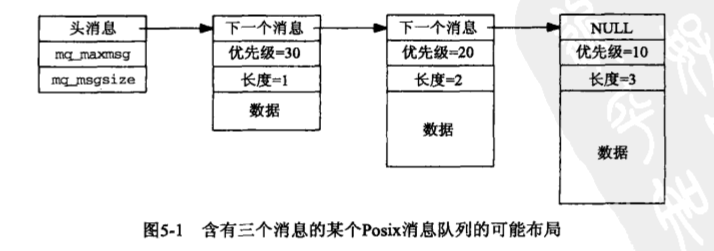

**进程间通信(Interprocess Communication,  IPC),  IPC的基本设计目标是高性能**

**Posix是 可移植操作系统接口 `(Portable Operating System Interface)` 首字母的缩写**

- [所有PosixIPC共同属性](#所有PosixIPC共同属性)
    - [IPC名字](#IPC名字)
    - [创建和打开IPC通道函数](#创建和打开IPC通道函数)
        - [创建或打开一个IPC对象的逻辑](#创建或打开一个IPC对象的逻辑)
    - [IPC权限](#IPC权限)
    
- [Posix消息队列](#Posix消息队列)
    - [mq_open函数](#mq_open函数)
    - [mq_close函数](#mq_close函数)
    - [mq_unlink函数](#mq_unlink函数)
    - [mq_getattr和mq_setattr函数](#mq_getattr和mq_setattr函数)
        - [获得消息队列限制](#获得消息队列限制)
    - [mq_send和mq_receive函数](#mq_send和mq_receive函数)
    
- [Posix信号量](#Posix信号量)
  
    - [信号量域互斥锁以及条件变量之间的三个差异](#信号量域互斥锁以及条件变量之间的三个差异)
    - [二值信号量](#二值信号量)
    - [Posix提供的两种信号量包括有名信号量与基于内存的无名信号量](#Posix提供的两种信号量包括有名信号量与基于内存的无名信号量)
        - [有名信号量专属函数](#有名信号量专属函数)
        - [基于内存的无名信号量专属函数](#基于内存的无名信号量专属函数)
        - [两种信号量共享的操作函数](#两种信号量共享的操作函数)
        - [两种信号量的限制](#两种信号量的限制)
        - [简单范例](#简单范例)
    
- [Posix共享内存区_IPC效率最快](#Posix共享内存区_IPC效率最快)

    - [内存映射区](#内存映射区)

    - [共享内存区对象](#共享内存区对象)

        - [mmap函数](#mmap函数)
        - [ftruncate和fstat函数](#ftruncate和fstat函数)
            - [简单范例](#简单范例)

        - 


- **以下三种类型的IPC 合称为 Posix IPC**
    - Posix 消息队列
    - Posix 信号量
    - Posix 共享内存区


**下面是所有Posix IPC函数汇总, 都需要  <fcntl.h> <sys/stat.h> 头文件**

|                               |  消息队列  |    信号量     |  共享内存区  |
| :---------------------------: | :--------: | :-----------: | :----------: |
|          **头文件**           | <mqueue.h> | <semaphore.h> | <sys/mman.h> |
| **创建, 打开或删除IPC的函数** |  mq_open   |   sem_open    |   shm_open   |
|                               |  mq_close  |   sem_close   |  shm_unlink  |
|                               | mq_unlink  |   sem_init    |              |
|                               |            |  sem_destroy  |              |
|     **控制IPC操作的函数**     | mq_getattr |               |  ftruncate   |
|                               | mq_setattr |               |    fstat     |
|        **IPC操作函数**        |  mq_send   |   sem_wait    |     mmap     |
|                               | mq_receive |  sem_trywait  |    munmap    |
|                               | mq_notify  |   sem_post    |              |
|                               |            | sem_getvalue  |              |

**MacOs 不支持 mqueue.h 消息队列**


# 所有PosixIPC共同属性

## IPC名字

- Posix.1 是这样描述 Posix IPC名字的
    - **它必须符合已有的路径名规则 (必须最多 PATH_MAX 字节构成, 包括 结尾的空字节)**
    - **如果它以斜杠符 开头, 那么对这些函数的不同调用将访问同一个队列, 如果它不以斜杠符开头, 那么效果取决于实现**
    - **名字中额外的斜杠符的解释由实现定义**


- **三种类型的 Posix IPC都使用 Posix IPC名字   来进行标识**
    - mq_open, sem_open, shm_open  这三个函数的第一个参数就是这样的一个名字, 它可能是某个文件系统中的一个真正的路径名, 也可能不是


```c
/*
	错误判断和名称修改  
*/

#include    <stdarg.h>        /* ANSI C header file */
#include    <syslog.h>        /* for syslog() */
#include <stdlib.h>    // getenv()
#include <sys/errno.h>
#include <stdio.h>
#include <string.h>
#include <unistd.h>
#include <sys/syslimits.h>

#define MAXLINE  1024
int        daemon_proc;        /* set nonzero by daemon_init() */

static void
err_doit(int errnoflag, int level, const char *fmt, va_list ap)
{
    int        errno_save, n;
    char    buf[MAXLINE];

    errno_save = errno;        /* value caller might want printed */
#ifdef    HAVE_VSNPRINTF
    vsnprintf(buf, sizeof(buf), fmt, ap);    /* this is safe */
#else
    vsprintf(buf, fmt, ap);                    /* this is not safe */
#endif
    n = strlen(buf);
    if (errnoflag)
        snprintf(buf+n, sizeof(buf)-n, ": %s", strerror(errno_save));
    strcat(buf, "\n");

    if (daemon_proc) {
        syslog(level, buf);
    } else {
        fflush(stdout);        /* in case stdout and stderr are the same */
        fputs(buf, stderr);
        fflush(stderr);
    }
    return;
}


void
err_sys(const char *fmt, ...)
{
    va_list        ap;

    va_start(ap, fmt);
    err_doit(1, LOG_ERR, fmt, ap);
    va_end(ap);
    exit(1);
}


char *
px_ipc_name(const char *name)
{
    char    *dir, *dst, *slash;

    if ( (dst = malloc(PATH_MAX)) == NULL)
        return(NULL);

        /* 4can override default directory with environment variable */
    if ( (dir = getenv("PX_IPC_NAME")) == NULL) {
#ifdef    POSIX_IPC_PREFIX
        dir = POSIX_IPC_PREFIX;        /* from "config.h" */
#else
        dir = "/tmp/";                /* default */
#endif
    }
        /* 4dir must end in a slash */
    slash = (dir[strlen(dir) - 1] == '/') ? "" : "/";
    snprintf(dst, PATH_MAX, "%s%s%s", dir, slash, name);

    return(dst);            /* caller can free() this pointer */
}
/* end px_ipc_name */

char *
Px_ipc_name(const char *name)
{
    char    *ptr;

    if ( (ptr = px_ipc_name(name)) == NULL)
        err_sys("px_ipc_name error for %s", name);
    return(ptr);
}


int main(int argc, const char * argv[]) {
    const char* name = "test";
    printf("%s\n", Px_ipc_name(name));
    return 0;
}
```


## 创建和打开IPC通道函数


```c
#include <sys/stat.h>
#include <fcntl.h>

#include <semaphore.h>
sem_t* sem_open(const char *name, int oflag, ...);  // 新信号量的地址
sem_t* sem_open(const char *name, int oflag);
sem_t* sem_open(const char *name, int oflag, mode_t mode, unsigned int value);  //创建新的对象

<sys/mman.h>
 int shm_open(const char *name, int oflag, ...);
 int shm_unlink(const char *name);  // 释放共享内存区, 函数执行相反的操作，删除先前由 shm_open() 创建的对象

#include <mqueue.h>
mqd_t mq_open(const char *name, int oflag);  // 消息队列描述符
mqd_t mq_open(const char *name, int oflag, mode_t mode, struct mq_attr *attr);


/*
参数:  name : 名字. mq_open()函数只允许在根目录下创建.   /tmp.posixMsg
     oflag : 怎样打开所请求的对象, 下面表格有说明, 创建新对象时,至少需要 mode 参数
      mode : 指定权限位,  S_IRUSR 用户读, S_IWUSR 用户写, S_IRGRP 属组成员读, S_IWGRP 属组成员写
                        S_IROTH 其他用户读, S_IWOTH 其他用户写
                 会与 umask 进行掩码修正.
     value : 指定新信号量的初始值
   		attr : 指定队列允许的最大消息数和最大消息大小.
   		
返回值:  成功时，sem_open() 返回新信号量的地址；该地址在调用其他信号量相关函数时使用。出现错误时，sem_open() 返回 SEM_FAILED，并设置 errno 以指示错误。
		    成功时， shm_open() 返回一个非负的文件描述符。失败时，shm_open() 返回 -1。 shm_unlink() 成功时返回 0，错误时返回 -1。
		    成功时，mq_open() 返回一个消息队列描述符供其他消息队列函数使用。出错时，mq_open() 返回 (mqd_t) -1，设置 errno 以指示错误。
*/
```


| oflag 参数 说明 |  mq_open   | sem_open | shm_open |
| :-------------: | :--------: | :------: | :------: |
|      只读       |  O_RDONLY  |          | O_RDONLY |
|      只写       |  O_WRONLY  |          |          |
|      读写       |   O_RDWR   |          |  O_RDWR  |
| 若不存在则创建  |  O_CREAT   | O_CREAT  | O_CREAT  |
|   排他性创建    |   O_EXCL   |  O_EXCL  |  O_EXCL  |
|   非阻塞模式    | O_NONBLOCK |          |          |
| 若已存在则截断  |            |          | O_TRUNC  |


### 创建或打开一个IPC对象的逻辑

|     oflag标志     |      对象不存在      |      对象已存在      |
| :---------------: | :------------------: | :------------------: |
|    无特殊标志     | 出错, errno = ENOENT | 成功, 引用已存在对象 |
|      O_CREAT      |  成功,  创建新对象   | 成功, 引用已存在对象 |
| O_CREAT \| O_EXCL |  成功,  创建新对象   | 出错, errno = EEXIST |

- 起始位置
    - **对象已存在?**
        - 否: O_CREAT设置了?
            - 否: 出错返回  errno = ENOENT
            - 是: 表格是否已满?
                - 否 : 成功创建新对象, 成功返回
                - 是:  出错返回  errno = ENOSPC
        - 是 : O_CREAT 和 O_EXCL 都设置了?
            - 是:  出错返回, errno = EEXIST
            - 否:  访问权限允许 ? 
                - 否: 出错返回 , errno = EACCES
                - 是:  成功返回.


## IPC权限

**新的消息队列, 有名信号量 或 共享内存区对象 是由其 oflag参数中含有 O_CLEREAT 标志的 mq_open, sem_open或 shm_open函数创建的.**

- **当这三个函数打开一个 ==已存在的== 消息队列,信号量或共享内存区对象时 ( 或者未 指定 O_CREAT,或者指定了 O_CREAT 但没有指定 O_EXCL,  同时对象已经存在),  将基于如下信息执行权限测试:**
    - ***创建时赋予该 IPC 对象的权限位;***
    - ***所请求的访问类型 (O_RDONLY , O_WRONLY 或 O_RDWR;***
    - ***调用进程的有效用户ID,  有效组 ID 以及各个辅助组ID***


- **大多数Unix内核按如下步骤 执行权限测试:**
    - ***如果当前进程的有效用户 ID 为0 (root超级用户), 那就允许访问***
    - ***在当前进程的有效用户 ID 等于该 IPC 对象的属主 ID 的前提下, 如果相应的用户访问权限位已设置, 那就允许访问, 否则拒绝访问 ( rwx )***
    - **在当前进程的有效组 ID 或它的某个辅助组 ID 等于该 IPC 对象的组 ID 的前提下, 如果相应的组访问权限位已设置, 就允许访问, 否则拒绝**
    - **如果相应的 其他用户访问权限位已设置, 就允许访问, 否则就拒绝访问**


# Posix消息队列

**消息队列可认为是一个链表, 拥有权限时 可以放置和取走消息**

==**每一个消息都是一个记录, 它由发送者赋予一个优先级**==

- **消息队列是具有随内核的持续性**
    - **一个进程可以往某个队列写入一些消息, 然后终止,  再让另一个进程在某个时刻读出这些消息**

> - ==**与System V 消息队列的差别:**==
>     - **Posix总是返回最高优先级的最早消息,  而System V 可以指定返回任意优先级的消息**
>     - **向一个空队列放置一个消息时, Posix消息队列允许产生一个信号或启动一个线程, 而System V则不提供类似机制**
>     - ==**消息队列中 消息的属性:**==
>         - **无符号整数优先级(Posix) , 长整形 (System V)**
>         - **消息的数据部分长度 (可以为0)**
>         - **数据本身 ( 如果长度大于0 )**




## Poxis消息队列相关函数

==**编译携带下面函数的代码时, 要在gcc 添加选项  `-lrt`,  范例: `gcc ClieSend.c -o c.out -lrt`**==

### mq_open函数

```c
// 创建或打开 一个消息队列,  一个进程最多同时打开的消息队列数目为 MQ_OPEN_MAX , 定义在 <unistd.h>
#include <unistd.h>
#include <mqueue.h>
mqd_t mq_open(const char *name, int oflag);  // 消息队列描述符
mqd_t mq_open(const char *name, int oflag, mode_t mode, struct mq_attr *attr);
/*
参数:  name : 名字, 必须是 /开头,  而且只允许在根目录下创建.   /tmp.posixMsg
     oflag : 怎样打开所请求的对象, 创建新对象时,至少需要 mode 参数
      mode : 指定权限位,  S_IRUSR 用户读, S_IWUSR 用户写, S_IRGRP 属组成员读, S_IWGRP 属组成员写
                        S_IROTH 其他用户读, S_IWOTH 其他用户写
                 会与 umask 进行掩码修正.
   		attr : 指定队列允许的最大消息数和最大消息大小.
返回值:  成功时，mq_open() 返回一个消息队列描述符供其他消息队列函数使用。出错时 -1，设置 errno 以指示错误。
*/

| oflag 参数 说明 |  mq_open   | sem_open | shm_open |
| :-------------: | :--------: | :------: | :------: |
|      只读       |  O_RDONLY  |          | O_RDONLY |
|      只写       |  O_WRONLY  |          |          |
|      读写       |   O_RDWR   |          |  O_RDWR  |
| 若不存在则创建    |  O_CREAT   | O_CREAT  | O_CREAT  |
|   排他性创建     |   O_EXCL   |  O_EXCL  |  O_EXCL  |
|   非阻塞模式     | O_NONBLOCK |          |          |
| 若已存在则截断    |            |          | O_TRUNC  |
```


### mq_close函数

```c
// 关闭 当前进程消息队列的一个描述符, 使其 消息队列的引用计数 减一, 当引用计数为0时, 该消息队列也不会被删除, 只有当调用 mq_unlink()  函数的时候 才会在引用计数为0时 彻底删除消息队列

#include <mqueue.h>
int  mq_close( mqd_t mqdes);

/* 参数:  mqes:  mq_open 的返回值, 也就是一个描述符
 返回值:  成功时 mq_close() 返回 0；出现错误时，返回 -1，并设置 errno 以指示错误。
```


### mq_unlink函数

```c
//   mq_unlink() 删除指定的消息队列名称。 使其 消息队列的引用计数 减一, 当引用计数为0时, 该消息队列就会被删除
//     消息队列名称会立即删除, 只是代表无法让新的进程来使用这个消息队列了. 并不会限制当前正在通信的队列进程

#include <mqueue.h>
int mq_unlink(const char* name);

/* 参数 :  name: 消息队列的名称
 返回值 :  成功时 mq_unlink() 返回 0；出现错误时，返回 -1，并设置 errno 以指示错误。
*/
```


### mq_getattr和mq_setattr函数

```c
// 获得消息队列的 四个属性,  和  设置消息队列的某个属性
#include <mqueue.h>
int  mq_getattr (mqd_t mqdes, struct mq_attr*  attr);
int  mq_setattr (mqd_t mqdes, const struct mq_attr* attr, struct mq_attr* oarrt);

// 返回值: 成功时 mq_getattr() 和 mq_setattr() 返回 0； 出错时，返回 -1，设置 errno 以指示错误
struct mq_attr {
  long mq_flags;       /* 设置阻塞和非阻塞 0 or O_NONBLOCK ,只能用 mq_setattr() 设置*/
  long mq_maxmsg;      /* 队列中消息的最大个数, 只能在 mq_open() 时设置 */
  long mq_msgsize;     /* 每条消息的最大长度,  只能在 mq_open() 时设置 */
  long mq_curmsgs;     /* 当前在队列中的消息数 */
};
```


### 获得消息队列限制

```c
#include <unistd.h>
#include <stdio.h>
#include <mqueue.h>
#include <limits.h>
int main(void){
	printf("MQ_OPEN_MAX=%ld, MQ_PRIO_MAX=%ld\n", 
            sysconf(_SC_MQ_OPEN_MAX), sysconf(_SC_MQ_PRIO_MAX));
	return 0;
}
```


### mq_send和mq_receive函数

```c
// 往队列内放置和取走一个消息,  但是无法确定消息的发送者和接受者
//   每个消息都有一个优先级,  它是一个小于 MQ_PRIO_MAX 的无符号整数 , 这个数值至少是 32.  <unistd.h>
//      数字越大, 优先级越高
#include <mqueue.h>
#include <unistd.h>

int  mq_send(mqd_t mqdes, const char* ptr, size_t len, unsigned int prio);
ssize_t mq_receive(mqd_t mqdes, char* ptr, size_t len, unsigned int* priop);

/* 参数:  mqdes: 描述符
          ptr : 发送缓冲区和接受消息的缓冲区, 需要使用 malloc分配, 并且由发送者创建,由接受者删除
          len : 表示发送消息ptr长度 和 缓冲区ptr的长度,要注意 mq_attr.qm_maxsize 的限制,或大或小
                    应该使用 mq_getattr() 来确定缓冲区的大小, 接受缓冲区要设置的稍微大一些
         prio : 待发送消息的优先级. 其值必须小于 MQ_PRIO_MAX, 也可以不使用优先级, 设置为0即可
        priop : 接收到消息的优先级, 数字越大, 优先级越高, 不使用优先级时,应该设置为 空指针
 返回值:  
     mq_send()   成功时  返回零；出现错误时，返回 -1，并设置 errno 以指示错误。
     mq_receive() 成功时，返回接收到的消息中的字节数；出现错误时，返回 -1，并设置 errno 以指示错误。
*/
```


# Posix信号量

**信号量是一种用于提供不同进程间或一个给定进程的不同线程间同步手段的原语**

- **三种类型的信号量**
    - **Posix有名信号量** : 使用 Poxis名字标识, 可用于进程或线程间同步
    - **Posix 基于内存的信号量**  : 存放在共享内存区中,  可用于线程或进程间的同步
    - **System V 信号量**  :  在内核中维护,  可用于进程或线程间的同步


## 信号量域互斥锁以及条件变量之间的三个差异

- **信号量域互斥锁以及条件变量之间的三个差异:**
    - 互斥锁必须由上锁的线程执行解锁, 信号量的挂出却不必由执行过它的等待操作的同一线程执行
    - 互斥锁要么锁住要么解开
    - **信号量有一个与之关联的状态, 信号量的挂出总是被记住的**


## 二值信号量

二值信号量  其值为1或0 的信号量,  System V 是内核维护, Posix 则不必在内核中维护, 可以在文件系统的路径名对应的名字来标识.

- **二值信号量有三种操作, 且都是原子操作**
    - **创建**  :创建一个信号量, 指定初始值, 通常是1 或0 
    - **等待**  : 等待一个信号量, 会测试信号量的值, 其值小于或等于0, 就阻塞等待, 一旦大于0, 那么就将它减1
    - **挂出**  : 挂出一个信号量, 将信号量的值 加1 .


## Posix提供的两种信号量包括有名信号量与基于内存的无名信号量

==**编译时 需要使用  `gcc  -pthread`  参数**==

==**不涉及多进程间同步时,使用 基于内存的无名信号量,  否则就使用有名信号量**==

==**信号量是不会继承的**==


### 有名信号量专属函数

​	**支持跨进程和线程使用.**

  **有名信号量是 随内核持续, 虽然有名信号量在进程关闭时 被迫关闭, 但是没有被删除, 其他进程依然可以使用**

```c
// 有名信号量 专属 函数
#include <semaphore.h>

typedef   int  sem_t;

sem_t* sem_open( const char* name, int oflag, ...  /* mode_t mode, unsigned int value */);
/* 创建 或 打开一个 已存在的有名信号量
   name : 信号量文件的路径和文件名, 跨进程就是看这个
  oflag : 可以是0 ,或 O_CREAT 或 O_CREAT | O_EXCL  ,  
            有的系统可能会要求 O_RDONLY , O_WRONLY 或 O_RDWR 标志, 
             如果添加这些标志出现问题那么会返回一个 EACCES 错误, 则代表这个系统不支持这三个标志
   mode : 如果指定了 oflag | O_CREAT ,那么 第三个和第四个参数是需要的. 
             指定权限位,  S_IRUSR 用户读, S_IWUSR 用户写, S_IRGRP 属组成员读, S_IWGRP 属组成员写
                        S_IROTH 其他用户读, S_IWOTH 其他用户写
                 会与 umask 进行掩码修正.
  value : 指定信号量的初始值一般都为正数, 但不能大于  , 不可大于 _POSIX_SEM_VALUE_MAX 这个值至少是 32767
返回值 : 有名信号量的结构体指针, 用于 sem_close , sem_unling 等函数.
        出错时 则为  SEM_FAILED
*/

int    sem_close(sem_t *sem);
/* 关闭一个有名信号量, 当进程终止时, 会自动执行这个操作关闭有名信号量, 但是还会存在于内核中的
   sem :  sem_open() 的返回值
	返回值 : 成功返回0,  失败返回-1
*/

int    sem_unlink(sem_t *sem);
/* 删除一个有名信号量, 但却要等到 信号量被 sem_close() 关闭 才能执行删除
    sem :  sem_open() 的返回值
	返回值 : 成功返回0,  失败返回-1
*/
```

### 基于内存的无名信号量专属函数

==**如果是子进程要使用这个信号量, 那么必须将 信号量的值sem 写入共享内存区中.  子进程不会继承父进程的信号量**==

**MacOS没有实现这个内容**

```c
// 基于内存的无名信号量 专属 函数
#include <semaphore.h>
int sem_init(sem_t* sem, int shared, unsigned int value);
/*初始化信号量, 分配内存 ,  不需要调用 sem_open() 函数
    sem : 应该是一个已经分配了内存的 sem值
 shared : 为0时 在本进程中的线程间共享,  为1时 在多进程间共享
  value : 无名信号量的初始值  , 不可大于 _POSIX_SEM_VALUE_MAX
返回值: 成功返回 0；出错时，返回 -1，并设置 errno 以指示错误。
*/

int sem_destroy(sem_t* sem);
/*销毁信号量 ,使用完之后 就必须使用这个来摧毁内存
 sem  :  sem_init() 初始化的值
返回值: 成功返回 0；出错时，返回 -1，并设置 errno 以指示错误。
*/
```

### 两种信号量共享的操作函数

```c
// 两种信号量 共享的操作函数
#include <semaphore.h>
int  sem_wait(sem_t* sem);
/*加锁,  调用一次相当于对 sem 初始化的value 做了 --(自减) 操作
  如果信号量的值为0, 线程会阻塞.  原子操作
    sem :  sem_open() 的返回值
	返回值 : 成功返回0,  失败返回-1  , 如果被信号中断 那么会立即返回, 错误为 EINTR
*/

int  sem_trywait(sem_t* sem)
/*  尝试加锁,  当 sem == 0 时加锁失败, 不阻塞, 直接返回
    sem :  sem_open() 的返回值
  返回值 : 成功返回0,  失败返回-1 , 返回一个 EAGAIN 错误
*/
 
int  sem_post(sem_t* sem);
/*  解锁,  对 sem 初始化的 value 做 ++ (自增) 操作, 不能大于value的上限.
    sem :  sem_open() 的返回值
  返回值 : 成功返回0,  失败返回-1
*/

int  sem_getvalue(sem_t *sem, int *valp);
/*  获得 当前信号量的值
    sem :  sem_open() 的返回值
	 valp :  获得传出参数, 是当前信号量的值
返回值 : 如果当前信号量已上锁 会返回0  或某个负数 其绝对值是等待该信号量解锁的线程数
*/
```


### 两种信号量的限制

```c
#include <semaphore.h>
#define _POSIX_SEM_NSEMS_MAX    // 一个进程可同时打开着的最大信号量数. (至少 256)
#define _POSIX_SEM_VALUE_MAX    // 一个信号量的最大值 (32767)
```


### 简单范例

```c
#include <sys/errno.h>
#include <unistd.h>
#include <fcntl.h>
#include <signal.h>
#include <semaphore.h>
#ifdef __APPLE__
	#include <pthread/pthread.h>
#else
	#include <pthread.h>
#endif

int main(int argc, char* argv[]){
    int    c = 0, flags = 0;
    sem_t  *sem = NULL;
    unsigned int value = 1;
    
    flags = O_RDWR | O_CREAT;
    value = 1;
    
    printf("_POSIX_SEM_NSEMS_MAX = %d, SEM_VALUE_MAX = %d\n" ,
            _POSIX_SEM_NSEMS_MAX,SEM_VALUE_MAX);
    
    sem = sem_open(SEQFILE, flags ,FILE_MODE, value );
    if( sem == NULL)
        err_quit("sem error", "");
    sem_close(sem);
    sem_unlink(SEQFILE);
    return 0;
}
```


# Posix共享内存区_IPC效率最快

==**共享内存区是IPC效率最快的,   共享它的进程在传递数据时不再涉及内核, 但却需要某种形式的同步方式 <互斥锁,条件变量, 读写锁, 记录锁, 信号量等>**==

==**不涉及内存操作就代表不会通过任何系统调用进入内核来传递彼此的数据. 但是内核必须建立允许各个进程共享该内存区的内存映射关系, 然后一直由内核来管理该内存区(处理页面故障等)**==


- **共享内存区分两种**
    - **内存映射区**  , 由 open() 函数打开, 再由 mmap() 函数把得到的描述符映射到当前进程地址空间中的一个文件
    - **共享内存区对象**, 由 shm_open() 函数打开一个Posix IPC名字`(也可以是文件系统的根目录下的文件名)`, 再将得到的描述符传递给 mmap() 函数映射到当前进程的地址空间


## 内存映射区

**内存映射区 : 实现无血缘关系进程的通信 , 没有阻塞 ,而且注意父子进程读写的顺序 ,但是他效率高,因为他操作的是内存**

由 open() 函数打开, 再由 mmap() 函数把得到的描述符映射到当前进程地址空间中的一个文件

**使用open() 与 mmap() 来进行创建,  使用标准内存操作函数来使用, strcpy() 等**


## 共享内存区对象

由 shm_open() 函数打开一个Posix IPC名字`(也可以是文件系统的根目录下的文件名)`, 再将得到的描述符传递给 mmap() 函数映射到当前进程的地址空间

- **创建步骤**
    - **指定一个名字调用 shm_open() , 创建或打开一个共享内存区对象, 依靠这个名字就可以在其他进程间使用**
    - **调用 mmap() 将 共享内存区映射到 进程的地址空间**

```c
<sys/mman.h>
 int shm_open(const char *name, int oflag, mode_t mode);
 int shm_unlink(const char *name);  //删对象名字,不会对内存区有影响,只是限制shm_open() 的再次调用

/*
参数:  name : 名字. mq_open()函数只允许在根目录下创建.   /tmp.posixMsg
     oflag : 打开或创建对象以及读写权限, 必须指定一个读写权限 , (默认会有打开操作)
              创建或打开 O_CREAT, 排他性创建 O_EXCL 创建新对象时,至少需要 mode 参数
              读写权限 O_RDONLY 只读, O_RDWR 读写,  O_TRUNC 若内存区存在就截断为0长度
              
      mode : 仅仅在 oflag 参数内有 O_CREAT 时 才可以指定下面的参数, 否则只可以为0
             指定权限位,  S_IRUSR 用户读, S_IWUSR 用户写, S_IRGRP 属组成员读, S_IWGRP 属组成员写
                        S_IROTH 其他用户读, S_IWOTH 其他用户写
                 会与 umask 进行掩码修正.
返回值:成功时，返回一个非负的文件描述符 给mmap()。失败时返回 -1。 shm_unlink() 成功时返回 0，错误时返回 -1。
*/

创建共享内存区对象流程,  应该还需要一个 信号量来做同步
int ret = 0;
shm_unlink("shmfile");  // 防止已存在  , 确定当前是主进程 创建文件
int fd=shm_open("shmfile", O_RDWR| O_CREAT, S_IRUSR| S_IWUSR| S_IRGRP| S_IWGRP| S_IROTH);
if(fd < 0 )
  err_quit("shm_open", "");
ret = ftruncate(fd, 5*4096);  // 4K
if(ret != 0)
  err_quit("ftruncate", "");
char* ptr=mmap(NULL, 5*4096, PROT_READ| PROT_WRITE, MAP_SHARED, fd, 0);
if( ptr == MAP_FAILED)
  err_quit("mmap", "");
close(fd);
ret = shm_unlink("shmfile");
if( ret != 0)
  err_quit("shm_unlink", "");
printf ("OK\n");
```


## mmap函数

**mmap函数把一个文件或一个Posix 共享内存区对象映射到调用进程的地址空间.**

==**内存分布为:  文件开头在低内存, 末尾在高内存**==

- **使用mmap函数的三个目的:**
    - 使用普通文件以提供内存映射I/O
    - 使用特殊文件以提供匿名内存映射
    - **使用 shm_open()  以提供无亲缘关系进程间的Posix共享内存区**

```c
有名内存映射区需要先调用 open() 函数 新建或打开一个文件, 并且使用 lseek() 将文件大小进行扩充, 这个大小就是 length的大小, 一般都是 页面大小 4K(4096) 的倍数.

共享内存区对象则是使用 shm_open() 打开一个 Posix IPC 名字.然后将描述符传递给 mmap()
 
   long len = sysconf(_SC_PAGESIZE); // 可以获得页面大小
  
可以是有名也可以是匿名, 匿名的话就不需要磁盘文件支持了, 也不需要open() 函数

  
<sys/mman.h>
void* mmap( void*  adrr, size_t length, int prot, int flags, int fd,  off_t  offset );
// 创建内存映射,  将磁盘文件的数据映射到内存, 用户通过修改内存就能修改磁盘文件. 但是不能扩充文件大小,所修改的内容长度有限制.
//  共享内存区 与 内存映射区 仅仅是 open() 与 shm_open() 的区别
/*参数: 
  adrr : 映射区首地址,一般传入NULL,让内核自己去选择起始地址,就是fd映射内存空间的位置
length : 映射区的大小, 就是内存的大小, 一般为4k的倍数
  prot :  映射区权限, PROT_READ 读, PROT_WRITE 写, PROT_EXEC 可执行, PROT_NONE 不可访问
  flags : 标志位参数, 
              MAP_SHARED 共享,  修改了内存数据会同步到硬盘 需要调用 msycn()函数, 
              MAP_PRIVATE 私有, 写时复制 不会同步
              MAP_ANON   设置匿名对象
              必须指定 MAP_SHARED 或 MAP_PRIVATE 中的一个 , 无血缘进程间通信必须指定 MAP_SHARED
              匿名内存映射时必须指定 MAP_SHARED | MAP_ANON , 且 fd为-1, 忽略 offset参数
     fd : 要映射的文件对应fd, 通过open 得到文件描述符
             匿名内存映射时必须指定为-1, 忽略 offset参数
 offset : 映射文件的偏移量,  一般设置0就好.要么就必须是4k的倍数,否则报错.

返回值: 调用成功返回映射区的首地址. 
           调用失败返回一个宏 (MAP_FAILED 可以当作if条件,其实就是一个 -1 ,),并且把error设置成一个合适的值.
                   if ( mmap返回值  == MAP_FAILED ) { 创建内存映射失败了 }
    出现 SIGBUS信号, 代表 是在内存映射区中访问, 但是已经超出底层支持文件的大小. 就是文件比内存映射小.
    出现 SIGSEGV 信号, 代表 超出了内存映射区的访问范围,就是访问越界了
*/

   

 1. 想要实现内存映射区,那么必须要有一个文件.(这是一个绝对前提,如果没有,那么所有操作全部不成立)
 2. 参数 prot 权限设定值,必须大于等于 open 文件时候的权限.
 3. 不可以对文件大小为0 的文件进行内存映射, (就算是新文件,也尽量使用lseek来拓展文件,以防万一).
 4. 只要映射区创建成功之后, 就算关闭文件描述符, 也没有影响.
 5. 文件中的原有数据在单纯文件映射时有用, 进程间通信时,没用.仅仅起到桥梁作用.
 6. 对内存的操作适用于内存映射区.(strcpy, strlen,strcmp,strcat)
 7.  不要使用 write() 等系统调用来操作内存,  而是使用页表操作等方式.(虽然也是内核参与的)
 8. 可以被子进程 继承

有名:
  int fd = open (FILE_NAME, O_RDWR | O_CREAT , S_IRUSR| S_IWUSR| S_IRGRP| S_IROTH);
  char* ptr = mmap( NULL, 1024, PROT_READ| PROT_WRITE, MAP_SHARED, fd, 0 );
匿名:
  char* ptr = mmap(NULL, 1024, PROTO_READ| PROTO_WRITE, MAP_SHARED| MAP_ANON, -1, 0 );
   
   
   
int munmap(void* addr, size_t length);
// 释放内存映射区,将 mmap 申请的内存释放掉
/*  参数:
   addr : mmap 的返回值
 length : mmap 的第二个参数,也就是内存大小.(要注意一定是4k 的倍数) 
返回值:  成功返回0 , 出错返回-1 ,  如果成功删除后再次访问addr地址, 将出现 SIGSEGV信号
*/
           


int msycn(void *addr,  size_t len,  int flags);
// 同步硬盘上的文件与内存映射区中的内容一致, 但前提是  mmap (flags == MAP_SHARED) ,否则无效
// 要在使用 内存空间前设置
/*参数:
   addr : mmap映射的内存区首地址, 也可以指定内存区中的某个位置
    len : 内存区长度, 也可以指定一定的长度
  flags : MS_ASYNC 执行异步写 非阻塞 , MS_SYNC 执行同步写 阻塞, MS_INVALIDATE 使高速缓冲的数据失效
           必须指定  MS_ASYNC  或 MS_SYNC 中的一个
返回值:  成功返回0 ,失败返回-1
*/
// 范例:
int main(){
    int fd = open (FILEAPTH, O_RDWR | O_CREAT , S_IRUSR| S_IWUSR| S_IRGRP| S_IROTH);
    lseek(fd, 1024, SEEK_END);
    void* p =  mmap(NULL, 1024, PROT_WRITE|PROT_READ , MAP_SHARED , fd, 0);
    if( p ==  MAP_FAILED )
    {
        std::cout << "失败了" << std::endl;
        exit(errno);
    }
    char* cp = reinterpret_cast<char*>(p);
    msync(p, 1024, MS_ASYNC | MS_INVALIDATE);
    for(int i =0; i < 1024; ++i){
        cp[i] = 'a' + ( i % 26);
    }
        
    munmap(p, 1024);
}

```


### ftruncate和fstat函数

```c
// 需要在调用 mmap 之前使用

#include <unistd.h>
int ftruncate(int fd, off_t length);
// 对于 一个普通文件 : 扩充或减小 文件大小 , 类似于 lseek(length-1) = '1';
// 对于 一个内存共享区对象 : 只能修改 新创建 的 对象的大小设置为 length 字节长度, shm_open()
/*
  参数:  fd : 已经打开的文件描述符 , open() ,  shm_open() 之类的
     length : 长度
返回值: 成功0 , 出错 -1
*/
// 例子:
 int fd = shm_open("file", O_RDWR | O_CREAT , S_IRUSR | S_IWUSR | S_IRGRP | S_IROTH);
 ftruncate(fd, 4096);
 char* ptr = mmap(NULL, 4096, PROT_READ | PROT_WRITE, MAP_SHARED  , fd , 0);
 close(fd);
 shm_unlink(MMAP_NAME);


#include <sys/types.h>
#include <sys/stat.h>
int  fstat(int fd, struct stat *buf);
// 可以获取一个已经存在的共享内存区对象的大小
/*
  参数:  fd : 已经打开的共享内存区对象
       buf : 当fd指向共享内存区对象时,只有下面四个成员含有信息, 需要先分配空间
               struct stat{
                  mode_t  st_mode;
                  uid_t   st_uid;
                  git_t   st_gid;
                  off_t   st_size;
               }
返回值: 成功0 , 出错 -1
*/
int fd = shm_open("file", O_RDWR | O_CREAT , S_IRUSR | S_IWUSR | S_IRGRP | S_IROTH);
struct stat stat = { 0 };
if ( 0 != fstat( fd, &stat ) ){
  err_quit("fstat error", "");
}
printf("%lld\n", stat.st_size);
```


### 简单范例

```c
#ifdef __APPLE__
    #include <pthread/pthread.h>
#else
    #include <pthread.h>
#endif
#include <sys/mman.h>
#include <stdio.h>
#include <stdlib.h>
#include <unistd.h>
#include <fcntl.h>
#include <sys/types.h>
#include <sys/sem.h>
#include <semaphore.h>

const int   FILE_MODE = (S_IRUSR | S_IWUSR | S_IRGRP | S_IROTH);
const short MAXLINE = 1024;

const char* SEM_NAME =  "/tmp/mysem";
const char* MMAP_NAME = "/tmp/mmapFile";

int main(int argc, char* argv[]){
    int fd, i, nloop, zero =0;
    int *ptr = NULL;
    sem_t *mutex;
    
    nloop = 1000;
    fd = Open(MMAP_NAME, O_RDWR | O_CREAT , FILE_MODE);
    write(fd, &zero, sizeof(zero));
    ptr = mmap(NULL, sizeof(int), PROT_READ | PROT_WRITE, MAP_SHARED, fd, 0);
    if (ptr == NULL)
        err_quit("mmap", "");
    close(fd);
    
    mutex = sem_open(SEM_NAME, O_CREAT | O_EXCL, FILE_MODE , 1);  // 使用信号量来做同步
    if(mutex == SEM_FAILED || mutex == NULL)
        err_quit("sem_open", "");
    sem_unlink(SEM_NAME);
    setbuf(stdout, NULL);  // 将标准输出 设置成非缓冲区模式, 如果NULL是某个字符串,那么就变成缓冲区
    
    if(fork() == 0){
        for(i =0; i < nloop; i++){
            sem_wait(mutex);
            printf("child :%d\n",(*ptr) ++);
            sem_post(mutex);
        }
        exit(0);
    }
    
    for(i =0; i < nloop; i++){
        sem_wait(mutex);
        printf("parent :%d\n",(*ptr) ++);
        sem_post(mutex);
    }
    sleep(5);
    printf("%d\n", *ptr);
    sem_close(mutex);   // 清理信号量
    munmap(ptr, sizeof(int));
    unlink(MMAP_NAME);  // 清理文件
    return 0;
}
```


