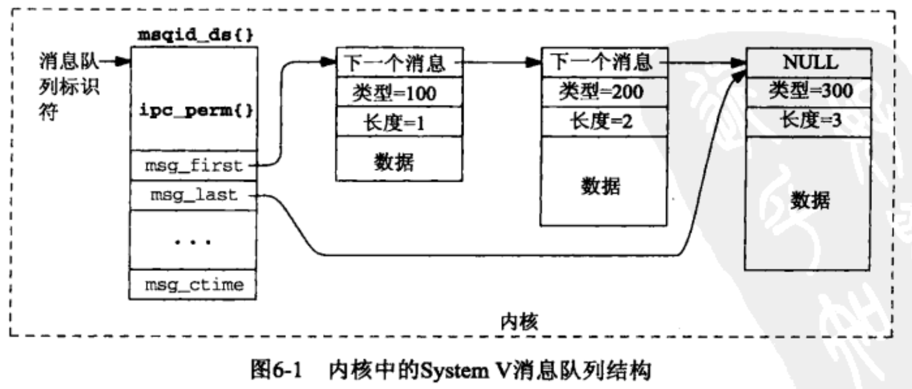

**进程间通信(Interprocess Communication,  IPC),  IPC的基本设计目标是高性能**

- [key_t键和IPC键以及ftok函数](#key_t键和IPC键以及ftok函数)
- [内核维护的PIC信息结构ipc_perm结构体](#内核维护的PIC信息结构ipc_perm结构体)
- [创建和打开IPC通道](#创建和打开IPC通道)
- [IPC权限](#IPC权限)
- [删除和查看IPC的命令](#删除和查看IPC的命令)
- [SystemV消息队列](#SystemV消息队列)
    - [内核维护的消息队列链表结构](#内核维护的消息队列链表结构)
    - [msgget函数](#msgget函数)
    - [msgsnd函数](#msgsnd函数)
    - [msgrcv函数](#msgrcv函数)
    - [msgctl函数](#msgctl函数)
    - 


- **以下三种类型的IPC 合称为 System V IPC**
    - System V 消息队列
    - System V 信号量
    - System V 共享内存区


## key_t键和IPC键以及ftok函数

==**三种类型的 System V IPC 使用 key_t 值 作为它们的名字. 头文件<sys/types.h> 把 key_t 这个数据类型定义为一个整数, 通常是一个至少32位的整数, 这些整数值通常是由 `ftok` 函数赋予的**==

```c
// ftok()  函数把一个已存在的路径名和一个整数标识符 转换成一个 key_t 值,  称为 IPC键
// ftok() 函数尝试创建适合与 semget(2) 和 shmget(2) 函数一起使用的唯一密钥。
// 该函数把从 pathname 导出的消息 与 ID 低序8位 组成一个整数 IPC键.
#include <sys/ipc.h>
	typedef __int32_t        key_t; 

	key_t ftok (const char* pathname , int id);

/*   参数: pathname : 已存在的路径名, 并且这个文件必须存在
                id : 不可以为0, 如果给定相同的 id，指向文件的链接将返回相同的键。
    返回值: 如果路径不存在或调用进程无法访问，则 ftok() 函数将返回 -1。
*/


ftok() 函数的典型实现调用 stat函数, 然后组合以下三个值:
   1.  pathname 所在的文件系统的信息 ( stat结构的 st_dev成员)
   2.  该文件在本文件系统内的索引节点号 ( stat结构的 st_ino成员),该文件不可以反复删除创建,会造成索引号变动.
   3.  id 的低序8位, 不能为0.
  不能保证两个不同的路径名与同一个id的组合产生不同的键.
```


```c
// 范例,获取文件系统信息和IPC键,    输出:  st_dev: 1000004, st_ino: 529893, key: 57049893
#include <sys/stat.h>
#include <stdio.h>
#include <stdarg.h>
#include <errno.h>
#include <sys/errno.h>
#include <sys/ipc.h>
#include <stdlib.h>
#include <unistd.h>
#include <sys/types.h>
#include <string.h>
#include <syslog.h>

#define    MAXLINE        4096    
int        daemon_proc = 1;


void
err_sys(const char *fmt, ...);

static void
err_doit(int errnoflag, int level, const char *fmt, va_list ap);


void
err_quit(const char *fmt, ...);

key_t
Ftok(const char *pathname, int id);


int main(int argc, const char * argv[]) {
    struct stat  statfd;
    if (argc != 2){
        err_quit("usage: ftok <pathname> ");
    }
    
    if (stat(argv[1], &statfd) == -1)
        err_sys("stat error");
    printf("st_dev: %lx, st_ino: %lx, key: %x\n",
           (u_long) statfd.st_dev, (u_long)statfd.st_ino,
           Ftok(argv[1], 0x57));
    return 0;
}

void
err_sys(const char *fmt, ...)
{
    va_list        ap;
    va_start(ap, fmt);
    err_doit(1, LOG_ERR, fmt, ap);
    va_end(ap);
    exit(1);
}

static void
err_doit(int errnoflag, int level, const char *fmt, va_list ap)
{
    int        errno_save, n;
    char    buf[MAXLINE];

    errno_save = errno;        /* value caller might want printed */
#ifdef    HAVE_VSNPRINTF
    vsnprintf(buf, sizeof(buf), fmt, ap);    /* this is safe */
#else
    vsprintf(buf, fmt, ap);                    /* this is not safe */
#endif
    n = strlen(buf);
    if (errnoflag)
        snprintf(buf+n, sizeof(buf)-n, ": %s", strerror(errno_save));
    strcat(buf, "\n");

    if (daemon_proc) {
        syslog(level, buf);
    } else {
        fflush(stdout);        /* in case stdout and stderr are the same */
        fputs(buf, stderr);
        fflush(stderr);
    }
    return;
}

void
err_quit(const char *fmt, ...)
{
    va_list        ap;

    va_start(ap, fmt);
    err_doit(0, LOG_ERR, fmt, ap);
    va_end(ap);
    exit(1);
}


key_t
Ftok(const char *pathname, int id)
{
    key_t    key;

    if ( (key = ftok(pathname, id)) == -1)
        err_sys("ftok error for pathname \"%s\" and id %d", pathname, id);
    return(key);
}

```


## 内核维护的PIC信息结构ipc_perm结构体

**内核为每个IPC对象维护一个信息结构, 其内容跟内核给文件维护的信息类似**

```c
#include <sys/ipc.h>
struct ipc_perm{
  uid_t    uid;  // 所有者的用户 ID
  gid_t    gid;  // 所有者的组 ID
  uid_t    cuid;  // 创建者的用户 ID
  gid_t    cgid;  // 创作者组ID
  mode_t   mode;   // 读/写权限
  unsigned short  seq;  /* 插槽使用序列号, 内核为系统中每个潜在的IPC对象维护的计数器.每删除一个IPC对象时,
                           内核就递增相应的槽位号, 若溢出则循环回0 */
  key_t    key;   // IPC键值
};

struct msqid_ds {
  struct ipc_perm msg_perm;   /* 这是一个 ipc_perm 结构（见下文），用于指定对消息队列的访问权限。 */
  time_t          msg_stime;  /* 上次 msgsnd(2) 系统调用的时间。 */
  time_t          msg_rtime;  /* 上次 msgrcv(2) 系统调用的时间。*/
  time_t          msg_ctime;  /* 创建队列的时间或上次 msgctl() IPC_SET 操作,创建或 最后修改的时间 */
  unsigned long   msg_cbytes; /* 当前在消息队列中的所有消息的字节数。这是POSIX上次 msgctl() 的时间中未指定的非标准Linux扩展*/
  msgqnum_t       msg_qnum;   /* 当前在消息队列中的消息数 */
  msglen_t        msg_qbytes; /* 消息队列上允许的消息文本的最大字节数。 */
  pid_t           msg_lspid;  /* 执行最后一次 msgsnd(2) 系统调用的进程的 PID。 */
  pid_t           msg_lrpid;  /* 执行最后一次 msgrcv(2) 系统调用的进程的 PID。 */
};
```

**System V IPC标识符 是系统范围内的, 而不是特定于进程**


## 创建和打开IPC通道

**共享的头文件 `<sys/types.h>, <sys/ipc.h>`**

|                         |    消息队列     |   信号量    |  共享内存区   |
| :---------------------: | :-------------: | :---------: | :-----------: |
|       **头文件**        |   <sys/msg.h>   | <sys/sem.h> |  <sys/shm.h>  |
| **创建或打开IPC的函数** |   **msgget**    | **semget**  |  **shmget**   |
|  **控制IPC操作的函数**  |   **msgctl**    | **semctl**  |  **shmctl**   |
|     **IPC操作函数**     | msgsnd,  msgrcv |    semop    | shmat,  shmdt |


```c
#include <sys/types.h>
#include <sys/ipc.h>
#include <sys/stat.h>
#include <sys/msg.h>
#include <sys/sem.h>
#include <sys/shm.h>

int msgget(key_t key, int oflag);
int semget(key_t key, int nsems, int oflag);
int shmget(key_t key, size_t size, int oflag);   /* 这个和 shmat 配合使用即可 */

/* 参数:   
     key : 是 ftok() 函数的返回值, 或 IPC_PRIVATE 宏,这宏保证 会创建一个 新的唯一的IPC对象
  oflag : 指定IPC对象的读写权限位,并选择是 创建还是访问一个已经存在的IPC对象, 规则如下:
              IPC_CREAT  指定的IPC对象不存在就创建,否则就返回已存在的该对象
              IPC_CREAT | IPC_EXCL  指定的IPC对象不存在就创建,否则就返回一个 EEXIST错误.因为对象已存在
   size: 共享内存区的长度.

返回值: 
    msgget() 如果成功，返回值将是消息队列标识符（一个非负整数），否则返回 -1 并带有 errno 指示错误。
		semget() 如果成功，系统调用将返回信号量集的 id；否则，返回-1 并设置errno 以指示错误。
		shmget() 成功时，将返回一个有效的共享内存标识符。出错时，返回 -1，并设置 errno 以指示错误。
*/
返回的标识符 是可以应用于所有进程的.

  

void* shmat(int shmid, const void *shmaddr, int shmflg); 
/*  把共享内存区对象映射到调用进程的地址空间。
	连接共享内存标识符为shmid的共享内存，连接成功后把共享内存区对象映射到调用进程的地址空间，随后可像本地空间一样访问。
	fork后子进程继承已连接的共享内存地址。exec后该子进程与已连接的共享内存地址自动脱离(detach)。进程结束后，已连接的共享内存地址会自动脱离(detach)。
参数: 
	msqid: 	 共享内存标识符
	shmaddr: 指定共享内存出现在进程内存地址的什么位置，直接指定为NULL让内核自己决定一个合适的地址位置
	shmflg:  SHM_RDONLY：为只读模式，其他为读写模式

返回值:
	成功：附加好的共享内存地址
	出错：-1，错误原因存于error中
错误代码：
	EACCES：无权限以指定方式连接共享内存
	EINVAL：无效的参数shmid或shmaddr
	ENOMEM：核心内存不足
*/


int   shmdt(const void *shmaddr);
/* 断开共享内存连接。
	与shmat函数相反，是用来断开与共享内存附加点的地址，禁止本进程访问此片共享内存	。
	本函数调用并不删除所指定的共享内存区，而只是将先前用shmat函数连接（attach）好的共享内存脱离（detach）目前的进程。
参数: 
	shmaddr：连接的共享内存的起始地址

返回值:
	成功：0
	出错：-1，错误原因存于error中
错误代码：
	EINVAL：无效的参数shmaddr
*/
  

int shmctl(int shmid, int cmd, struct shmid_ds *buf);
/* 完成对共享内存的控制。
	与shmat函数相反，是用来断开与共享内存附加点的地址，禁止本进程访问此片共享内存	。
参数: 
	msqid：共享内存标识符
	cmd:  有下面三个参数 
				IPC_STAT：得到共享内存的状态(包括共享内存区的长度)，把共享内存的shmid_ds结构复制到buf中
				IPC_SET：改变共享内存的状态，把buf所指的shmid_ds结构中的uid、gid、mode复制到共享内存的shmid_ds结构内
				IPC_RMID：删除这片共享内存
	buf: 共享内存管理结构体。具体说明参见共享内存内核结构定义部分, 传出部分。

返回值:
	成功：0
	出错：-1，错误原因存于error中
错误代码：
	EACCESS：参数cmd为IPC_STAT，确无权限读取该共享内存
	EFAULT：参数buf指向无效的内存地址
	EIDRM：标识符为msqid的共享内存已被删除
	EINVAL：无效的参数cmd或shmid
	EPERM：参数cmd为IPC_SET或IPC_RMID，却无足够的权限执行
*/


  // 范例,  连续输出 内核赋予的 消息队列标识符 10次
#include <sys/stat.h>
#include <sys/errno.h>
#include <syslog.h>
#include <sys/types.h>
#include <stdio.h>
#include <stdarg.h>
#include <string.h>
#include <stdlib.h>
#include <unistd.h>

#include <sys/ipc.h>
#include <sys/sem.h>
#include <sys/shm.h>
#include <sys/msg.h>
  
int main(int argc, const char * argv[]) {
    // 标识符 是跨进程的内核变量
    int  i, msqid;
    for(i = 0; i <10; i++){
       //     进行替换  (MSG_R | MSG_W | MSG_R>>3 | MSG_R>>6), 属主可读写,组员和其他人可读
        msqid = msgget(IPC_PRIVAT, 0400 | 0200 | 040 | 04 | IPC_CREAT);
        if( msqid != -1){  
            printf("msqid = %d\n", msqid);
            msgctl(msqid, IPC_RMID, NULL);  // IPC_RMID 删除标识符
        }
        else{
            fprintf(stderr, "%s",strerror(errno));
            exit(errno);
        }           
    }
    exit(0);
}
```


- **打开一个IPC 对象的逻辑流程:**
    - 起始位置:
        - key == IPC_PRIVATE 
            - true:  系统表格是否已满?
                - **true: 出错返回, errno =  ENOSPC**
                - ==**false:  成功. 创建了新对象,返回标识符**==
            - false:  key是否已存在?
                - **true:  IPC_CREATE 和 IPC_EXCL 都设置了?**
                    - **true:  出错返回 , errno = EEXIST**
                    - **false: 访问权限允许?**
                        - ==**true: 成功返回标识符**==
                        - **false: 出错返回, errno = EACCES**
                - false: IPC_CREAT 是否被设置?
                    - true:  系统表格是否已满?
                        - **true: 出错返回, errno =  ENOENT**
                        - ==**false:  成功. 创建了新对象,返回标识符**==


## IPC权限

- **创建一个新 IPC 对象时, 一下信息就保存到该对象的 ipc_perm 结构中.**
    - **oflag参数 中某些位初始化 ipc_perm 结构的 mode 成员**
    - cuid 和 cgid 成员分贝设置为调用进程的有效用户ID 和 有效组 ID.  这两个成员合称为创建者 ID
    - ipc_perm 结构的 uid和gid成员也分呗设置为 调用进程的有效用户ID 和有效组 ID, 这两个成员合称为 属主ID
        - **可以调用 ctlXXX类似的命令 (IPC_SET) 修改属主ID, 创建者ID 却从不改变.**

| ==IPC权限位表格== | **符号值**  | **符号值** | **符号值** |   **说明**   |
| :---------------: | :---------: | :--------: | :--------: | :----------: |
| **数字值(8进制)** |  消息队列   |   信号量   | 共享内存区 |              |
|       0400        |    MSG_R    |   SEM_R    |   SHM_R    | 由属主用户读 |
|       0200        |    MSG_W    |   SEM_A    |   SHM_W    | 由属主用户写 |
|       0040        | MSG_R  >> 3 | SEM_R >> 3 | SHM_R >> 3 | 由属组成员读 |
|       0020        | MSG_W >> 3  | SEM_W >> 3 | SHM_W >> 3 | 由属组成员写 |
|       0004        | MSG_R >> 6  | SEM_R >> 6 | SHM_R >> 6 | 由其他用户读 |
|       0002        | MSG_W >> 6  | SEM_A >> 6 | SHM_W >> 6 | 由其他用户写 |


## 删除和查看IPC的命令

**System V IPC的三种类型 . 使用标准文件命令 (ls) 看不到.  必须使用 `ipcs` 查看 , 使用 `ipcrm` 删除**

```bash
$ipcs 
# 输出
IPC status from <running system> as of Wed Jun  9 19:28:09 CST 2021
T     ID     KEY        MODE       OWNER    GROUP
Message Queues:
q 3407872 0x00000000 --rw-r--r--       lq    staff

T     ID     KEY        MODE       OWNER    GROUP
Shared Memory:

T     ID     KEY        MODE       OWNER    GROUP
Semaphores:


$ipcrm  -q 删除消息队列   -s 删除信号量  -m 删除共享内存
```


# SystemV消息队列




## 内核维护的消息队列链表结构

```c
当第二个参数为 IPC_SET 或 IPC_STAT 时，其地址作为第三个参数传递给 msgctl() 的结构。在 IPC_SET 命令的情况下，只有 msg_perm.{uid|gid|perm} 和 msg_qbytes 是有效的。在 IPC_STAT 的情况下，只有指示为 [XSI] 强制字段的字段才能保证有意义：不要依赖于其他字段的内容。

注意：保留字段不会跨 IPC_SET / IPC_STAT 保留。
  
#include <sys/msg.h>
// Linux
struct msqid_ds {
  struct ipc_perm msg_perm;   /* 这是一个 ipc_perm 结构（见下文），用于指定对消息队列的访问权限。 */
  time_t          msg_stime;  /* 上次 msgsnd(2) 系统调用的时间。 */
  time_t          msg_rtime;  /* 上次 msgrcv(2) 系统调用的时间。*/
  time_t          msg_ctime;  /* 创建队列的时间或上次 msgctl() IPC_SET 的操作 创建 或 最后修改的时间 */
  unsigned long   msg_cbytes; /* 当前在消息队列中的所有消息的字节数。这是POSIX上次 msgctl() 的时间中未指定的非标准Linux扩展*/
  msgqnum_t       msg_qnum;   /* 当前在消息队列中的消息数 */
  msglen_t        msg_qbytes; /* 消息队列上允许的消息文本的最大字节数。 */
  pid_t           msg_lspid;  /* 执行最后一次 msgsnd(2) 系统调用的进程的 PID。 */
  pid_t           msg_lrpid;  /* 执行最后一次 msgrcv(2) 系统调用的进程的 PID。 */
};


// Macos
struct msqid_ds
{
	struct ipc_perm  msg_perm; /* 消息队列权限  */
	__int32_t       msg_first;      /* 保留：仅内核使用 */
	__int32_t       msg_last;       /* 保留：仅内核使用*/
	msglen_t        msg_cbytes;     /* 队列中的字节数 */
	msgqnum_t       msg_qnum;       /* 队列中的消息数*/
	msglen_t        msg_qbytes;     /* [XSI] 队列上的最大字节数*/
	pid_t           msg_lspid;      /* [XSI] 最后一个 msgsnd() 的 pid */
	pid_t           msg_lrpid;      /* [XSI] 最后一个 msgrcv() 的 pid*/
	time_t          msg_stime;      /* [XSI] 上次 msgsnd() 的时间 */
	__int32_t       msg_pad1;       /* 保留：请勿使用 */
	time_t          msg_rtime;      /* [XSI] 上次 msgrcv() 的时间 */
	__int32_t       msg_pad2;       /* 保留：请勿使用 */
	time_t          msg_ctime;      /* [XSI] 上次 msgctl() 的时间 */
	__int32_t       msg_pad3;       /* 保留：请勿使用 */
	__int32_t       msg_pad4[4];    /* 保留：请勿使用 */
};


#include <sys/ipc.h>
struct ipc_perm{
  uid_t    uid;  // 所有者的用户 ID
  gid_t    gid;  // 所有者的组 ID
  uid_t    cuid;  // 创建者的用户 ID
  gid_t    cgid;  // 创作者组ID
  mode_t   mode;   // 读/写权限
  unsigned short  seq;  /* 插槽使用序列号, 内核为系统中每个潜在的IPC对象维护的计数器.每删除一个IPC对象时,
                           内核就递增相应的槽位号, 若溢出则循环回0 */
  key_t    key;   // IPC键值
};
```


## msgget函数

```c
// 创建一个新的消息队列 或 访问一个已经存在的消息队列
#include <sys/types.h>
#include <sys/ipc.h>
#include <sys/stat.h>
#include <sys/msg.h>
int  msgget(key_t key, int oflag);

/* 参数: 
       key : 是 ftok() 函数的返回值, 或 IPC_PRIVATE 宏,这宏保证 会创建一个 新的唯一的IPC对象
     oflag : 指定IPC对象的读写权限位,并选择是 创建还是访问一个已经存在的IPC对象, 规则如下:
              IPC_CREAT  指定的IPC对象不存在就创建,否则就返回已存在的该对象
              IPC_CREAT | IPC_EXCL  指定的IPC对象不存在就创建,否则就返回一个 EEXIST错误.因为对象已存在
              MSG_R 属主用户读,  MSG_W 属主用户写,  MSG_R  >> 3 属组成员读,  MSG_W >> 3 属组成员写,
              MSG_R >> 6 其他用户读,  MSG_W >> 6 其他用户写
              (创建一般都是  IPC_CREAT | IPC_EXCL | MSG_R | MSG_W | MSG_R >> 3 | MSG_R >> 6 )
 返回值: 如果成功，返回值将是消息队列标识符（一个非负整数），否则返回 -1 并带有 errno 指示错误。
*/
```


## msgsnd函数

```c
#include <sys/msg.h>
#include <sys/ipc.h>
#include <sys/sta.h>
#include <sys/types.h>
int msgsnd(int msqid, const void* ptr, size_t length, int flag);

/* 参数:
  msqid : 由 msgget() 返回值消息队列标识符.
    ptr : 指向一个消息模版 结构体 struct msgbuf , 可以根据下面结构的模版, 自定义一个结构体
               struct msgbuf{ 
                     long mtype;     // 消息类型, 该值必须大于0, 小于0的则是用作特殊的指示器
                     char mtext[1];  // 消息数据.
                };
length : 消息数据的长度, sizeof( *ptr ) - sizeof(msgbuf.mtype);
  flag : 可以是0,也可以是 IPC_NOWAIT 非阻塞,如果没有存放新消息的可用空间,该函数就立马返回 EAGAIN错误
          如果为0 那么就进入休眠状态
返回值: 成功返回 0 , 失败时 函数返回 -1，errno 表示错误.
       被信号中断时 EINTR , 将写入的消息队列被删除 EIDRM
*/
```


## msgrcv函数

```c
#include <sys/msg.h>
#include <sys/ipc.h>
#include <sys/sta.h>
#include <sys/types.h>
ssize_t  msgrcv (int msqid, void *ptr, size_t length, long type, int flag);

/* 参数:
  msqid : 由 msgget() 返回值消息队列标识符.
    ptr : 指向一个消息模版 结构体 struct msgbuf , 可以根据下面结构的模版, 自定义一个结构体
               struct msgbuf{ 
                     long mtype;     // 消息类型, 该值必须大于0, 小于0的则是用作特殊的指示器
                     char mtext[1];  // 消息数据.
                };
length : 接受消息数据缓冲区的长度.
  type : 指定希望从给定的缓冲队列中读出什么样的消. 
            为0 返回该队列的第一个消息 也就是最早进入消息队列的消息.
           大于0 返回其类型为type的第一个消息.
           小于0 返回其类型值小于或等于 type参数的绝对值的消息中类型值最小的第一个消息.
  flag : 指定所请求类型的消息不在说指定的队列中时该做何处理.
         可以是0,也可以是 IPC_NOWAIT 非阻塞,如果没有消息可返回,该函数就立马返回 ENOMSG错误
          如果为0 那么就进入休眠状态
          设置为 MSG_NOERROR 时, 当返回值消息大于缓冲区 就会返回截取的一部分, 如果没设置就返回 E2BIG错误
返回值 : 成功时 返回实际读取并写入到 ptr 缓冲区中的字节数, 失败时返回 -1，errno 表示错误.
*/
```


## msgctl函数

```c
// 提供在一个消息队列上的各种控制操作

#include <sys/types.h>
#include <sys/ipc.h>
#include <sys/msg.h>
	#ifdef __APPLE__
		#include <sys/msgbuf.h>
	#endif
int msgctl(int msqid, int cmd, struct msqid_ds *buff);

/* 参数:
  msqid :  由 msgget() 返回值消息队列标识符.
    cmd :  命令:  IPC_RMID 删除给定的消息队列 , 丢弃消息队列上的消息.
                  IPC_SET 设置其结构体 struct msqid_ds 的四个成员. uid, gid, mode, msg_qbytes
                  IPC_stat 获得消息队列的属性, 写入 buff
   buff : 接收或设置的 属性结构体.
返回值 : 出错时，返回 -1 并带有 errno 指示错误。
        成功时，IPC_STAT、IPC_SET 和 IPC_RMID 返回 0
        成功的 IPC_INFO 或 MSG_INFO 操作返回内核内部数组中最高使用条目的索引，记录有关所有消息队列的信息。
            （此信息可与重复的 MSG_STAT 或 MSG_STAT_ANY 操作一起使用，以获取有关系统上所有队列的信息。）
         成功的 MSG_STAT 或 MSG_STAT_ANY 操作返回其索引在 msqid 中给出的队列的标识符。
*/
struct msqid_ds {
  struct ipc_perm msg_perm;   /* 所有权和权限 */
  time_t          msg_stime;  /* 上次msgsnd() 的时间  */
  time_t          msg_rtime;  /* 上次 msgrcv() 的时间 */
  time_t          msg_ctime;  /* msgctl() 创建或最后修改的时间 */
  unsigned long   msg_cbytes; /* # 队列中的字节数 */
  msgqnum_t       msg_qnum;   /* # 队列中的消息数 */
  msglen_t        msg_qbytes; /* 队列中的最大字节数,只允许有这么多数据 */
  pid_t           msg_lspid;  /* 最后一个 msgsnd() 的 PID */
  pid_t           msg_lrpid;  /* 上次 msgrcv() 的 PID */
};

  #include <sys/ipc.h>
  struct ipc_perm{
    uid_t    uid;  // 所有者的用户 ID
    gid_t    gid;  // 所有者的组 ID
    uid_t    cuid;  // 创建者的用户 ID
    gid_t    cgid;  // 创作者组ID
    mode_t   mode;   // 读/写权限
    unsigned short  seq;  /* 插槽使用序列号, 内核为系统中每个潜在的IPC对象维护的计数器.每删除一个IPC对象时,
                             内核就递增相应的槽位号, 若溢出则循环回0 */
    key_t    key;   // IPC键值
  };
```


```c
#include <sys/ipc.h>
#include <sys/stat.h>
#include <sys/msg.h>
#include <unistd.h>
#include <fcntl.h>
#include <signal.h>
#include <sys/types.h>
#include <stdio.h>
#include <sys/errno.h>

int main(int argc, const char * argv[]) {
    int    msqid;
    struct msqid_ds info;
    struct msgbuf   buf;
    
    msqid = msgget(IPC_PRIVATE, IPC_CREAT | 0664);
#ifdef __APPLE__
  	buf.msg_magic = 1;
    buf.msg_bufc = calloc(1, 1);
#else
      buf.mtype = 1;
      buf.mtext[0] = 1;
#endif
 int ret =   msgsnd(msqid, &buf, 1, 0);
    if( 0 !=  ret){
        fprintf(stderr, "msgsend出错 %d, %s\n", ret, strerror(errno));
        free(buf.msg_bufc);
        exit(errno);
    }
    ret = msgctl(msqid, IPC_STAT, &info);
    if( 0 !=  ret){
        fprintf(stderr, "msgctl出错 %d, %s\n",ret, strerror(errno));
        free(buf.msg_bufc);
        exit(errno);
    }
    
    printf("read-write: %03o, cbytes=%lu, qnum=%lu, qbytes=%lu\n",
           info.msg_perm.mode & 0777, (u_long)info.msg_cbytes,
           (u_long)info.msg_qnum, (u_long)info.msg_qbytes);
    msgctl(msqid, IPC_RMID, NULL);
    free(buf.msg_bufc);
    exit(0);
}
```


范例1： 父子进程通信范例

```c
#include <stdio.h>

#include <unistd.h>

#include <string.h>

#include <sys/ipc.h>

#include <sys/shm.h>

#include <error.h>

#define SIZE 1024

int main()

{

    int shmid ;

    char *shmaddr ;

    struct shmid_ds buf ;

    int flag = 0 ;

    int pid ;

 

    shmid = shmget(IPC_PRIVATE, SIZE, IPC_CREAT|0600 ) ;

    if ( shmid < 0 )

    {

            perror("get shm  ipc_id error") ;

            return -1 ;

    }

    pid = fork() ;

    if ( pid == 0 )

    {

        shmaddr = (char *)shmat( shmid, NULL, 0 ) ;

        if ( (int)shmaddr == -1 )

        {

            perror("shmat addr error") ;

            return -1 ;

 

        }

        strcpy( shmaddr, "Hi, I am child process!\n") ;

        shmdt( shmaddr ) ;

        return  0;

    } else if ( pid > 0) {

        sleep(3 ) ;

        flag = shmctl( shmid, IPC_STAT, &buf) ;

        if ( flag == -1 )

        {

            perror("shmctl shm error") ;

            return -1 ;

        }

 

        printf("shm_segsz =%d bytes\n", buf.shm_segsz ) ;

        printf("parent pid=%d, shm_cpid = %d \n", getpid(), buf.shm_cpid ) ;

        printf("chlid pid=%d, shm_lpid = %d \n",pid , buf.shm_lpid ) ;

        shmaddr = (char *) shmat(shmid, NULL, 0 ) ;

        if ( (int)shmaddr == -1 )

        {

            perror("shmat addr error") ;

            return -1 ;

 

        }

        printf("%s", shmaddr) ;

        shmdt( shmaddr ) ;

        shmctl(shmid, IPC_RMID, NULL) ;

    }else{

        perror("fork error") ;

        shmctl(shmid, IPC_RMID, NULL) ;

    }

 

    return 0 ;

}


/*
编译 gcc shm.c –o shm。

执行 ./shm，执行结果如下：

shm_segsz =1024 bytes
shm_cpid = 9503
shm_lpid = 9504
Hi, I am child process!
*/
```


范例2:多进程读写范例

```c
多进程读写即一个进程写共享内存，一个或多个进程读共享内存。下面的例子实现的是一个进程写共享内存，一个进程读共享内存。

（1）下面程序实现了创建共享内存，并写入消息。
 
shmwrite.c源代码如下：
  
#include <stdio.h>
#include <sys/ipc.h>
#include <sys/shm.h>
#include <sys/types.h>
#include <unistd.h>
#include <string.h>
  
typedef struct{
    char name[8];
    int age;
} people;


int main(int argc, char** argv)
{

    int shm_id,i;
    key_t key;
    char temp[8];
    people *p_map;
    char pathname[30] ;
 

    strcpy(pathname,"/tmp") ;
    key = ftok(pathname,0x03);
    if(key==-1)
    {
        perror("ftok error");
        return -1;
    }

    printf("key=%d\n",key) ;
    shm_id=shmget(key,4096,IPC_CREAT|IPC_EXCL|0600); 
    if(shm_id==-1)
    {
        perror("shmget error");
        return -1;
    }
  
    printf("shm_id=%d\n", shm_id) ;
    p_map=(people*)shmat(shm_id,NULL,0);
    memset(temp, 0x00, sizeof(temp)) ;
    strcpy(temp,"test") ;
    temp[4]='\0';
    for(i = 0;i<3;i++)
    {
        temp[4]+=1;
        strncpy((p_map+i)->name,temp,5);
        (p_map+i)->age=0+i;
    }

    shmdt(p_map) ;
    return 0 ;
}
```

范例3:实现从共享内存读消息。

```c
shmread.c源代码如下：
  
#include <stdio.h>
#include <string.h>
#include <sys/ipc.h>
#include <sys/shm.h>
#include <sys/types.h>
#include <unistd.h>

typedef struct{
    char name[8];
    int age;
} people;

int main(int argc, char** argv)
{
    int shm_id,i;
    key_t key;
    people *p_map;
    char pathname[30] ;
 

    strcpy(pathname,"/tmp") ;
    key = ftok(pathname,0x03);
    if(key == -1)
    {
        perror("ftok error");
        return -1;
    }

    printf("key=%d\n", key) ;
    shm_id = shmget(key,0, 0);   
    if(shm_id == -1)
    {
        perror("shmget error");
        return -1;
    }

    printf("shm_id=%d\n", shm_id) ;
    p_map = (people*)shmat(shm_id,NULL,0);
    for(i = 0;i<3;i++)
    {
        printf( "name:%s\n",(*(p_map+i)).name );
        printf( "age %d\n",(*(p_map+i)).age );
    }

    if(shmdt(p_map) == -1)
    {
        perror("detach error");
        return -1;
    }

    return 0 ;
}


/*
编译与执行

①    编译gcc shmwrite.c -o  shmwrite。
②    执行./shmwrite，执行结果如下：
key=50453281
shm_id=688137

③    编译gcc shmread.c -o shmread。
④    执行./shmread，执行结果如下：

key=50453281
shm_id=688137
name:test1
age 0
name:test2
age 1
name:test3
age 2

⑤    再执行./shmwrite，执行结果如下：
key=50453281
shmget error: File exists
⑥    使用ipcrm -m 688137删除此共享内存。

*/
```

共享内存通信代码：

父进程：

```c++
#include <iostream>
#include <unistd.h>
#include <sys/types.h>
#include <sys/ipc.h>
#include <sys/shm.h>
#include <cstring>

using namespace std;

#define SHM_KEY 1234
#define SHM_SIZE 1024

int main()
{
   // 创建共享内存
   int shmid = shmget(SHM_KEY, SHM_SIZE, IPC_CREAT | 0666);
   if(shmid == -1)
   {
       cerr << "shmget failed" << endl;
       return 1;
   }

   // 连接共享内存
   void* addr = shmat(shmid, NULL, 0);
   if(addr == (void*)-1)
   {
       cerr << "shmat failed" << endl;
       return 1;
   }

   // 向共享内存写入数据
   string message = "hello from parent process";
   memcpy(addr, message.c_str(), message.size() + 1);

   cout << "parent process: data written to shared memory" << endl;

   // 挂起进程，等待子进程读取共享内存中的数据
   pause();

   // 断开与共享内存的连接
   shmdt(addr);

   // 删除共享内存
   shmctl(shmid, IPC_RMID, NULL);

   return 0;
}
```

子进程：

```c++
#include <iostream>
#include <unistd.h>
#include <sys/types.h>
#include <sys/ipc.h>
#include <sys/shm.h>
#include <cstring>

using namespace std;

#define SHM_KEY 1234
#define SHM_SIZE 1024

int main()
{
   // 连接共享内存
   int shmid = shmget(SHM_KEY, SHM_SIZE, 0666);
   if(shmid == -1)
   {
       cerr << "shmget failed" << endl;
       return 1;
   }

   void* addr = shmat(shmid, NULL, 0);
   if(addr == (void*)-1)
   {
       cerr << "shmat failed" << endl;
       return 1;
   }

   // 从共享内存中读取数据
   string message((char*)addr);
   cout << "child process: message received: " << message << endl;

   // 断开与共享内存的连接
   shmdt(addr);

   // 向父进程发送信号，让其继续执行
   kill(getppid(), SIGCONT);

   return 0;
}
```

消息队列通信代码：

父进程：

```c++
#include <iostream>
#include <unistd.h>
#include <sys/types.h>
#include <sys/ipc.h>
#include <sys/msg.h>
#include <cstring>

using namespace std;

#define MSG_KEY 1234

struct msgbuf
{
   long mtype;
   char mtext[1024];
};

int main()
{
   // 创建消息队列
   int msqid = msgget(MSG_KEY, IPC_CREAT | 0666);
   if(msqid == -1)
   {
       cerr << "msgget failed" << endl;
       return 1;
   }

   // 构造消息
   msgbuf msg;
   msg.mtype = 1;
   strcpy(msg.mtext, "hello from parent process");

   // 发送消息到消息队列
   if(msgsnd(msqid, &msg, strlen(msg.mtext) + 1, 0) == -1)
   {
       cerr << "msgsnd failed" << endl;
       return 1;
   }

   cout << "parent process: message sent to message queue" << endl;

   // 挂起进程，等待子进程从消息队列中读取数据
   pause();

   // 删除消息队列
   msgctl(msqid, IPC_RMID, NULL);

   return 0;
}
```

子进程：

```c++
#include <iostream>
#include <unistd.h>
#include <sys/types.h>
#include <sys/ipc.h>
#include <sys/msg.h>
#include <cstring>

using namespace std;

#define MSG_KEY 1234

struct msgbuf
{
   long mtype;
   char mtext[1024];
};

int main()
{
   // 连接消息队列
   int msqid = msgget(MSG_KEY, 0666);
   if(msqid == -1)
   {
       cerr << "msgget failed" << endl;
       return 1;
   }

   // 接收消息
   msgbuf msg;
   if(msgrcv(msqid, &msg, 1024, 1, 0) == -1)
   {
       cerr << "msgrcv failed" << endl;
       return 1;
   }

   cout << "child process: message received: " << msg.mtext << endl;

   // 向父进程发送信号，让其继续执行
   kill(getppid(), SIGCONT);

   return 0;
}
```

