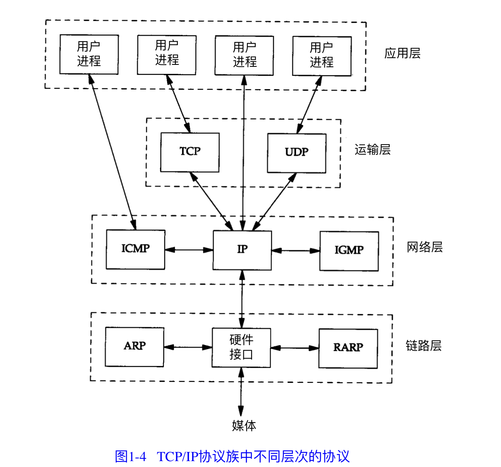

## 目录

- [TCP-IP](#TCP-IP)
- [不同层次的协议](#不同层次的协议)
- [封装](#封装)
- [数据链路层-以太网和IEEE802封装](#数据链路层-以太网和IEEE802封装)
    - [封装格式](#封装格式)
- [网络层-环回接口](#网络层-环回接口)
- [最大传输单元MTU和路径MTU](#最大传输单元MTU和路径MTU)
- [IP网际协议](#IP网际协议)
- 

# TCP-IP

### TCP/IP 协议族的四个层次  分层

**在 T C P / I P 中，网络层和运输层之间的区别是最为关键的:`网络层( I P ) 提 供 点 到 点 的 服 务` ， `而传输层( T C P 和 U D P ) 提 供 端 到 端 的 服 务`.**

> 从上到下,分别是 应用层, 传输层, 网络层, 链路层

- **应用层**
  - **负责处理特定的应用程序细节**
  - Telnet, FTP 和 e-mail
- **传输层(运输层)**
  - **主要为两台主机上的应用程序提供端到端通讯**
  - TCP(传输控制协议) 和 UDP(用户数据报协议)
  - 它所做的工作包括把应用程序交给它的数据分 成合适的小块交给下面的网络层，确认接收到的分组，设置发送最后确认分组的超时时钟 等
  - **TCP在不可靠的IP层上提供一个可靠的出传输层.**
- **网络层**
  - **处理分组在网络中的活动，例如分组的选路 , 包括IP协议(网际协议), ICMP(internet互联网控制报文协议) 和 IGMP(internet 组管理协议)**
      - **`ping` 命令就是调用的 ICMP 协议来实现的.**
  - 提供的是 **逐跳(hop-to-hop)协议**
  - 提供的是一种不可靠的服务, 他只是尽快的把分组从源节点送到目的节点, 但不提供可靠性保障.
- **链路层**
  - **处理与电缆(或其他任何传输媒介) 的物理接口细节**
  - TCP/IP 支持多种不同的链路层协议, 这取决于网络所使用的硬件.（以太网,令牌环网,FDDI,RS-232串行线路).	
  - 链路层主要由三个目的
      - 为 IP 模块发送和接收IP 数据报
      - 为 ARP 模块发送ARP请求和接收ARP 应答;
      - 为RARP 发送 RARP 请求和接收 RARP 应答.

**互联网的目的之一就是在应用程序内隐藏所有的物理细节**

## 不同层次的协议

## 封装

**以太网的单个数据包不得少于46字节(少的要补齐),也不可大于1500字节,如果算上数据链路层的添加的头部和尾部,应该是1500+14+4=1518字节**

**IEEE802的单个数据包不得少于46字节(少的要补齐),也不可大于1492字节,如果算上数据链路层的添加的头部和尾部,应该是1492+14+4=1510字节**

## 数据链路层-以太网和IEEE802封装

> **以太网和 IEEE802是完全不同的两个东西**

**以太网的单个数据包不得少于46字节(少的要补齐),也不可大于1500字节,如果算上数据链路层的添加的头部和尾部,应该是1500+14+4=1518字节**

**IEEE802的单个数据包不得少于46字节(少的要补齐),也不可大于1492字节,如果算上数据链路层的添加的头部和尾部,应该是1492+14+4=1510字节**

- **以太网标准:**
    - 采用 CSMA/CD 的媒体接入方法.
    - 速率为 10Mb/s, 地址48bit (MAC地址)
- **IEEE802封装标准:**
    - 802.3 针对整个 CSMA/CD 网络
    - 802.4 针对令牌总线网络
    - 802.5 针对令牌环网络
    - 这三者的共同特性由 802.2 标准来定义,那就是802网络共有的逻辑链路控制(LLC)

### 封装格式

**下面是以太网封装, 上面的内容是 802.2 与 802.3标准的格式(他俩格式相同)**

- 802.3 长度字段 不包括 CRC 校验码
- CRC字段用于帧内后续字节差错的循环冗余校验(校验和) , 它也被称为FCS与帧校验序列.
- 802.3规定数据部分最短为38字节,不足时使用 pad进行插入补充
- 以太网,要求数据部分最少是46字节.(不足时插入 pad 字节)

- **在以太网以及IEEE802.2和.3 中,类型为 0806的是ARP协议.**
    - **这个协议对 32bit的地址和 48bit的硬件地址进行映射(IP和MAC地址)**

## 网络层-环回接口

> localhost 环回接口

**A类 网络号 127 就是为 换回接口预留的.  大多数系统会把IP地址 127.0.0.1分配给这个接口,并命名为 `localhost` .**

一旦传输层检测到目的端地址是环回地址时, 应该可以省略部分传输层和所有网络层的逻辑操作. IP数据报离开网络层时会把它返回给自己.

**关键点:**

- **传给环回地址(127.0.0.1) 的任何数据均作为IP输入.**
- **传送广播地址或多播地址的数据赋值一份传给环回接口, 然后送到以太网上, 这是因为广播传送和多播传送的定义包含主机本身** 
- **任何传送给该主机IP地址的数据均送到环回接口**
    - **送给主机本身IP地址的IP数据报一般不出现在相应的网络上**

## 最大传输单元MTU和路径MTU

- **最大传输单元MTU:**
    - **一个包含所有内容的帧的最大长度 的上限, 就是 最大传输单元MTU.(以太网是1500)**
    - **MTU只针对传输出去的数据进行限制**
- **路径MTU:**
    - **两个主机之间的通信要通过多个网络,那么每个网络的链路层就可能有不同的MTU, 重要的不是两台主机所在网络的 MTU的值,重要的是两台通信主机路径中的最小MTU, 被称作路径MTU.**

> **当IP层有一个数据要传, 但是数据长度比链路层的 MTU 还大,那么IP层就需要进行分片, 把数据报分成若干片, 每片都小于 MTU.**

**使用命令`netstat` 可以打印出网络接口的 MTU**

## IP网际协议

- IP是 TCP/IP 协议中最为核心的协议.所有 TCP, UDP, ICMP, IGMP 数据都以 IP数据报格式传输.
- **不可靠 :它不能保证 I P 数据报能成功地到达目的地。 `I P 仅 提 供 最 好 的传输服务`。如果发生某种错误时，如某个路由器暂时用完了缓冲区， `I P 有 一 个 简 单 的 错 误 处理算法:丢弃该数据报`，`然后发送 I C M P 消 息 报 给 信 源 端` 。 任 何 要 求 的 可 靠 性 必 须 由 上 层 来 提供(如 T C P )**
- **无连接:  I P 并 不 维 护 任 何 关 于 后 续 数 据 报 的 状 态 信 息**.
    - **每个数据报的处理都是相互独立的, IP数据报可以不按发送顺序接收.**
- **使用 `ifconfig` 和 `netstat` 命令可以获取很多详细信息**
    - **`netstat -r`  获得路由表**
    - **`netstat -an`  获得目前所有的网络活动**
    - `ifconfig eth0 1.2.3.4 netmask 255.255.255.0` 设置网卡的IP和子网掩码

> [IP网际协议详解](../计算机网络/IP网际协议.md)

