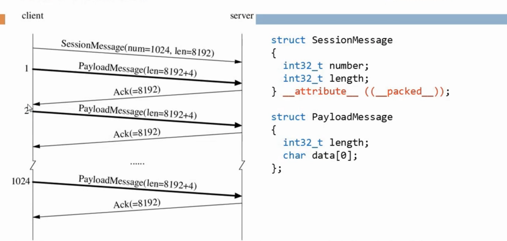

- [TTCP模型](#TTCP模型)
- [TTCP代码](#TTCP代码)
- 

- **关心的性能指标:**
  - 带宽,  每秒钟收发的数据量  MB/s  (1000进制)
  - 吞吐量,  应用层面 能够处理多少数据 , QPS查询/秒,   TPS事物/秒
  - 延迟,  毫秒
  - 利用率,  百分比, 有效载荷 与载体,  有效吞吐量与理论BW
  - **开销,  CPU利用率之类的, 和用于压缩以及加密 SSL , TLS  , 一定要先压缩, 后加密**
    - **压缩后传输可以减少网络利用率, 但是会提高 CPU 使用率**

## TTCP模型

## TTCP代码

不应该使用 非阻塞IO, 不会提高性能

