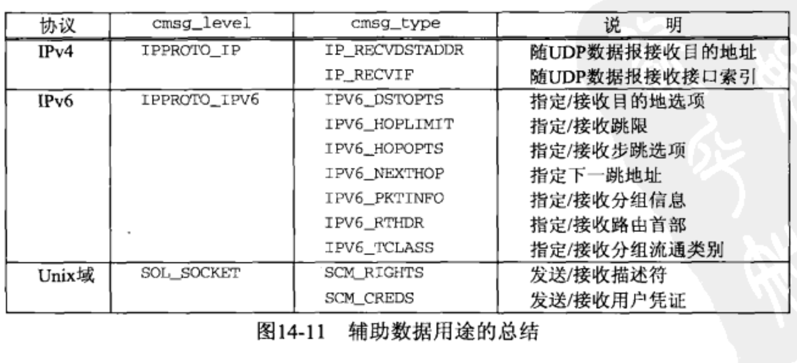

## 目录

- [高级I/O函数	](#高级I/O函数)
- [套接字超时](#套接字超时)
  - [alarm 设置时钟函数](#alarm函数)
  - [通过alarm函数 使用SIGALRM信号 为connect设置超时](#通过alarm函数使用SIGALRM信号为connect设置超时)
  - [使用SIGALRM信号  为recvfrom函数 设置超时](#使用SIGALRM信号为recvfrom函数设置超时)
  - [使用select函数为recvfrom函数设置超时](#使用select函数为recvfrom函数设置超时)
- [recv  函数和  send 函数](#recv函数和send函数)
- [readv  函数和  writev 函数](#readv函数和writev函数)
- [recvmsg 函数和  sendmsg 函数](#recvmsg函数和sendmsg函数)
- [recvfrom函数和sendto函数](#recvfrom函数和sendto函数)
- [辅助数据-控制信息](#辅助数据-控制信息)
- [高级轮询技术](#高级轮询技术)
  - [kqueue接口](#kqueue接口)


- ==**如果进程需要内核更新标志, 那么就必须调用`recvmsg` 而不是 `recv` 或 `recvfrom`**==
  - **传回的标志是在一个 `msghdr` 结构中**

## 高级I/O函数

- **`read` 和 `write` 这两个函数的 三个变体**
  - **`recv` 和 `send` 允许通过第四个参数从进程到内核传递标志**
  - **`readv` 和 `writev` 允许指定结构体中输入数据 或从其中输出数据的缓冲区向量**
  - **`recvmsg` 和 `sendmsg` 结合了其他I/O 函数的所有特性, 并具备接收和发送辅助数据的新能力**


## 套接字超时

- **在套接字I/O 操作上设置超时的方法有三种:**
  - **调用`alarm`, 他在指定超时期 满时产生 `SIGALRM`信号.**
    - 这个方法涉及信号处理, 而信号处理在不同的实现上存在差异, 有可能干扰 `alarm` 调用
  - **在 `select` 中阻塞等待I/O, (`select` 内置时间限制), 以此替代直接阻塞在 `read` 和 `write` 调用上**
  - **使用较新的 `SO_RCVTIMEO` 和 `SO_SNDTIMEO` 套接字选项.**
    - 但是并非所有实现都支持这两个套接字选项.
    - **这个套接字选项对 `connect` 并不适用**
    - **仅仅适用于套接字描述符, 上面两个适用于任何描述符**
- **TCP内置的 `connect` 超时大概为75秒,这是内核决定的, 无法使用其他手法进行延长,但可以减短**
- ==**`select` 可用来在 `connect` 上设置超时的先决条件是 : 相应套接字处于非阻塞模式**==


### alarm函数

**闹钟函数, 到达设定时间后会发出一个 ==`SIGALRM`== 信号. 并中断当前的所有函数的执行**

==**只是一次性计时,并不会循环往复**==

==**该函数并不会发生阻塞现象**==

==**该函数必须配合信号处理函数来使用**==

```c
#include  <unistd.h>
unsigned int  alarm(unsigned int second );
参数:    second: 倒计时的秒数.  为0时, 取消本线程的报警时钟.
返回值:  如果设置过闹钟,则返回闹钟距离完成时间的剩余秒数. 并且推翻曾经的设置,修改为此次修改的值.
        正常则返回0 .
到达设置的时间后,会发出一个 SIGALRM 信号,需要使用sigaction() 信号处理函数来接收. 
  会出发出信号一次, 不会有阻塞现象发生.
```


### 通过alarm函数使用SIGALRM信号为connect设置超时

- **对 `connect` 函数进行封装**
  - 需要一个 `等待的秒数` 参数
- **此技术应该使用在单线程或 末尾线程使用**
  - **信号处理的时候 绝对不能使用 SA_RESTART 来重启系统调用**

```c
#include <stdio.h>
#include <sys/socket.h>
#include <signal.h>
#include <stdlib.h>
#include <fcntl.h>
#include <netinet/in.h>
#include <arpa/inet.h>
#include <netdb.h>
#include <unistd.h>


/* 信号处理函数  SIGALRM , 什么都不做 */
static void
connect_alarm( int signo, siginfo_t* siginfo, void*  t)
{
    return;        /* 只是用来中断connect（）的 */
}
/* 结束连接时间, 也就是结束 connect_timeo() 函数 */


/* ================================= */
#define SA struct sockaddr

/* 在设定的 nsec 秒数到达后, 还没有连接成功则关闭套接字并返回等待的时长, 否则返回已用时长*/
unsigned int
connect_timeo (int sockfd, const SA* saptr, const socklen_t salen, const unsigned int nsec)
{
  Sigfunc* sigfunc ;
  int      n;
  
  /* 设置信号处理函数, 处理的是 SIGALRM 信号 */
  struct sigaction sig_temp, sig_original;
  memset(&sig_temp, 0, sizeof(struct sigaction));
  memset(&sig_original, 0, sizeof(struct sigaction));
  sig_temp.sa_sigaction =connect_alarm;
  sig_temp.sa_flags = SA_NOCLDSTOP;   //绝对不能使用 SA_RESTART 来重启系统调用
  sigaction(SIGALRM, &sig_temp, &sig_original);  // 设置信号处理, 并保留原有设置内容
	
  if (alarm (nsec) != 0)  // 设置闹钟到具体时间 , != 0 则表示曾经设置过.
    fprintf( stderr, "connect_timeo: alarm was already set : %m \n");  //报警 
                     //%m 会自动调用  strerror(errno); 函数并进行替换( Linux独有, MAC没有)

  
  if ( (n = connect(sockfd, saptr, salen)) < 0){
    close (sockfd);      // 套接字连接失败, 可能是闹钟触发, 关闭套接字.
    if (errno == EINTR)  // 调用达到闹钟设置时间,被闹钟中断.
       errno = ETIMEDOUT;  // 修改errno的值, 防止三次握手的进行.
  }

  alarm(0);    // 关闭闹钟
  sigaction(SIGALRM, &sig_original, NULL );   //恢复原有的信号处理程序
  return (n);
}
```


### 使用SIGALRM信号为recvfrom函数设置超时

```c
#include <stdio.h>
#include <sys/socket.h>
#include <signal.h>
#include <stdlib.h>
#include <fcntl.h>
#include <netinet/in.h>
#include <arpa/inet.h>
#include <netdb.h>
#include <unistd.h>

#define  MAXLEN  1024
#define  SA   struct sockaddr
static void   sig_alrm(int, struct __siginfo *, void *); // 信号处理函数

// STDIN_FILENO  这是描述符0
// stdin         这是 FILE,系统输入流, 带缓冲区

/* fp一般是标准输入stdin,  sockfd UDP套接字描述符, pservaddr接收数据的对方地址, servlen 地址长度*/
void
dg_cli (FILE* fp, int sockfd, const SA* pservaddr, socklen_t servlen)
{
    ssize_t   n;
    char  sendline[MAXLEN], recvline[MAXLEN +1 ] = { [ 0 ... MAXLEN ] = '\0' };
    struct sigaction sig_temp, sig_original;
    
    
    /* 设定信号处理 */
    memset(&sig_temp, 0, sizeof(sig_temp));
    memset(&sig_original, 0, sizeof(sig_temp));
    sig_temp.sa_sigaction = sig_alrm;
    sig_temp.sa_flags = SA_NOCLDSTOP;
    sigaction(SIGALRM, &sig_temp, &sig_original);
    
    
    while (fgets(sendline, MAXLEN, fp) != NULL){
        sendto(sockfd, sendline, strlen(sendline), 0, pservaddr, servlen);
        alarm(5);  // 5秒闹钟倒计时
        
        if ( (n = recvfrom(sockfd, recvline, MAXLEN, 0, NULL, NULL)) < 0){
            if (errno == EINTR)
                fprintf(stderr, "socket timeout\n");
            else{
                fprintf(stderr, "recvfrom error: %m");
                exit(errno);
            }
        }
        else{
            alarm(0);     // 取消闹钟
            recvline[0] = '\0';  /* 置空 */
            fputs(recvline, stdout);
        }
    }
}
```


### 使用select函数为recvfrom函数设置超时

```c
#include <sys/socket.h>
#include <stdio.h>
#include <unistd.h>

/* 等待给定描述符变为可读 ,适用于任何套接字,包括 UPD和TCP */
int
readable_timo (int fd, int sec)
{
    fd_set          rset;  // 1024bit, 对应  0 ~ 1023 描述符, 由 select() 使用
    struct timeval  tv;    // 时间
    
    FD_ZERO(&rset);
    FD_SET(fd, &rset);
    
    tv.tv_sec  = sec;
    tv.tv_usec = 0;
    
    return ( select(fd+1, &rset, NULL, NULL, &tv));
    //如果定时器到期,并且当所有描述符都没有就绪,那么会返回 0, 也就是超时
    // 返回-1 则表示出错.
    // 正常 返回可读套接字数量的总和, 这里只有一个 fd
    
}
```


## recv函数和send函数

```c
#include <sys/socket.h>

ssize_t  recv (int sockfd, void* buff,       size_t nbytes, int flags);
ssize_t  send (int sockfd, const void* buff, size_t nbytes, int flags);

参数:  sockfd: 已连接的套接字描述符
        buff: 发送或接收数据的应用缓冲区
      nbytes: 缓冲区长度
       flags: 标志 (一般给0) :
           MSG_DONTROUTE 绕过路由表查找.(与目的地直连),与SO_DONTROUTE套接字效果相同,用于send函数
           MSG_DONTWAIT  仅本次操作打开套接字的非阻塞属性,调用后恢复.  两函数都可使用
           MSG_OOB       只发送或接收外带数据,TCP只有一个字节可以作为外带数据发送. 两函数都可使用
           MSG_PEEK      查看数据,但系统不会在查看后丢弃这些数据. 用于recv函数
           MSG_WAITALL   不要在尚未读入请求数目的字节之前让一个读操作返回. 用于recv函数
                            如果发生错误,则仍有可能返回比请求字节数要少的数据.(信号,连接终止,错误)
              
返回值: 成功则返回写出或读入的字节数,  出错则返回 -1
```


## readv函数和writev函数

- **允许单个系统调用 `读入到` 或者 `写出至` 一个或多个缓冲区.**
  - ==**这些操作分别成为分散读和集中写**==
    - **来自读操作的输入数据被分散到多个应用缓冲区中**
    - **来自多个应用缓冲区的输入数据则被集中提供给单个写操作**
- **`writev` 是原子操作**
  - **一次 `writev` 调用只产生单个 UDP数据报.**

```c
#include <sys/uio.h>
ssize_t  readv  (int filedes, const struct iovec* iov, int iovcnt);
ssize_t  writev (int filedes, const struct iovec* iov, int iovcnt);

参数:   filedes: 描述符(包括套接字)
           iov: 指向 iovec结构体 数组 的指针, 里面记录了应用缓冲区地址和长度.
        iovcnt: iov结构体数组中, 元素的数量, 最大值 IOV_MAX = 2100或1024或16

返回值: 若成功则为读入或写出的字节数, 出错则返回-1.
          
struct iovec { 
	void*   iov_base;  /* 缓冲区的起始地址 */
  size_t  iov_len;   /* 缓冲区长度 */
};


例子: 解释了第二个参数 iov 的内容
#define  MAXLEN 1024
void
echo_w (int fd ){  // fd是一个已连接的套接字描述符
    ssize_t i, wbyt, rbyt;
    struct iovec iov[5];  // 结构体数组
    char* buff = NULL;

    for ( i=0; i< 5; i++ ){ //初始化结构体数组
        buff = (char*)malloc(MAXLEN);
        iov[i].iov_base = buff;
        iov[i].iov_len  = MAXLEN;
    }
    
    // 读取.
    if ( (rbyt = readv (fd, iov, 5)) < 0)
        exit(errno);

    /* 通过下面这两步 , 可以得到 读入的数据占用了几个数据结构,虽然没啥用  */
    wbyt =  rbyt/MAXLEN;
    if ( (rbyt % MAXLEN) > 0  && wbyt > 0)
        wbyt++;
    
    // 写入
    if ( (wbyt = writev (fd, iov, wbyt)) < 0)   //套接字, 结构体数组, 结构体数组内元素个数
        exit(errno);
    
    for ( i=0; i< 5; i++ ) //释放 结构体数组
        free (iov[i].iov_base);
}
```


## recvmsg函数和sendmsg函数

- ==**这两个函数是最通用的,可以替换所有的 `read`, `readv`, `recv`, 和 `recvfrom` ,输出也是一样.**==

```c
#include <sys/socket.h>
ssize_t recvmsg (int sockfd, struct msghdr* msg, int flags);
ssize_t sendmsg (int sockfd, struct msghdr* msg, int flags);

参数: sockfd: 描述符(包括套接字)
        msg: 函数的大部分参数都封装在这个结构体内
      flags: 标志, 只有sendmsg函数需要设置.
                 MSG_DONTROUTE ,  MSG_DONTWAIT, MSG_EOR, MSG_OOB
               
返回值: 成功返回读入和写出的字节数,  出错返回-1
  
struct msghdr{
	void*           msg_name;      /* 可选地址,无连接套接字填写该字段(UDP),已连接套接字应该置空该字段 */
                                    // sockaddr 结构体 , 或 sockaddr_in 结构体
	socklen_t       msg_namelen;    /* 可选地址的大小,无连接套接字填写,已连接套接字应该置空该字段 */
	struct  iovec*  msg_iov;        /* 输入输出缓冲区数组,结构体定义在下面 */
	int             msg_iovlen;     /* msg_iov中的元素个数 */
	void*           msg_control;    /* 辅助数据缓冲区,需要手动分配一块内存空间
      												 ,函数会向里面写入 stuct cmsghdr结构体, 20字节以上 ,后面就是辅助数据了*/
	socklen_t       msg_controllen; /* 存放辅助数据的实际数据量, 传出或传入参数 */
	int             msg_flags;      /* recvmsg（）返回的标志, sendsmg忽略该成员 */
  /* recvmsg 会设置的该标志的值: 
         * MSG_BCAST  收到了UDP广播 , MSG_MCAST  收到了多播数据报
         * MSG_TRUNC  本数据报的 数据被截断,内核预备返回的数据报超过进程事先分配的空间(ioc_len成员之和)
         * MSG_CTRUNC 本数据报的 辅助数据被截断,内核预备返回的数据报超过进程事先分配的空间(ioc_len成员之和) 
         * MSG_EOR    数据结束一个逻辑记录, TCP不使用本标志(字节流协议)
         * MSG_OOB    绝不为 TCP 外带数据返回, 它用于其他协议族 (OSI)
         * MSG_NOTIFICATION   由SCTP接受者返回,指示读入的消息是一个事件通知,而不是数据消息
 */
};

struct iovec { 
	void*   iov_base;  /* 缓冲区的起始地址 */
  size_t  iov_len;   /* 缓冲区长度 */
};
```


## recvfrom函数和sendto函数

**这两个函数类似于 `read`和 `write` 函数, 只不过是需要三个额外参数.**

==**无论应用请求多大的缓冲区`(nbytes参数)` ,`recvfrom` 绝不会返回多于1个数据报的数据**==

```c
#include <sys/socket.h>
ssize_t recvfrom( int sockfd, void* buff, size_t nbytes, int flags,
                 struct sockaddr* from, socklen_t* addrlen);
ssize_t sendto  ( int sockfd, const void* buff, size_t nbytes, int flags,
                 const struct sockaddr* to, socklen_t addrlen);

	参数:  sockfd : UDP套接字
         buff  : 发送或接收数据的缓冲区的指针
         nbytes: 读写字节数,不会超过buff缓冲区大小
         flags :   MSG_OOB   处理 外带数据
                   MSG_PEEK  偷看传入的消息
                   MSG_WAITALL  等待完整的请求或错误
                   一般这个参数给0即可.
         from  : 传出参数, 数据报发送者的协议地址和端口号.
                (该参数可以为空指针,但是addrlen也必须为空指针,表示不关心数据发送者的协议地址,但有风险)
         to    : 指向一个含有数据报 接收者的协议地址(地址及端口号)的套接字地址结构.(传入参数)
         addrlen: 指定from和to 的地址结构长度.(recvfrom是传出指针参数, sendto是传入普通参数)

 返回值: 允许发送空的UDP数据报,也就是说返回0 是正常的. 
        对于TCP套接字，返回值0表示对等方已关闭其连接的一半。
        出错返回 -1 
        TCP和UDP已连接套接字使用sendto发送数据报时 不可以指定地址(to)和长度(addrlen),否则返回 EISCONN 错误
   	    未连接UDP套接字使用 sendto,write,send 不指定目的地址时 ,返回 EDESTADDRREQ 错误或 ENOTCONN 错误
        sendto 应该返回已发送的字节数. 否则出错
        recvfrom 应该返回已接收到的字节数
```

==**可使用 `sudo tcpdump -i lo0 -v` 命令来监视和查看UDP/TCP 数据报内容. (lo0  是回环网卡,也就是接口)**==

- 使用 `recvfrom` 可以获得 来自客户的IP数据报中的  源IP地址和源端口号 (客户端的IP地址和端口号)
- 使用 `recvmsg` 可以获得 来自客户的IP数据报中的 目的IP地址.   (服务器的IP地址)需要设置 IP_RECVDSTADDR或 IPV6_PKTINFO 套接字选项 (ipv4和v6)
- 使用 `getsockname` 可以获得 来自客户的IP数据报中的 目的端口号.(服务器的端口号)


## 辅助数据-控制信息

- **辅助数据 可以通过 `sendmsg` 和 `recvmsg` 这两个函数, 使用 `msghdr` 结构中的 `smg_control` 和 `msg_controllen` 这两个成员发送和接收**

- **辅助数据又称 控制信息**
- **辅助数据由一个或多个辅助数据对象构成,每个对象以一个定义在头文件`<sys/socket.h>`中的 `cmsghdr`结构开头**



```c
#include <sys/socket.h>

struct cmsghdr {
	socklen_t       cmsg_len;       /* 数据字节数，包括下面所有的辅助数据*/
	int             cmsg_level;     /* 始发协议, IPv4/6  */
	int             cmsg_type;      /* 协议特定类型   */
/* 其次是unsigned char cmsg_data , 下面都是辅助数据内容*/
};
```


```c
使用下面的宏可以进行辅助数据处理:
#include <sys/socket.h>
#include <sys/param.h>
struct cmsghdr* CMSG_FIRSTHDR (struct msghdr* mhdrptr);
	//返回: 指向第一个 cmsghdr结构的指针, 若无辅助数据则为NULL

struct cmsghdr* CMSG_NXTHDR (struct msghdr* mhdrptr, struct cmsghdr* cmsgptr);
  //返回: 指向下一个 cmsghdr结构的指针, 若不再有辅助数据对象则为NULL

unsigned char* CMSG_DATA (struct cmsghdr* cmsgptr);
  // 返回: 指向与 cmsghdr结构关联的数据的第一个字节的指针

unsigned int CMSG_LEN (unsigned int length);
  // 返回: 给定数据量下存放到cmsg_len中的值

unsigned int CMSG_SPACE (unsigned int length);
  // 返回: 给定数据量下一个辅助数据对象总的大小

/* ==================================== */

使用伪代码为:
struct  msghdr  msg;
struct cmsghdr* cmsgptr;

/* 填写 msg 结构 */
/* 调用 recvmsg() 函数 */

for ( cmsgptr = CMSG_FIRSTHDR(&msg); cmsgptr != NULL ;
      cmsgptr = CMSG_NXTHDR(&msg, cmsgotr)
     {
       if (cmsgptr->cmsg_level == ...  && cmsgptr->cmsg_type == ... ){
         u_char* ptr;
         ptr = CMSG_DATA(cmsgptr); //ptr指向的过程数据
       }
     }
```


### recvmsg使用范例和描述符传递

```c
#include <sys/socket.h>
#include <sys/param.h>
#include <errno.h>
#include <stdio.h>

ssize_t
read_fd(int fd, void *ptr, size_t nbytes, int *recvfd)
{
	struct msghdr	msg;
	struct iovec	iov[1];
	ssize_t			n;

#ifdef	HAVE_MSGHDR_MSG_CONTROL
	union {
	  struct cmsghdr	cm;
	  char				control[CMSG_SPACE(sizeof(int))];
	} control_un;
	struct cmsghdr	*cmptr;

	msg.msg_control = control_un.control;
	msg.msg_controllen = sizeof(control_un.control);
#else
	int				newfd;

	msg.msg_accrights = (caddr_t) &newfd;
	msg.msg_accrightslen = sizeof(int);
#endif

	msg.msg_name = NULL;
	msg.msg_namelen = 0;

	iov[0].iov_base = ptr;
	iov[0].iov_len = nbytes;
	msg.msg_iov = iov;
	msg.msg_iovlen = 1;

	if ( (n = recvmsg(fd, &msg, 0)) <= 0)
		return(n);

#ifdef	HAVE_MSGHDR_MSG_CONTROL
	if ( (cmptr = CMSG_FIRSTHDR(&msg)) != NULL &&
	    cmptr->cmsg_len == CMSG_LEN(sizeof(int))) {
		if (cmptr->cmsg_level != SOL_SOCKET)
			err_quit("control level != SOL_SOCKET");
		if (cmptr->cmsg_type != SCM_RIGHTS)
			err_quit("control type != SCM_RIGHTS");
		*recvfd = *((int *) CMSG_DATA(cmptr));
	} else
		*recvfd = -1;		/* descriptor was not passed */
#else
/* *INDENT-OFF* */
	if (msg.msg_accrightslen == sizeof(int))
		*recvfd = newfd;
	else
		*recvfd = -1;		/* descriptor was not passed */
/* *INDENT-ON* */
#endif

	return(n);
}
/* end read_fd */
```


## 高级轮询技术

### kqueue接口

- kqueue 接口.
  - **本接口允许进程向内核注册描述所关注 kqueue事件的 事件过滤器(event filter).**
    - **事件:**
      - 与select类似的 文件I/O 超时
      - 异步 I/O
      - 文件修改通知 (文件被删除或修改时发出的通知)
      - 进程跟踪 (例如进程调用 exit 或 fork 时发出的通知)
      - 信号处理
- kqueue 碰到 EOF的处理行为取决于文件描述符关联的是文件, 管道, 还是终端, 因此需要调用 fstat 判定调用者指定的文件指针是否关联一个文件
  - **套接字就是表示 有个EOF待处理**
  - **文件 会在 kevent结构的 data 成员中返回文件中剩余字节数**
- **术语 事务 的含义是客户的请求和服务器的应答**

```c
#include <sys/types.h>
#include <sys/event.h>
#include <sys/time.h>

int  kqueue (void);
	/* 返回值:  新的kqueue描述符, 用于后续的 kevent调用中使用. 
	           小于0时 出错 	 */

	 
int  kevent (int kq,   const struct kevent* changlist,   int nchanges, 
             struct kevent* eventlist,    int nevents, 
             const struct timespec* timeout );
		/* kevent用于注册所关注的事件, 也用于确定是否有所关注事件发生.
参数:      kq : kqueue的返回值, kqueue描述符.
   changlist : 数组参数, 给出对所关注事件做出的更改, 若无更改则取值 NULL
    nchanges : changlist 数组的元素个数 , 当changlist为NULL时, 该值为0
   eventlist : 数组 传出参数, 已触发的任何事件,由函数进行返回
     nevents : eventlist 传出参数 中 数组元素的个数
     timeout : NULL阻塞进程,timespec值为非0时指定明确的超时值, timespec值为全0时执行非阻塞事件检查
     
返回值: eventlist中返回的事件数目,  超时返回0

kqueue 碰到 EOF的处理行为取决于文件描述符关联的是文件, 管道, 还是终端, 因此需要调用 fstat 判定调用者指定的文件指针是否关联一个文件
		*/

void EV_SET (struct kevent* kev,    uintptr_t ident,     short filer, 
             u_short flags,    u_int  fflags,    intptr_t data,    void* udata);
   //用来设置 kevent 这个结构体的宏定义

	struct kevent{
    uintptr_t   ident;   // 此事件的标识符
    short       filter;  /* 过滤事件类型, EVFILT_READ描述符可读,   EVFILT_WRITE描述符可写,
          EVFILT_AIO异步I/O事件, EVFILT_PROC进程exit,fork或exec事件,  EVFILT_SIGNAL收到信号,
          EVFILT_VNODE文件修改和修改事件, EVFITLT_TIMER周期性或一次性的定时器 */
    u_short     flags;   /* 动作标志,   EV_ADD增设事件,  EV_CLEAR用户获取后复位事件状态, 
          EV_DELETE删除事件 , EV_DISABLE 禁用事件但不删除, EV_ENABLE 重新启用先前禁用的事件, 
          EV_ONESHOT 触发一次后删除事件, EV_EOF 发生EOF条件, EV_ERROR 发生错误 errno值在data成员中 */
    u_int       fflags;  // 特定于过滤器的标志
    intptr_t    data;    // 过滤器专用数据
    void       *udata;   // 不透明的用户数据标识符
  }
```

```c
// 范例
#include <sys/socket.h>
#include <unistd.h>
#include <stdio.h>
#include <string.h>
#include <netinet/in.h>
#include <sys/types.h>
#include <sys/time.h>
#include <sys/event.h>
#include <errno.h>
#include <sys/stat.h>
#include <stdlib.h>
#define  MAXLINE  1024
void str_cli(FILE* fp, int sockfd){ // fp是标准输入, sockfd是以及打开的套接字
    int  kq, i, n, nev, stdineof=0, isfile;
    char  buf[MAXLINE] =  {[0 ... MAXLINE-1] = '\0'};
    struct kevent  kev[2];     //这里是数组
    struct timespec  ts;
    struct stat  st;
    
    // kqueue 碰到 EOF的处理行为取决于文件描述符关联的是文件, 管道, 还是终端, 因此需要调用 fstat 判定调用者指定的文件指针是否关联一个文件
    isfile = ((fstat(fileno(fp), &st) == 0) && ( st.st_mode & S_IFMT) == S_IFREG);
    
    
    EV_SET(&kev[0], fileno(fp), EVFILT_READ, EV_ADD, 0, 0, NULL);
    EV_SET(&kev[1], sockfd, EVFILT_READ, EV_ADD, 0, 0, NULL);
    
    if( (kq = kqueue()) < 0)
        exit(kq);  // 出错
    ts.tv_sec = ts.tv_nsec = 0;   //时间为0, 执行非阻塞事件检查
    kevent(kq, kev, 2, NULL, 0, &ts);  // 注册套接字可读事件, 变成了非阻塞函数
    for (; ; ) {
        nev = kevent(kq, NULL, 0, kev, 2, NULL); // 阻塞函数, 只关注曾经设置过的事件
        for(i=0; i < nev; i++){
            if(kev[i].ident == sockfd){
                if( (n = read(sockfd, buf, MAXLINE)) == 0){
                    if(stdineof == 1)
                        return;
                    else{
                        fprintf(stderr, "stdineof != 0\n");
                        exit(n);
                    }
                }
                if( n = write(fileno(stdout), buf, n) <= 0){
                    fprintf(stderr, "write != 0\n");
                    exit(n);
                }
            }
            if(kev[i].ident == fileno(fp)){
                n = read(fileno(fp), buf, MAXLINE);
                if( n > 0)
                    write(sockfd, buf, n);
                if (n == 0 || (isfile && n == kev[i].data)){
                    stdineof = 1;
                    shutdown(sockfd, SHUT_WR);  // 半关闭
                    kev[i].flags = EV_DELETE;
                    kevent(kq, &kev[i], 1, NULL, 0, &ts);
                    continue;
                }
            }
        }
    }
}

```


